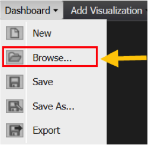

# Navegador de painéis{#dashboard-browser}

O Navegador de painéis facilita a navegação, pesquisa e abertura de painéis criados e salvos por você e outros membros da organização.

Você pode navegar e acessar todos os painéis que tem permissões para visualizar (para obter mais informações sobre controles de acesso, consulte a seção Controles de acesso). O Navegador de painéis funciona bem quando você precisa encontrar um painel, mas não tem certeza sobre qual deles você precisa ou onde ele está. O Navegador de painéis também é útil para obter detalhes adicionais e executar funções especiais em um determinado painel.

## Abrir o navegador de painéis {#section-10e158d738684219ab997ef050b675d7}

Ao fazer logon no painel do Adobe Data Workbench, o Navegador de painéis será exibido por padrão. Você também pode acessar o Navegador de painéis a qualquer momento clicando no menu Painel na barra de ferramentas e selecionando **[!UICONTROL Browse…]**.

