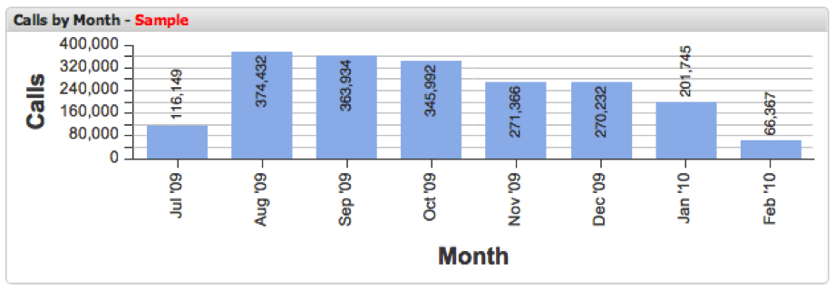

# Parâmetro de Query para{#query-to-parameter}

O painel permite visualizar amostras de dados do Adobe data workbench em vez de consultar seu conjunto de dados até a conclusão.

Como os resultados da amostra são retornados rapidamente, usar um recurso de porcentagem menor **[!UICONTROL Query To]** facilita a criação e a análise rápidas do painel até que um resultado completo seja retornado. O parâmetro **[!UICONTROL Query To]** pode ser facilmente ajustado a qualquer momento usando o menu **[!UICONTROL Query To]** no menu **[!UICONTROL Update]** da barra de ferramentas.

Como executar consultas para 100% de conclusão pode levar vários minutos, é recomendável ajustar o parâmetro **[!UICONTROL Query To]** para um valor menor ao criar painéis, ou adicionar e configurar visualizações. Também é recomendável diminuir esse valor ao ajustar as seleções em um painel, até ter certeza de que está pronto para executar a query até 100% de conclusão.

>[!NOTE]
>
>Um indicador será mostrado no cabeçalho para cada visualização que não tem um resultado de consulta 100% concluído.

