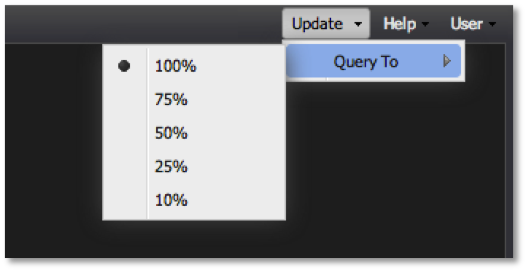

# Parâmetro de consulta{#query-to-parameter}

O painel permite que você visualize amostras de dados da análise de big data da Adobe em vez de consultar seu conjunto de dados até a conclusão.

Como os resultados da amostra são retornados rapidamente, o uso de um recurso **[!UICONTROL Query To]** percentual mais baixo facilita a criação e análise rápidas do painel até que um resultado completo seja retornado. O **[!UICONTROL Query To]** parâmetro pode ser facilmente ajustado a qualquer momento usando o **[!UICONTROL Query To]** menu no **[!UICONTROL Update]** menu da barra de ferramentas.

Como a execução de consultas para 100% de conclusão pode levar vários minutos, recomenda-se que você ajuste o **[!UICONTROL Query To]** parâmetro para um valor menor ao criar painéis ou adicionar e configurar visualizações. Também é recomendável diminuir esse valor ao ajustar suas seleções em um painel até ter certeza de que está pronto para executar a consulta até 100% de conclusão.

>[!NOTE]
>
>Um indicador será mostrado no cabeçalho para cada visualização que não tenha um resultado de consulta 100% concluído.

