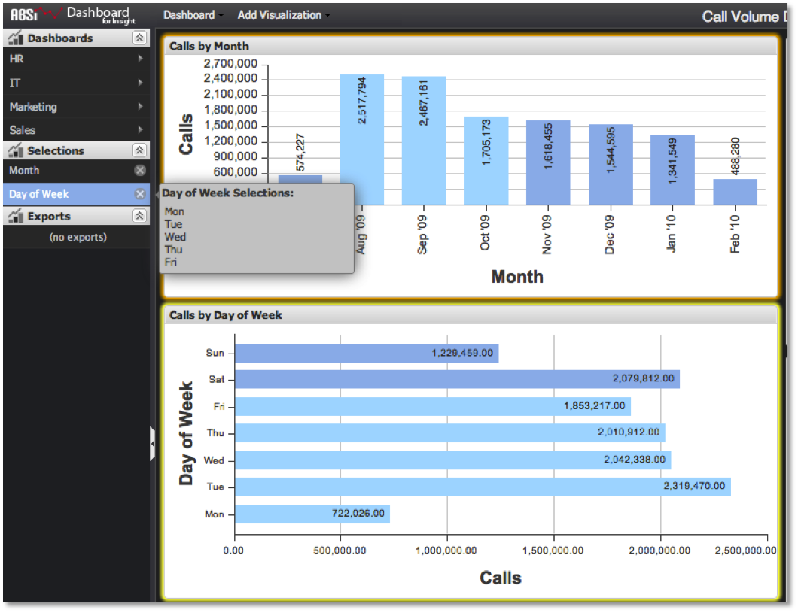

# Determinando o que está selecionado{#determining-what-s-selected}

Há duas maneiras de determinar quais seleções foram feitas em um painel.

* Primeiro, todas as seleções feitas no painel serão representadas por um item no **[!UICONTROL Selections]** menu. Cada grupo de seleções de uma visualização aparecerá como um item na lista. Eles serão rotulados com o nome da dimensão correspondente (ou seja, &quot;Dia&quot;, &quot;Mês&quot;, etc.). Colocar o cursor do mouse sobre essa entrada exibirá um pop-up que identifica exatamente quais valores de métrica foram selecionados.

   

* Outro recurso para ajudar a identificar as seleções que foram feitas é o realce da visualização. Qualquer visualização que tenha uma seleção será contornada em laranja. Além disso, colocar o cursor do mouse sobre um item de seleção destacará sua visualização correspondente em amarelo claro, mostrando o usuário de onde a seleção veio.

