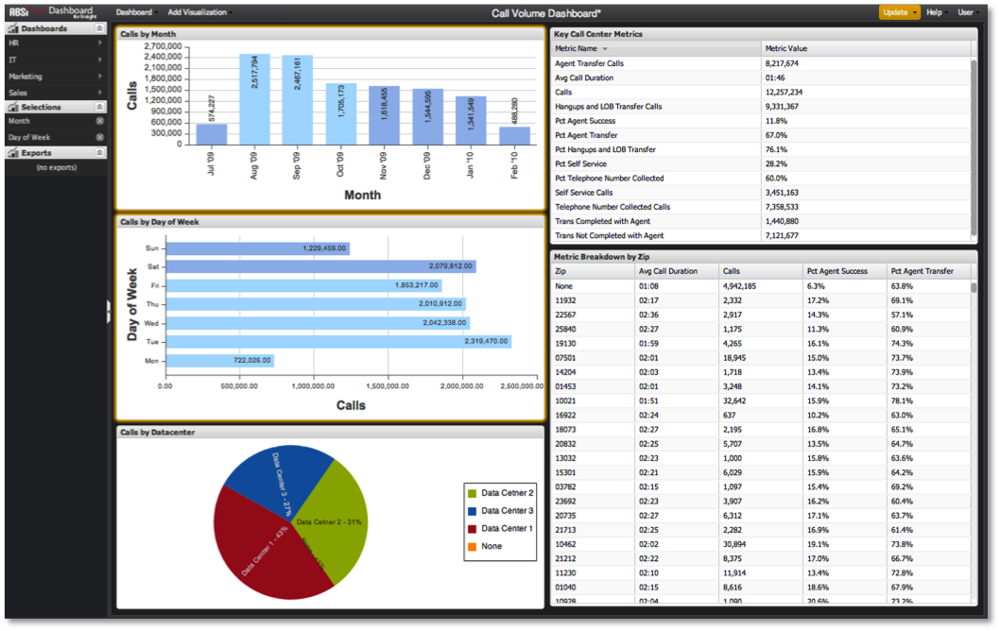

# Aplicar seleções{#applying-selections}

As seleções não são aplicadas automaticamente aos resultados de dados do painel.

1. Concluída a realização das seleções desejadas e clique em **[!UICONTROL Update]**.

   Se o botão **[!UICONTROL Update]** for laranja, isso indica que você deve clicar nele para aplicar alguma alteração nas seleções do painel. Esse recurso permite fazer várias seleções na tela e enquadrar suas perguntas analíticas sem ter uma consulta iniciada toda vez que você faz uma alteração.

   
