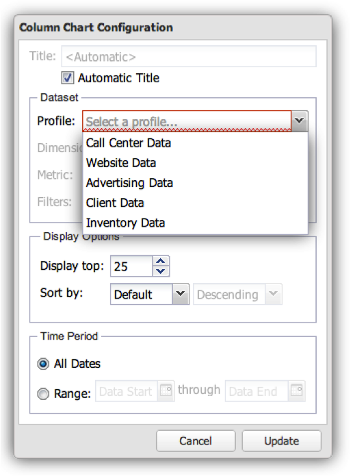
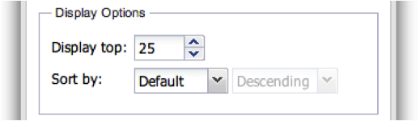

# Configuração de visualizações{#configuring-visualizations}

Mostra como configurar Título, Perfil, Dimensão, Métrica, Filtro, Exibir Parte Superior, Classificar Por e Período.

Cada visualização na tela do painel tem sua própria configuração. Quando uma visualização é adicionada pela primeira vez à tela do painel, sua janela de configuração é exibida automaticamente. Depois de configurada, a visualização pode ser modificada a qualquer momento clicando no ícone de engrenagem na parte superior direita da janela de visualização.

>[!NOTE]
>
>As opções de configuração variam um pouco dependendo do tipo de visualização que está sendo exibido.

## Título da visualização {#section-0414844283d745ae912e85f8ea14a51d}

Esse campo permite personalizar o título exibido na parte superior da visualização. Por padrão, o título é definido como **[!UICONTROL Automatic Title]**, gerando automaticamente um título para a janela de visualização. Limpando o **[!UICONTROL Automatic Title]** botão, você pode colocar qualquer título nesse campo. (Esse campo se aplica a todas as visualizações.)

## Perfil {#section-16eb0def0a2d4eb289f5bb9200d14754}

Esse campo permite selecionar de qual perfil você deseja visualizar dados. Clicar no menu suspenso fornecerá uma lista dos perfis aos quais você tem acesso. (Esse campo não se aplica a visualizações de Rich Text.)

Perfis são conjuntos de dados definidos na análise de big data que contêm dados sobre um determinado domínio, juntamente com as dimensões, métricas e filtros que acompanham os dados. Geralmente, um perfil é projetado para atender a uma finalidade específica (como marketing ou tráfego de site).

>[!NOTE]
>
>Você pode ver apenas os perfis para os quais recebeu acesso. Para obter mais informações, consulte Controles de acesso.

## Dimensão {#section-4ebb8c4308a146c3a35c7ac7ab6b579f}

Permite selecionar a dimensão que deseja visualizar. A lista é preenchida a partir da lista de dimensões disponíveis do perfil selecionado no campo Perfil. Clique na dimensão desejada e clique no botão Selecionar. (Esse campo não se aplica a legendas de métricas e visualizações de Rich Text.)

Dimensões são categorias de tipos de dados semelhantes. Por exemplo, a dimensão Dias da semana é composta dos seguintes elementos de dados: Domingo, segunda-feira, terça-feira, quarta-feira, quinta-feira, sexta-feira e sábado. As dimensões mostram o que está sendo medido.

## Metric(s) {#section-7d46f2f1b9fe4e539b5eb0a0dc6e5ad3}

Permite selecionar as métricas a serem visualizadas. As métricas são objetos quantitativos e são definidas por alguma expressão quantificável. Por exemplo, as Exibições de página por sessão são derivadas da expressão da contagem de Exibições de página dividida pela contagem de Sessões. Métricas respondem à questão de &quot;quantos?&quot;

As visualizações de métrica única têm uma janela de seleção de métrica única:

As visualizações de várias métricas têm uma janela de seleção de várias métricas:

A lista é preenchida a partir da lista de métricas disponíveis no perfil selecionado no campo Perfil.

Clique nas métricas desejadas e clique em **[!UICONTROL Select]**. (Esse campo não se aplica a visualizações de Rich Text.)

## Filtros {#section-f8619ae2f8e54735a2c1b0fbb8bb1281}

Selecione os filtros que deseja aplicar à sua visualização. A janela de seleção de filtro permite selecionar vários filtros na lista de filtros. A lista é preenchida a partir da lista de filtros disponíveis a partir do perfil selecionado no campo Perfil. Clique no filtro desejado e clique em **[!UICONTROL Select]**.

>[!NOTE]
>
>Os filtros aplicados aqui são aplicados somente à visualização correspondente, não ao painel inteiro. Isso é útil para comparar os resultados de duas visualizações diferentes com filtros diferentes aplicados.

## Exibir ferramentas {#section-7ce71cb0fa6446998b710b427e68b133}

As visualizações no painel não são projetadas para exibir a totalidade dos dados. Em vez disso, eles permitem que você especifique o número de registros de dimensão que deseja exibir na visualização. Isso exibe o número superior de dimensões, dependendo do valor de classificação fornecido abaixo. (Esse campo não se aplica a tabelas, legendas de métricas e visualizações de Rich Text.)

## Sort By {#section-f686249e20444359bff87c00cc2ba29f}

Isso permite especificar como os dados devem ser classificados quando são exibidos na visualização. (Esse campo não se aplica a tabelas, legendas de métricas e visualizações de Rich Text.) Há várias opções de classificação:

* **[!UICONTROL Default]** - Retorna os dados não classificados com base na ordem de classificação armazenada na análise de big data. Essa é a opção a ser usada para dados baseados em tempo, como hora, dia, semana ou mês.
* **[!UICONTROL Dimension]** -Classifique os dados com base no valor da dimensão alfanumérica.
* **[!UICONTROL Metric]** - Classifique os dados com base no valor da métrica e é bom para visualizar rapidamente as dimensões principais.
* **[!UICONTROL Descending]** - Classifique os dados em ordem decrescente.
* **[!UICONTROL Ascending]** - Classifique os dados em ordem crescente.

## Período de tempo {#section-6220368e9e524b46ac735add6ab9edb0}

Essa visualização permite especificar a data de início e/ou término desejada dos dados a serem exibidos na visualização.

Selecionar **[!UICONTROL All Dates]**exibe todo o intervalo de datas disponível no perfil.

A seleção **[!UICONTROL Range]** exibe apenas os dados que estão dentro de um intervalo especificado. Para informar o intervalo de datas, você pode digitar a data inicial e/ou final ou usar uma entrada de calendário selecionando o ícone de calendário.

(Esse campo não se aplica a visualizações de Rich Text.)

>[!NOTE]
>
>Os intervalos de datas aplicados aqui são aplicados somente à visualização correspondente, não ao painel inteiro. Isso é útil para comparar os resultados de duas visualizações diferentes com intervalos de datas diferentes aplicados.

