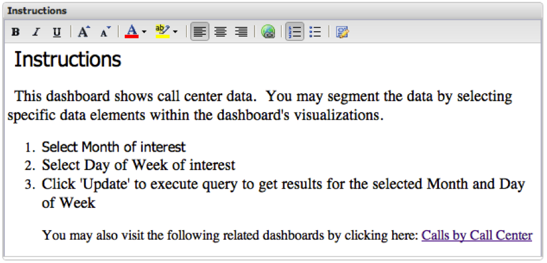

# Texto formatado{#rich-text}

A visualização de rich text permite incorporar informações baseadas em texto no painel. Isso é útil para fornecer descrições, hiperlinks ou informações instrucionais. A barra de ferramentas de formatação de texto na parte superior da janela Rich Text permite manipular o formato do texto no corpo da janela.

Para adicionar texto à janela de rich text, coloque o cursor dentro do corpo da janela de rich text e comece a digitar. Para editar texto dentro da janela rich text, use a barra de ferramentas de formatação de texto na parte superior desta janela.
