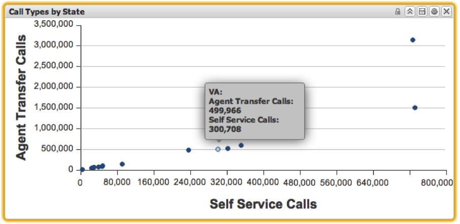

# Gráfico de dispersão{#scatter-plot}

As visualizações do gráfico de dispersão permitem visualizar duas métricas em relação a uma dimensão, com cada elemento de dados representado como um ponto em um eixo x-y. Os gráficos de dispersão permitem que até 200 elementos de dados exclusivos sejam exibidos no gráfico de uma só vez. Os incrementos da primeira métrica são rotulados ao longo do eixo y, enquanto os incrementos da segunda métrica são rotulados ao longo do eixo x. Colocar o mouse sobre um ponto no gráfico de linha exibirá o valor exato nesse ponto.

As seleções podem ser feitas em gráficos de dispersão clicando em um ponto específico. Pressionar e manter pressionada a tecla **[!UICONTROL Alt]** manterá as seleções ao clicar em itens adicionais. Pressionar e manter pressionada a tecla **[!UICONTROL Alt]** ao clicar também alterna o valor de uma seleção. Isso é útil para remover apenas uma seleção de um grupo de itens já selecionados.

