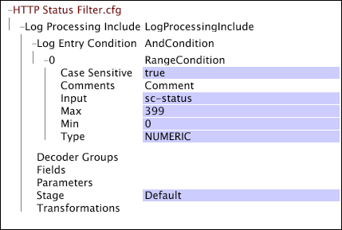

# Configurações específicas da Web para processamento de log{#web-specific-settings-for-log-processing}

{{eol}}

Informações sobre configurações específicas da Web definidas nos arquivos de inclusão do conjunto de dados de processamento de log que são fornecidos com perfis do Adobe para o Site.

A filtragem definida por essas configurações ocorre depois que as entradas de log deixam os decodificadores e as transformações são aplicadas, mas antes da avaliação pela [!DNL Log Entry Condition].

* [Filtragem de status HTTP](../../../home/c-dataset-const-proc/c-config-web-data/c-web-spec-log-proc.md#section-ac66acdcb6aa467d81c3721199e540fd)
* [Filtragem de robô](../../../home/c-dataset-const-proc/c-config-web-data/c-web-spec-log-proc.md#section-7f43681dfbc64b969619cb88f97d5ad5)

## Filtragem de status HTTP {#section-ac66acdcb6aa467d81c3721199e540fd}

Você pode configurar a implementação de [!DNL Site] para remover entradas de log com códigos de status sc de 400 ou superior do conjunto de dados. Solicitações bem-sucedidas têm códigos de status inferiores a 400. Sua implementação padrão inclui uma [!DNL Log Processing Dataset Include] arquivo no qual a filtragem do status HTTP é configurada.

**Para editar as configurações da filtragem de status HTTP**

1. Abra o [!DNL Profile Manager] no perfil do conjunto de dados e abra o [!DNL Dataset\Log Processing\Traffic\HTTP Status Filter.cfg] arquivo.

   >[!NOTE]
   >
   >Se você personalizou sua implementação de [!DNL Site], o arquivo no qual essas configurações existem pode ser diferente do local descrito.

1. Revise ou edite os valores dos parâmetros do arquivo, conforme desejado. Use o exemplo a seguir como guia.

   

   Para obter informações sobre o [!DNL Range] condição, consulte [Condições](../../../home/c-dataset-const-proc/c-conditions/c-abt-cond.md).

1. Salve as [!DNL HTTP Status Filter.cfg] ao clicar com o botão direito do mouse **[!UICONTROL (modified)]** na parte superior da janela e clicando em **[!UICONTROL Save]**.

1. Para que as alterações feitas localmente entrem em vigor, no [!DNL Profile Manager], clique com o botão direito do mouse na marca de seleção do arquivo no [!DNL User] e, em seguida, clique em **[!UICONTROL Save to]** > *&lt;**[!UICONTROL profile name]**>*, em que o nome do perfil é o nome do perfil do conjunto de dados ou o perfil herdado ao qual o arquivo de inclusão do conjunto de dados pertence.

   >[!NOTE]
   >
   >Não salve o arquivo de configuração modificado em nenhum dos perfis internos fornecidos pelo Adobe, pois as alterações são substituídas ao instalar atualizações nesses perfis.

## Filtragem de robô {#section-7f43681dfbc64b969619cb88f97d5ad5}

Você pode configurar a implementação de [!DNL Site] para usar arquivos de pesquisa para remover entradas de log geradas por robôs conhecidos, scripts de teste e endereços IP para usuários internos do conjunto de dados. Sua implementação padrão inclui uma [!DNL Log Processing Dataset Include] arquivo no qual a filtragem de robô está configurada.

**Para editar as configurações para filtragem de robôs**

1. Abra o [!DNL Profile Manager] no perfil do conjunto de dados e abra o [!DNL Dataset\Log Processing\Traffic\Robot Filter.cfg] arquivo.

   >[!NOTE]
   >
   >Se você personalizou sua implementação de [!DNL Site], o arquivo no qual essas configurações existem pode ser diferente do local descrito.

1. Revise ou edite os parâmetros do arquivo usando o exemplo a seguir e as informações como guias:

   

   O arquivo inclui um [!DNL NotRobotCondition] que é definida pelos três parâmetros a seguir:

   * **Filtragem de robô que não diferencia maiúsculas de minúsculas:** Verdadeiro ou falso. Se verdadeiro, letras maiúsculas e minúsculas não são consideradas na filtragem de robôs.
   * **Arquivo de pesquisa de robô, Linha de Base:** O caminho e o nome do arquivo de texto que contém uma lista de agentes do usuário do navegador que são robôs conhecidos e que devem ser filtrados do conjunto de dados. O Adobe fornece o arquivo de pesquisa de robô de linha de base. Se você não especificar um caminho, o servidor do Data Workbench procurará esse arquivo no diretório Pesquisas no diretório de instalação do servidor do Data Workbench.
   * **Arquivo de pesquisa de robô, estendido:** O caminho e o nome de arquivo de um arquivo de texto opcional que contém uma lista de agentes de usuário do navegador ou endereços IP que definem robôs específicos para sua implementação. Essa lista pode incluir robôs de monitoramento interno, scripts de teste e endereços IP para usuários internos que devem ser filtrados do conjunto de dados. Se você não especificar um caminho, o servidor do Data Workbench procurará esse arquivo no diretório Pesquisas no diretório de instalação do servidor do Data Workbench.

   Se o agente de usuário do navegador de uma entrada de log não estiver listado em qualquer arquivo de pesquisa, a entrada de log será considerada gerada por um visitante real e não será filtrada do conjunto de dados.

   >[!NOTE]
   >
   >A correspondência nos arquivos de pesquisa de robô usa subsequências de caracteres para comparar com os campos de log c-ip e cs(user-agent). Se a string de pesquisa começar com &quot;$&quot;, ela deve corresponder à frente da string que está sendo testada e, se ela terminar com &quot;$&quot;, a string de pesquisa deve corresponder ao final da string que está sendo testada. Se a string de pesquisa começar com e terminar com &quot;$&quot;, as cadeias de caracteres deverão corresponder exatamente para que a entrada de log seja filtrada. Por exemplo, para testar todos os endereços IP em um bloco da classe C, você usaria uma string como $231.78.123. para forçar uma correspondência na frente da string. Isso corresponderia aos endereços 231.78.123.0 a 231.78.123.255.

1. Salve o arquivo clicando com o botão direito do mouse **[!UICONTROL (modified)]** na parte superior da janela e clicando em **[!UICONTROL Save]**.

1. Para que as alterações feitas localmente entrem em vigor, no [!DNL Profile Manager], clique com o botão direito do mouse na marca de seleção do arquivo no [!DNL User] e, em seguida, clique em **[!UICONTROL Save to]** > *&lt;**[!UICONTROL profile name]**>*, em que o nome do perfil é o nome do perfil do conjunto de dados ou o perfil herdado ao qual o arquivo de inclusão do conjunto de dados pertence.

   Não salve o arquivo de configuração modificado em nenhum dos perfis internos fornecidos pelo Adobe, pois as alterações são substituídas ao instalar atualizações nesses perfis.

   >[!NOTE]
   >
   >Se for essencial que as entradas de log subjacentes usadas para construir um conjunto de dados não sejam alteradas (mesmo que as transformações usadas para construir e atualizar o conjunto de dados e suas dimensões sejam alteradas), o Arquivo de pesquisa de robô, a Linha de Base e o Arquivo de pesquisa de robô, Estendido, deverão ser controlados por versão. Colocar um número de versão nesses arquivos garante que as atualizações nos arquivos de pesquisa de robô padrão não alterem involuntariamente os conjuntos de dados de relatórios construídos anteriormente, adicionando ou excluindo entradas nesses arquivos.
