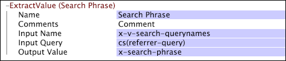

# ExtractValue{#extractvalue}

Se você estiver trabalhando com dados da Web, poderá usar a transformação ExtractValue para extrair um valor de uma string de consulta, cookie ou campo codificado de forma semelhante nos dados do site.

Observe que os nomes correspondentes ao valor a ser extraído podem ser diferentes em cada entrada de log.

<table id="table_D16A39BE035043628A4D6F7452952304"> 
 <thead> 
  <tr> 
   <th colname="col1" class="entry"> Parâmetro </th> 
   <th colname="col2" class="entry"> Descrição </th> 
   <th colname="col3" class="entry"> Padrão </th> 
  </tr> 
 </thead>
 <tbody> 
  <tr> 
   <td colname="col1"> Nome </td> 
   <td colname="col2"> Nome descritivo da transformação. Você pode inserir qualquer nome aqui. </td> 
   <td colname="col3"></td> 
  </tr> 
  <tr> 
   <td colname="col1"> Comentários </td> 
   <td colname="col2"> Opcional. Observações sobre a transformação. </td> 
   <td colname="col3"></td> 
  </tr> 
  <tr> 
   <td colname="col1"> Condição </td> 
   <td colname="col2"> Condições de aplicação desta transformação. </td> 
   <td colname="col3"></td> 
  </tr> 
  <tr> 
   <td colname="col1"> Nome de entrada </td> 
   <td colname="col2"> 
O(s) nome(s) dos campos a serem extraídos da Consulta de Entrada. 
 
 
Observação:  Se o Nome de entrada for um vetor (ou seja, há vários nomes presentes), apenas um valor será extraído. 
 
 </td> 
   <td colname="col3"></td> 
  </tr> 
  <tr> 
   <td colname="col1"> Consulta de entrada </td> 
   <td colname="col2"> O mapeamento codificado (sequência de consulta, cookie e assim por diante) do qual o valor deve ser extraído. </td> 
   <td colname="col3"></td> 
  </tr> 
  <tr> 
   <td colname="col1"> Valor de saída </td> 
   <td colname="col2"> O nome do campo usado para capturar o valor decodificado extraído. </td> 
   <td colname="col3"></td> 
  </tr> 
 </tbody> 
</table>

Se quiser extrair uma frase de pesquisa, poderá extrair a frase inteira e, se desejar, dividir a frase em termos de pesquisa usando uma transformação [!DNL Tokenize]. Para obter informações sobre a transformação [!DNL Tokenize], consulte [Tokenize](../../../../../home/c-dataset-const-proc/c-data-trans/c-transf-types/c-standard-transf/c-tokenize.md#concept-f460aa5df3a7476e971af29cf5d9b32c).

Esse exemplo configura uma transformação [!DNL ExtractValue] para extrair valores do campo x-v-search-querynames de cs(referrer-query) e armazená-los no campo x-search-phrase.

