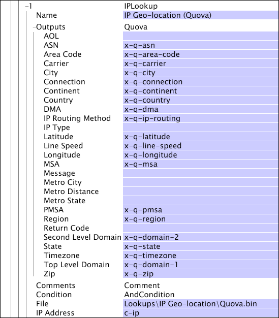

# IPLookup{#iplookup}

A transformação IPLookup pega dados de geolocalização de IP ou de IP (fornecidos por qualquer fornecedor desses dados e convertidos em formato proprietário por Adobe) e transforma os dados em informações geográficas que podem ser usadas na análise.

Duas [!DNL IPLookup] transformações são listadas no menu Add new > *Transformation type *:

* [!DNL IPLookup] Quova para  [!DNL IP geo-location] dados

* [!DNL IPLookup] Digital Envoy para  [!DNL IP geo-intelligence] dados

Ao definir uma transformação [!DNL IPLookup], escolha a transformação apropriada para seus dados [!DNL IP geo-location] ou [!DNL IP geo-intelligence].

<table id="table_C438A30AB5E64160A5C486D6887B1D7E"> 
 <thead> 
  <tr> 
   <th colname="col1" class="entry"> Parâmetro </th> 
   <th colname="col2" class="entry"> Descrição </th> 
   <th colname="col3" class="entry"> Padrão </th> 
  </tr> 
 </thead>
 <tbody> 
  <tr> 
   <td colname="col1"> Nome </td> 
   <td colname="col2"> Nome descritivo da transformação. Você pode inserir qualquer nome aqui. </td> 
   <td colname="col3"> </td> 
  </tr> 
  <tr> 
   <td colname="col1"> Comentários </td> 
   <td colname="col2"> Opcional. Observações sobre a transformação. </td> 
   <td colname="col3"> </td> 
  </tr> 
  <tr> 
   <td colname="col1"> Condição </td> 
   <td colname="col2"> Condições de aplicação desta transformação. </td> 
   <td colname="col3"> </td> 
  </tr> 
  <tr> 
   <td colname="col1"> Arquivo </td> 
   <td colname="col2"> Caminho e nome do arquivo de pesquisa. Caminhos relativos referem-se ao diretório de instalação do servidor do Data Workbench. Normalmente, esse arquivo está localizado no diretório Lookups no diretório de instalação do servidor do Data Workbench. </td> 
   <td colname="col3"> </td> 
  </tr> 
  <tr> 
   <td colname="col1"> Endereço IP </td> 
   <td colname="col2"> O campo do qual ler o endereço IP. </td> 
   <td colname="col3"> c-ip </td> 
  </tr> 
  <tr> 
   <td colname="col1"> Saídas </td> 
   <td colname="col2"> 
Os nomes das cadeias de caracteres de saída. 
 
 As transformações  IPLookup Quova e  IPLookup Digital Envoy têm parâmetros de saída diferentes. Certifique-se de usar a transformação apropriada para seus dados de pesquisa de IP. 
 </td> 
   <td colname="col3"> </td> 
  </tr> 
 </tbody> 
</table>

Neste exemplo, os dados [!DNL IP geo-location] (no arquivo de pesquisa [!DNL Quova.bin]) são usados para criar os campos de saída listados. As saídas (AOL, ASN, Código de área e assim por diante) podem ser usadas para criar dimensões para análise geográfica do tráfego de visitantes.

