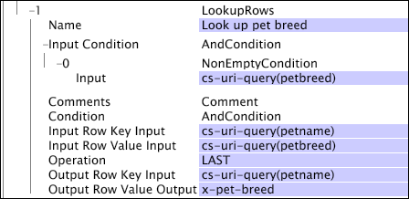

# LookupRows{#lookuprows}

A transformação LookupRows procura outras entradas de log com a mesma ID de rastreamento e define o valor do campo de saída para o valor de um campo designado na linha de entrada.

Como a [!DNL LookupRows] transformação realiza sua pesquisa nas entradas de registro e não nos arquivos de pesquisa, é muito semelhante à [!DNL CrossRows] transformação. Consulte [CrossRows](../../../../../home/c-dataset-const-proc/c-data-trans/c-transf-types/c-standard-transf/c-crossrows.md#concept-fcace08804f54db397ed631cc13ff4f2).

Para funcionar, a [!DNL LookupRows] transformação exige que os dados sejam solicitados no tempo e agrupados pela ID de rastreamento nos dados de origem. Portanto, [!DNL LookupRows] funciona somente quando definido no [!DNL Transformation.cfg] arquivo ou em um [!DNL Transformation Dataset Include] arquivo.

À medida que você revisa as descrições dos parâmetros na tabela a seguir, lembre-se do seguinte:

* A linha de saída é a linha de dados na qual a transformação está funcionando em um determinado ponto no tempo.
* As linhas de entrada são todas as outras linhas de dados (antes, depois ou incluindo a linha de saída) cujos valores do campo de entrada servem como entradas para a transformação.

<table id="table_AB68A89ECD5C45F39B8433F994BBD7D8"> 
 <thead> 
  <tr> 
   <th colname="col1" class="entry"> Parâmetro </th> 
   <th colname="col2" class="entry"> Descrição </th> 
   <th colname="col3" class="entry"> Padrão </th> 
  </tr> 
 </thead>
 <tbody> 
  <tr> 
   <td colname="col1"> Nome </td> 
   <td colname="col2"> Nome descritivo da transformação. Você pode digitar qualquer nome aqui. </td> 
   <td colname="col3"> </td> 
  </tr> 
  <tr> 
   <td colname="col1"> Comentários </td> 
   <td colname="col2"> Opcional. Notas sobre a transformação. </td> 
   <td colname="col3"> </td> 
  </tr> 
  <tr> 
   <td colname="col1"> Condição </td> 
   <td colname="col2"> Limita a saída da transformação a determinadas entradas de log. Se a condição não for atendida para uma entrada de log específica, o campo no parâmetro Saída de valor de linha de saída permanecerá inalterado. A entrada ainda pode ser usada para afetar outras entradas de log. </td> 
   <td colname="col3"> </td> 
  </tr> 
  <tr> 
   <td colname="col1"> Condição de entrada </td> 
   <td colname="col2">Aceita a entrada para a transformação somente de determinadas linhas de entrada. Se a  Condição de entrada não for atendida para uma linha de entrada específica, o campo de entrada dessa linha será ignorado e não afetará outras linhas de saída. No entanto, o campo de saída dessa linha ainda é modificado de acordo com a Condição especificada. </td> 
   <td colname="col3"> </td> 
  </tr> 
  <tr> 
   <td colname="col1"> Entrada da chave de linha de entrada </td> 
   <td colname="col2"> O nome do campo a ser usado como a chave para as linhas de entrada. </td> 
   <td colname="col3"> </td> 
  </tr> 
  <tr> 
   <td colname="col1"> Entrada do valor da linha de entrada </td> 
   <td colname="col2"> O nome do campo na linha de entrada cujo valor é copiado para o campo no parâmetro Saída do Valor da Linha de Saída se todas as condições forem atendidas. </td> 
   <td colname="col3"> </td> 
  </tr> 
  <tr> 
   <td colname="col1"> Operação </td> 
   <td colname="col2"> 
Uma operação que, para cada linha de saída, é aplicada a todas as linhas de entrada que satisfazem todas as condições definidas pelos parâmetros  Input Condition e Input Row Key Input Input (Condição de entrada) para produzir uma saída: 
     <ul id="ul_16FB152CB558497794DDED72A2F05CDD"> 
      <li id="li_22DA9F814E4E42D0B21E90B63A2A7A0E"> PRIMEIRO gera o valor do campo no parâmetro Entrada do valor da linha de entrada a partir da primeira linha de entrada correspondente nos dados (não a primeira linha correspondente após a linha de saída). </li> 
      <li id="li_45E00C3DE0494A1CB5C09B942088F161"> ÚLTIMO resulta no valor do campo no parâmetro Entrada do valor da linha de entrada a partir da última linha de entrada nos dados (não a última linha correspondente antes da linha de saída). </li> 
     </ul> 
 </td> 
   <td colname="col3"> </td> 
  </tr> 
  <tr> 
   <td colname="col1"> Entrada da chave da linha de saída </td> 
   <td colname="col2"> O nome do campo a ser usado como a chave para a linha de saída. </td> 
   <td colname="col3"> </td> 
  </tr> 
  <tr> 
   <td colname="col1"> Saída do Valor da Linha de Saída </td> 
   <td colname="col2">O nome do campo na linha de saída cujo valor é copiado do campo no parâmetro Entrada do valor da linha de entrada se todas as condições forem atendidas. Todas as linhas de saída com os mesmos  valores de entrada x-trackingid e de entrada de chave de linha de saída têm o mesmo valor de saída de valor de linha de  saída. </td> 
   <td colname="col3"> </td> 
  </tr> 
 </tbody> 
</table>

Os parâmetros Input Row Key Input, Input Row Value Input e Input Condition definem juntos o arquivo de pesquisa para cada ID de rastreamento, enquanto os parâmetros Output Row Key Input, Output Row Value Input e Condition controlam o que é pesquisado no arquivo e qual valor é armazenado no campo especificado por Output Row Value Output.

Para entender melhor a operação da transformação, considere o seguinte contorno:

* Para cada linha de saída que satisfaça a Condição e tenha uma entrada de chave de linha de saída não vazia:

   * Encontre a primeira ou a última linha de entrada de forma que

      * a linha de entrada satisfaz a condição de entrada e
      * o x-trackingid da linha de entrada é igual ao x-trackingid da linha de saída, e
      * a entrada da chave da linha de entrada é igual à entrada da chave da linha de saída da linha de saída,

* e defina a Saída do Valor da Linha de Saída da linha de saída como Entrada do Valor da Linha de Entrada da linha de entrada.

Considerações para [!DNL LookupRows]

* Valores de chave em branco nunca correspondem a nada. Mesmo que haja linhas de entrada com chaves em branco e valores que não estejam em branco que correspondam aos valores [!DNL Input Condition], um [!DNL Output Row Key Input] de &quot;&quot; sempre produzirá um valor [!DNL Output Row Value Output] de &quot;&quot;.

* Se não for proibido pelo [!DNL Input Condition], uma linha pode se procurar se seus valores [!DNL Input Row Key Input] e [!DNL Output Row Key Input] valores forem os mesmos.

Se você tiver vários valores chave, poderá combiná-los usando uma [!DNL Format] transformação (consulte [Formatar](../../../../../home/c-dataset-const-proc/c-data-trans/c-transf-types/c-standard-transf/c-format.md#concept-3de04869181e4694ab072b092186684b)) antes de aplicar uma [!DNL LookupRows] transformação.

Suponha que você tenha um site que tenha uma página de registro de animais de estimação, onde o nome e a raça sejam inseridos, e uma página posterior de &quot;comprar brinquedo&quot;, onde apenas o nome do animal de estimação seja usado. Você gostaria de ser capaz de vincular o nome do animal de estimação à raça de estimação inserida na página de registro. Para fazer isso, você pode criar a seguinte [!DNL LookupRows] transformação:

Vamos analisar este exemplo usando o contorno anterior:

* Para cada linha de saída que satisfaça um valor não vazio de cs-uri-query(petname) :

   * Encontre a ÚLTIMA linha de entrada de forma que

      * a linha de entrada contém um valor não vazio de cs-uri-query(petrace) e
      * o x-trackingid da linha de entrada é igual ao x-trackingid da linha de saída, e
      * o valor de cs-uri-query(petname) da linha de entrada é igual ao valor de cs-uri-query(petname) da linha de saída,

* e defina o valor de x-pet-range da linha de saída para o valor de cs-uri-query(petrace) da linha de entrada.

A [!DNL LookupRows] transformação usa o nome do animal de estimação (a chave) para garantir que a raça esteja vinculada ao registro do animal de estimação e compre páginas de brinquedos para que você possa analisar os brinquedos comprados para cada raça de animais de estimação, mesmo para visitantes com vários animais de estimação.
