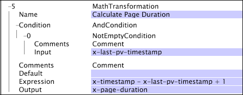

# Matemática{#math}

A transformação Matemática permite o uso de operações aritméticas em campos nas entradas de log.

As operações podem incluir números inteiros decimais e constantes de ponto flutuante.

<table id="table_FDF3DDF1960E43E391A67C9DC2A0E302"> 
 <thead> 
  <tr> 
   <th colname="col1" class="entry"> Campo </th> 
   <th colname="col2" class="entry"> Descrição </th> 
   <th colname="col3" class="entry"> Padrão </th> 
  </tr> 
 </thead>
 <tbody> 
  <tr> 
   <td colname="col1"> Nome </td> 
   <td colname="col2"> Nome descritivo da transformação. Você pode digitar qualquer nome aqui. </td> 
   <td colname="col3"></td> 
  </tr> 
  <tr> 
   <td colname="col1"> Comentários </td> 
   <td colname="col2"> Opcional. Notas sobre a transformação. </td> 
   <td colname="col3"></td> 
  </tr> 
  <tr> 
   <td colname="col1"> Condição </td> 
   <td colname="col2"> As condições em que essa transformação é aplicada. </td> 
   <td colname="col3"></td> 
  </tr> 
  <tr> 
   <td colname="col1"> Expressão </td> 
   <td colname="col2"> 
Uma expressão aritmética que descreve o cálculo a ser executado. 
 
 É possível usar qualquer uma das operações e funções listadas abaixo e incorporar nomes de campos à expressão: 
 
 Operações 
     <ul id="ul_DB5915FADA0A41A3B11F1F48615F40A9">
      <li id="li_CA9EA97243F04760A81313C17EE057B3"> Adição (+) </li>
      <li id="li_908A272EBA2340098C20F22AA8D9ED26"> Subtração (-) </li>
      <li id="li_C62257FF3AAB436D9148BBEA441621D7"> Multiplicação (*) </li>
      <li id="li_B5A9EAB3E49D4CB9A297172199F23542"> Divisão (/) </li>
      <li id="li_D2D2B51DB2C8412A9B6F9D5F3CC03F8A"> Restante (%) </li>
      <li id="li_07E7E368FFD2437A852B785E159848E5"> Exponenciação (^) </li>
     </ul>
 
Funções 
     <ul id="ul_E335AE8D684340AA998C4A2633FFDEE1">
      <li id="li_E036FF0B5DF244DDBFEDA9BFEDC62251"> sgn(x). Retorna 1 se x for positivo, 0 se x for zero ou -1 se x for negativo. </li>
      <li id="li_90CD8899DDC14778A95930C2768C82BC"> abs(x). Retorna o valor absoluto de x. </li>
      <li id="li_F4AF23F343F74BD88B7166B1C2BB065E"> floor(x). Retorna o maior número inteiro menor que ou igual a x. </li>
      <li id="li_A31379A3659240C3A629BFAF19A6DDF1"> round(x). Retorna o número inteiro mais próximo a x. </li>
      <li id="li_9C0A0F3A4A304026B543F2A64B98B922"> log(b,x). Retorna o logaritmo de x base b. </li>
      <li id="li_124D62C2CA5A42CBBCC5DB18FAA8920E"> min(x,y,...). Retorna o menor de todos os seus argumentos. </li>
      <li id="li_3B7B9FC1C0BF4E7688F9F49130B97B7F"> max(x,y,...). Retorna o maior de seus argumentos. </li>
     </ul>
 </td> 
   <td colname="col3"></td> 
  </tr> 
  <tr> 
   <td colname="col1"> Saída </td> 
   <td colname="col2"> O nome do campo que contém o resultado da operação aritmética. </td> 
   <td colname="col3"></td> 
  </tr> 
 </tbody> 
</table>

Neste exemplo, que usa campos de dados coletados do tráfego do site, um novo campo chamado x-page-duration é calculado subtraindo x-last-pv-timestamp de x-timestamp e adicionando 1. A saída é calculada somente se o campo x-last-pv-timestamp definido pelo usuário (que representa o carimbo de data e hora da última exibição de página do visitante), for preenchido ou &quot;não vazio&quot;.

Para obter informações sobre a [!DNL Not Empty] condição, consulte [Condições](../../../../../home/c-dataset-const-proc/c-conditions/c-abt-cond.md).
