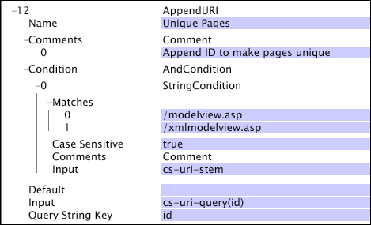

# AppendURI{#appenduri}

A transformação AppendURI fornece uma maneira de adicionar informações ao valor padrão que vêm das entradas de log usadas para criar o conjunto de dados.

A transformação coloca um par nome-valor no final do campo interno usado para criar a dimensão URI. O par name-value é criado usando o parâmetro Query String Key como o nome e o valor do parâmetro Input identificado como o valor do par. O [!DNL AppendURI] comando adiciona qualquer e &amp; símbolos necessários para separar os pares nome-valor do [!DNL URI] tronco e de quaisquer [!DNL AppendURI] operações anteriores que possam ter sido aplicadas ao URI.

A [!DNL AppendURI] transformação funciona somente quando definida no [!DNL Transformation.cfg] arquivo ou [!DNL Transformation Dataset Include] arquivo.

| Parâmetro | Descrição | Padrão |
|---|---|---|
| Nome | Nome descritivo da transformação. Você pode digitar qualquer nome aqui. |  |
| Comentários | Opcional. Notas sobre a transformação. |  |
| Condição | As condições em que essa transformação é aplicada. |  |
| Padrão | O valor padrão a ser usado se a condição for cumprida e o valor de entrada não estiver disponível. |  |
| Entrada | O nome do campo cujo valor é anexado ao URI. |  |
| Chave da string de consulta | O nome a ser usado na criação do par nome-valor que está sendo anexado. |  |

Considere um site que foi construído usando uma abordagem tradicional do Model-View-Controller. Nesses sistemas, é comum ter uma única página da Web como ponto de acesso ao sistema. Para esse site, as visualizações dos padrões de tráfego no sistema seriam muito desinteressantes e não forneceriam insights sobre a utilização do visitante e o fluxo de tráfego. Por exemplo, considere um site que funcione todas as solicitações da Web por meio de um URI do seguinte formulário:

* [!DNL http://www.examplesite.com/modelview.asp?id=login&name=bob]

A página ASP de exibição de modelo recebe todo o tráfego e determina suas ações com base no valor do campo de ID na consulta. Por padrão, a dimensão URI conteria uma única entrada:

* [!DNL modelview.asp]

Isso resultaria em um mapeamento bastante desinteressante do tráfego pelo site, já que todo o tráfego está sendo afundado por um único URI. Para abordar esse cenário em particular e fornecer uma exibição mais informativa na arquitetura subjacente do site, [!DNL AppendURI] pode ser usado para mover alguns dos pares nome-valor exclusivos do campo de consulta cs-uri para a dimensão URI usada para visualizações. A transformação mostrada abaixo fornece os detalhes dessa transformação:

Neste exemplo, há duas páginas usadas pelo sistema para lidar com todas as solicitações: [!DNL modelview.asp] e [!DNL xmlmodelview.asp]. Uma página é usada para o tráfego do navegador e a outra é usada para comunicações XML sistema a sistema. O processo do servidor de aplicativos usa o nome de id da consulta cs-uri para determinar qual ação tomar. Portanto, você pode extrair o valor do campo id e anexá-lo ao URI. O resultado é uma coleção de URIs com uma faixa de variação que reflete o tráfego do visitante pelo site. Aqui, uma [!DNL String Match] condição determina as entradas de log às quais a transformação é aplicada, pesquisando o campo cs-uri-stem para as duas páginas da Web de interesse e ignorando todas as outras. A entrada (o valor do par nome-valor) é o resultado de cs-uri-query(id), que é &quot;login&quot;. Conforme especificado pelo parâmetro Chave da string de consulta, o nome que está sendo anexado é &quot;id&quot;. Assim, para o valor de entrada de cs-uri do nosso exemplo, o URI resultante usado pela [!DNL URI] dimensão é [!DNL /modelview.asp&id=login].
