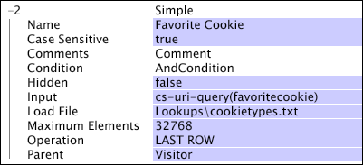

# Dimensões simples{#simple-dimensions}

Uma dimensão simples tem uma relação um para muitos com sua dimensão contável pai.

Uma dimensão simples é sempre um filho de uma dimensão contável. Você pode pensar em uma dimensão simples como uma representação de uma propriedade dos elementos em sua dimensão pai. Por exemplo, se estiver trabalhando com dados da Web, você pode definir a dimensão Referenciador de visitante , que é uma dimensão simples com uma dimensão principal de Visitante. Ele representa o primeiro referenciador HTTP para cada visitante na dimensão Visitante. Cada visitante na dimensão Visitante tem apenas um referenciador de visitante, mas muitos visitantes podem ter o mesmo referenciador de visitante. Portanto, a dimensão Referenciador de visitante tem uma relação um para muitos com a dimensão Visitante.

As dimensões simples são definidas pelos seguintes parâmetros:

<table id="table_E6F729DFA226459DBFC1776CE8CB81F8"> 
 <thead> 
  <tr> 
   <th colname="col1" class="entry"> Parâmetro </th> 
   <th colname="col2" class="entry"> Descrição </th> 
   <th colname="col3" class="entry"> Padrão </th> 
  </tr> 
 </thead>
 <tbody> 
  <tr> 
   <td colname="col1"> Nome </td> 
   <td colname="col2"> Nome descritivo da dimensão conforme ela aparece no Data Workbench. O nome da dimensão não pode incluir um hífen (-). </td> 
   <td colname="col3"> </td> 
  </tr> 
  <tr> 
   <td colname="col1"> Comentários </td> 
   <td colname="col2"> Opcional. Observações sobre a dimensão estendida. </td> 
   <td colname="col3"> </td> 
  </tr> 
  <tr> 
   <td colname="col1"> Condição </td> 
   <td colname="col2"> As condições em que a relação entre o Pai e o valor do campo de entrada deve ser criada. </td> 
   <td colname="col3"> </td> 
  </tr> 
  <tr> 
   <td colname="col1"> Oculto </td> 
   <td colname="col2"> Determina se a dimensão aparece na interface do Data Workbench. Por padrão, esse parâmetro é definido como false. Se, por exemplo, a dimensão for usada apenas como a base de uma métrica, você poderá definir esse parâmetro como true para ocultar a dimensão na exibição do Data Workbench. </td> 
   <td colname="col3"> false </td> 
  </tr> 
  <tr> 
   <td colname="col1"> Entrada </td> 
   <td colname="col2"> O campo de valores relacionado à dimensão pai (Pai). </td> 
   <td colname="col3"> </td> 
  </tr> 
  <tr> 
   <td colname="col1"> Carregar arquivo </td> 
   <td colname="col2"> 
Opcional. Um arquivo de valores disponíveis para a relação. Você usa um arquivo de carregamento quando uma das seguintes opções se aplica: 
 
 
     <ul id="ul_056C4A8E46AA479397DC63173C035D5C"> 
      <li id="li_C26EB5A4AB3C4BEB8EB3A217A5A2377E"> Os valores têm uma ordem de classificação específica que você deseja preservar na exibição do Data Workbench. Por exemplo, você pode criar uma dimensão Trimestre cujos elementos (os trimestres do ano) sempre são exibidos em ordem cronológica. </li> 
      <li id="li_5D4DF56BC6124D038A7260131B1F3DB3"> Você deseja criar espaços reservados para valores que podem não ser encontrados nos dados, mas precisam aparecer na exibição do Data Workbench. </li> 
     </ul> 
 
 Se for encontrado um valor que não está presente no arquivo, ele será adicionado ao final dos valores quando visualizado no Data Workbench. 
 </td> 
   <td colname="col3"> </td> 
  </tr> 
  <tr> 
   <td colname="col1"> Operação </td> 
   <td colname="col2"> 
As operações disponíveis são as seguintes: 
 
 
     <ul id="ul_88AE4279413C42609D8B53EC64B5E913"> 
      <li id="li_DD9623D006844BC28B2AAA8E12AA04E1"> PRIMEIRO NÃO EM BRANCO: O primeiro valor de entrada que não está em branco é usado, independentemente de ser proveniente da primeira entrada de log. Se Input for um campo vetorial, a primeira linha no vetor para a entrada de log relevante será usada. </li> 
      <li id="li_0FBE7F0B7B9744D994ECEDAA08F0045C"> PRIMEIRA LINHA: O valor da primeira entrada de log relacionada ao elemento da dimensão pai é usado, mesmo se a entrada estiver em branco. Se Input for um campo vetorial, a primeira linha no vetor para a entrada de log relevante será usada. Se esse valor estiver em branco ou não for um número, ou se a entrada de log relevante não atender à condição da dimensão, nenhum valor será usado. </li> 
      <li id="li_C17190BC699D4A099DC5326C07D1044D"> ÚLTIMO NONBLANK: O último valor de entrada que não está em branco é usado, independentemente de ser proveniente da última entrada de log. Se Input for um campo vetorial, a primeira linha no vetor para a entrada de log relevante será usada. </li> 
      <li id="li_00BAE86F12004C098F6A455908DB7062"> ÚLTIMA LINHA: O valor da última entrada de log relacionada ao elemento da dimensão pai é usado, mesmo se a entrada estiver em branco. Se Input for um campo vetorial, a primeira linha no vetor para a entrada de log relevante será usada. Se esse valor estiver em branco ou não for um número, ou se a entrada de log relevante não atender à condição da dimensão, nenhum valor será usado. </li> 
     </ul> 
 
 
Observação:  Se Operation não gerar um valor ou um valor em branco para uma entrada de log específica, o elemento correspondente da dimensão pai se relacionará ao elemento "Nenhum" da dimensão simples. 
 
 
 Você deve especificar uma operação para garantir que a dimensão seja definida conforme esperado. 
 </td> 
   <td colname="col3"> </td> 
  </tr> 
  <tr> 
   <td colname="col1"> Pai </td> 
   <td colname="col2"> O nome da dimensão pai. Qualquer dimensão contável pode ser uma dimensão principal. </td> 
   <td colname="col3"> </td> 
  </tr> 
 </tbody> 
</table>

Este exemplo ilustra a definição de uma dimensão simples usando dados de evento coletados do tráfego do site e um arquivo de carregamento.

Considere o exemplo de uma pesquisa de cookies de Scout Girl favoritos dos visitantes do site. Uma página da Web captura esse voto e o retorna ao servidor da Web no par de nomes favoritos. Somente um voto por visitante é contado, mas os visitantes podem mudar de ideia e votar novamente, se desejado. Esta é uma relação um para muitos: um visitante pode ter muitos votos, mas cada voto está associado a apenas um visitante. Portanto, o pai da dimensão é os visitantes (somente um voto por visitante) e a operação é A ÚLTIMA LINHA (para que possam mudar de ideia e votar novamente).

Os espaços reservados devem existir para todos os tipos de cookies, de modo que os tipos de cookies que não recebem votos sejam exibidos na exibição do Data Workbench. Por esses motivos, um arquivo de carregamento foi definido e contém a lista de tipos de cookies que podem ser selecionados. O conteúdo deste arquivo, salvo em um arquivo chamado [!DNL cookietypes.txt], é semelhante ao seguinte:

Tesouros animais

Caramel Delights

Limão-de-pastelaria

Partes de Manteiga de amendoim

Atalhos

Minhas finas

A dimensão final é definida conforme mostrado aqui:

