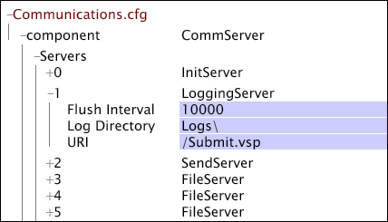

# Configurar uma unidade de servidor de arquivos do servidor do Data Workbench{#configuring-a-data-workbench-server-file-server-unit}

{{eol}}

Informações sobre as unidades do servidor de arquivos do Insight Server e o processo de configuração do servidor de arquivos.

<!--
c_abt_file_svr_units.xml
-->

Você pode configurar o servidor do Data Workbench (InsightServer64.exe) para ser executado como uma Unidade de Servidor de Arquivos (FSU) ao concluir os parâmetros no **[!UICONTROL Log Sources]** > **[!UICONTROL Log Server]** nó do [!DNL Log Processing.cfg] arquivo. Quando o servidor do Data Workbench é configurado para ser executado como uma FSU, ele armazena arquivos de origem ( [!DNL .vsl] arquivos, arquivos de texto ou arquivos XML) que podem ser acessados rapidamente por vários servidores de processamento (DPUs). Quando os DPUs em um cluster de servidores do Data Workbench acessam o FSU para ler os arquivos de log, eles dividem os arquivos de log entre eles e garantem que o mesmo arquivo não seja processado mais de uma vez.

>[!NOTE]
>
>Ao configurar uma FSU que atenda a um cluster de servidores do Data Workbench que consista em cinco a dez DPUs, você deve tornar o servidor principal do cluster a FSU.

Para obter informações sobre como instalar um cluster de servidores do Data Workbench, consulte *Guia de Instalação e Administração de Produtos para Servidores*.

<!--
c_file_svr_config_proc.xml
-->

Se o local for um local remoto, a máquina do servidor do Data Workbench que está processando os dados se conecta à máquina remota designada para ler os logs.

Na máquina do servidor do Data Workbench designada para ser executada como uma FSU, a variável [!DNL Access Control.cfg] O arquivo permite que as DPUs se conectem à FSU e a [!DNL Communications.cfg] O arquivo mapeia o local dos arquivos de dados remotos. As etapas do processo para configurar uma FSU são as seguintes:

1. No [!DNL Log Processing.cfg] no servidor do Data Workbench principal, especifique o tipo de fonte de dados e o local da fonte. Consulte [Especificação da Fonte de Dados](../../../home/c-dataset-const-proc/c-log-proc-config-file/c-ins-svr-file-svr-unit.md#section-d2b545db7ab142ffb4be32e040395383).

1. No [!DNL Access Control.cfg] no FSU, edite as permissões para permitir que os DPUs se conectem ao FSU para ler os dados de log. Consulte [Editar as permissões na unidade do servidor de arquivos](../../../home/c-dataset-const-proc/c-log-proc-config-file/c-ins-svr-file-svr-unit.md#section-b4a54b591b4e4435a728a67f194057ef).

1. No [!DNL Communications.cfg] no FSU, edite as configurações do [!DNL LoggingServer] e [!DNL FileServer] entradas para especificar o local dos arquivos de log. Consulte [Especificação do local dos arquivos de log](../../../home/c-dataset-const-proc/c-log-proc-config-file/c-ins-svr-file-svr-unit.md#section-f9a649bf1b2544feb10ad8820384edb0).

1. Se você estiver configurando seu perfil de conjunto de dados para ser executado em um cluster de servidores do Data Workbench, também deverá tornar o FSU do cluster no servidor, onde todas as dimensões do perfil são construídas: (Somente para clusters de servidores do Data Workbench) No [!DNL Communications.cfg] e [!DNL cluster.cfg] arquivos na FSU, adicione entradas para um &quot;servidor normalizado&quot; para tornar a FSU o servidor dentro do cluster em que todas as dimensões são construídas. Consulte [Criando um servidor de normalização centralizado para um cluster](../../../home/c-dataset-const-proc/c-log-proc-config-file/c-ins-svr-file-svr-unit.md#section-2c1f57b683f94cc193bc069e886bba28).

Para obter instruções sobre como configurar um perfil de conjunto de dados a ser processado por um cluster de servidores do Data Workbench, consulte *Guia de Instalação e Administração de Produtos para Servidores*.

>[!NOTE]
>
>As instruções a seguir pressupõem que todos os arquivos de log residam no diretório padrão. Se quiser armazenar logs em outro diretório ou criar vários caminhos de log, entre em contato com os Serviços de consultoria do Adobe para discutir sua configuração específica.

## Especificação da Fonte de Dados {#section-d2b545db7ab142ffb4be32e040395383}

Ao especificar fontes de dados remotas para um conjunto de dados, você deve especificar o tipo de fonte de dados e o local dos arquivos de log no servidor do Data Workbench principal.

**Especificação da fonte de dados e seu local**

1. Abra o [!DNL Log Processing.cfg] arquivo. Consulte [Editar o arquivo de configuração de processamento de log](../../../home/c-dataset-const-proc/c-log-proc-config-file/t-edit-log-proc-config-file.md#task-6a2fa1b735cb4eefad730f0a3a7858e5).

1. Adicione um [!DNL Sensor], arquivo de log ou fonte de dados XML. Consulte [Arquivos de registro](../../../home/c-dataset-const-proc/c-log-proc-config-file/c-log-sources.md#concept-3d4fb817c057447d90f166b1183b461e).

1. Preencha o parâmetro Caminhos de log . Consulte [Arquivos do sensor](../../../home/c-dataset-const-proc/c-log-proc-config-file/c-log-sources.md#concept-b25f11c477b54032a15b6117b3bf9009), [Arquivos de registro](../../../home/c-dataset-const-proc/c-log-proc-config-file/c-log-sources.md#concept-3d4fb817c057447d90f166b1183b461e)ou [Fontes de log XML](../../../home/c-dataset-const-proc/c-log-proc-config-file/c-log-sources.md#concept-c7b154e93748447b986e97f6ef688887). Certifique-se de especificar um URI válido.

1. Complete os parâmetros do Servidor de Log definidos na tabela a seguir:

<table id="table_5881B8DEFF984BC7A620CEEA3A637912"> 
 <thead> 
  <tr> 
   <th colname="col1" class="entry"> Parâmetro </th> 
   <th colname="col2" class="entry"> Descrição </th> 
  </tr> 
 </thead>
 <tbody> 
  <tr> 
   <td colname="col1"> Nome </td> 
   <td colname="col2"> Nome que identifica o servidor de arquivos remoto. </td> 
  </tr> 
  <tr> 
   <td colname="col1"> Nome comum do servidor SSL </td> 
   <td colname="col2"> 
  Nome comum do servidor listado no certificado SSL do servidor de arquivos. 
 
 Esse parâmetro é opcional se  Usar SSL está definida como false. 
 </td> 
  </tr> 
  <tr> 
   <td colname="col1"> Endereço </td> 
   <td colname="col2"> 
Endereço da máquina do servidor de arquivos. Pode ser deixado em branco se  Nome corresponde  Nome comum do servidor SSL. 
 
 Por exemplo:  visual.mycompany.com ou 192.168.1.90. 
 </td> 
  </tr> 
  <tr> 
   <td colname="col1"> Port </td> 
   <td colname="col2"> Porta pela qual a máquina do servidor do Data Workbench se comunica com o servidor de arquivos. </td> 
  </tr> 
  <tr> 
   <td colname="col1"> Certificado de cliente SSL </td> 
   <td colname="col2"> Nome do  Certificado SSL arquivo para o servidor do Data Workbench ( server_cert.pem). </td> 
  </tr> 
  <tr> 
   <td colname="col1"> Usar SSL </td> 
   <td colname="col2"> Verdadeiro ou falso. True indica que o servidor de arquivos usa  SSL. </td> 
  </tr> 
 </tbody> 
</table>

Se for necessário um servidor proxy para que as DPUs se conectem à FSU, é necessário concluir os seguintes parâmetros:

| Parâmetro | Descrição |
|---|---|
| Endereço Proxy | O endereço de um servidor proxy que o servidor do Data Workbench deve usar para acessar o servidor de arquivos. |
| Senha do Proxy | Opcional. A senha para o servidor proxy. |
| Porta de Proxy | A porta do servidor proxy. O padrão é 8080. |
| Nome de usuário proxy | Opcional. O nome de usuário do servidor proxy. |

Veja a seguir um exemplo de um [!DNL Log Server] no [!DNL Log Processing.cfg] arquivo. A Fonte de Log nº 1 é uma fonte LogFile que aponta para um diretório chamado Logs (observe o URI especificado no parâmetro Caminhos de Log) na máquina chamada FSU01.

## Editar as permissões na unidade do servidor de arquivos {#section-b4a54b591b4e4435a728a67f194057ef}

No processo anterior, você configurou um perfil para um determinado conjunto de dados para ler arquivos de log de um FSU. Agora, você deve editar as permissões no FSU para permitir conexões das DPUs que estão executando o perfil. As etapas a seguir orientam você na edição do arquivo de permissões [!DNL Access Control.cfg].

**Para editar permissões no FSU**

1. Abra o [!DNL Server Files Manager] para a máquina do servidor do Data Workbench que você está configurando como FSU e clique em **[!UICONTROL Access Control]** para mostrar seu conteúdo.

   Para obter informações sobre como abrir e trabalhar com a [!DNL Server Files Manager], consulte o *Guia do usuário do Data Workbench*.

1. No [!DNL Server Files Manager] , clique em **[!UICONTROL Access Control]** para mostrar seu conteúdo. O [!DNL Access Control.cfg] O arquivo está localizado dentro desse diretório.

1. Clique com o botão direito do mouse na marca de seleção na coluna de nome do servidor para [!DNL Access Control.cfg], depois clique em **[!UICONTROL Make Local]**. Uma marca de seleção aparece no [!DNL Temp] coluna para [!DNL Access Control.cfg].

1. Clique com o botão direito do mouse na marca de seleção recém-criada na [!DNL Temp] e clique em **[!UICONTROL Open]** > **[!UICONTROL in Workstation]**.

1. No [!DNL Access Control] , clique em **[!UICONTROL Access Control Groups]** para mostrar seu conteúdo.

1. Clique com o botão direito do mouse no rótulo numérico da final [!DNL AccessGroup] na lista e clique em **[!UICONTROL Add new]** > **[!UICONTROL Group]**.

1. Insira um [!DNL Name] para o novo [!DNL AccessGroup]. Exemplo: Conectando Servidores.

1. Clique com o botão direito do mouse **[!UICONTROL Member]** no novo [!DNL AccessGroup], depois clique em **[!UICONTROL Add new]** > **[!UICONTROL Member]**.

1. Insira o endereço IP da DPU do servidor do Data Workbench que se conecta a esse servidor de arquivos.
1. Repita as etapas 4 e 5 para quaisquer DPUs do servidor do Data Workbench que se conectem a essa FSU, incluindo as DPUs do servidor do Data Workbench em um cluster que deve acessar os arquivos de log.
1. Clique com o botão direito do mouse **[!UICONTROL Read-Only Access]** no novo [!DNL AccessGroup], depois clique em **[!UICONTROL Add new]** > **[!UICONTROL URI]**.

1. Insira o local dos arquivos de log armazenados na máquina do servidor de arquivos. Use barras (/) na especificação do caminho. O local padrão é /Logs/.
1. Clique com o botão direito do mouse **[!UICONTROL (modified)]** na parte superior da janela, em seguida, clique em **[!UICONTROL Save]**.

1. No [!DNL Server Files Manager] , clique com o botão direito do mouse na marca de seleção de [!DNL Access Control.cfg] no [!DNL Temp] e, em seguida, clique em **[!UICONTROL Save to]** > **[!UICONTROL server name]** para salvar as alterações feitas localmente no FSU do servidor do Data Workbench.

## Especificação do local dos arquivos de log {#section-f9a649bf1b2544feb10ad8820384edb0}

Você deve editar o [!DNL Communications.cfg] no FSU para especificar o local dos arquivos de log.

**Especificação do local dos arquivos de log**

1. No [!DNL Server Files Manager] , clique em **[!UICONTROL Components]** para mostrar seu conteúdo. O [!DNL Communications.cfg] O arquivo está localizado dentro desse diretório.

1. Clique com o botão direito do mouse na marca de seleção na coluna de nome do servidor para [!DNL Communications.cfg], depois clique em **[!UICONTROL Make Local]**. Uma marca de seleção aparece no [!DNL Temp] coluna para [!DNL Communications.cfg].

1. Clique com o botão direito do mouse na marca de seleção recém-criada na [!DNL Temp] e clique em **[!UICONTROL Open]** > **[!UICONTROL in Workstation.]**.

1. No [!DNL Communications.cfg] , clique em **[!UICONTROL component]** para mostrar seu conteúdo.

1. No [!DNL Communications.cfg] , clique em **[!UICONTROL Servers]** para mostrar seu conteúdo. Vários servidores podem aparecer: Servidores de arquivos, servidores de registro, servidores de inicialização, servidores de status, servidores de envio ou servidores replicados.

1. (Para [!DNL Sensor] somente fontes de log) Localize a variável [!DNL LoggingServer], onde [!DNL Sensor] grava seus arquivos de log a serem processados pelo servidor do Data Workbench e, em seguida, clica em seu número para exibir o menu. Edite o parâmetro Diretório de log para refletir o local desejado dos arquivos de log. O diretório de log padrão é a pasta Logs no diretório de instalação do servidor do Data Workbench.

   Não modifique nenhum outro parâmetro para a variável [!DNL LoggingServer].

   

1. Localize o FileServer que especifica o local dos arquivos de log. Pode haver vários servidores de arquivos listados em Servidores, portanto, talvez seja necessário visualizar o conteúdo de muitos deles (clicando no número do servidor) para encontrar o servidor desejado.
1. Edite o [!DNL Local Path] e parâmetros de URI para o FileServer para refletir a localização dos arquivos de log. O exemplo a seguir mostra que os arquivos de log residem na pasta Logs no diretório de instalação do servidor do Data Workbench:

   

   >[!NOTE]
   >
   >Se a variável [!DNL Local Path] e os parâmetros de URI são preenchidos como mostrado, você pode acessar os arquivos de log no FSU de qualquer servidor do Data Workbench clicando em [!DNL Logs] no [!DNL Server Files Manager].

1. Clique com o botão direito do mouse **[!UICONTROL (modified)]** na parte superior da janela de configuração, em seguida, clique em **[!UICONTROL Save]**.

1. No [!DNL Server Files Manager] , clique com o botão direito do mouse na marca de seleção de [!DNL Communications.cfg] no [!DNL Temp] e, em seguida, clique em **[!UICONTROL Save to]** > *&lt;**[!UICONTROL server name]**>* para salvar as alterações feitas localmente no FSU do servidor do Data Workbench.

## Criando um servidor de normalização centralizado para um cluster {#section-2c1f57b683f94cc193bc069e886bba28}

Se você estiver configurando seu perfil de conjunto de dados para ser executado em um cluster de servidores do Data Workbench, deverá tornar o FSU do cluster no servidor em que todas as dimensões do perfil são construídas.

A Adobe recomenda enfaticamente que a FSU do cluster sirva como o servidor principal do cluster e seu servidor de normalização centralizado.

Para tornar o FSU o servidor de normalização centralizado, você deve abrir e editar o [!DNL Communications.cfg] e [!DNL Cluster.cfg] arquivos no FSU.

**Para tornar a FSU o servidor de normalização centralizado**

1. Adicione um [!DNL NormalizeServer] entrada no [!DNL Communications.cfg] no FSU.

   >[!NOTE]
   >
   >Se tiver instalado o pacote de versão completo para o servidor do Data Workbench v5.0 ou posterior, a variável [!DNL Communications.cfg] O arquivo na FSU deve ter um [!DNL NormalizeServer] já existe. Siga as etapas abaixo para confirmar que a entrada existe.

   1. Abra o [!DNL Communications.cfg] no Data Workbench, conforme descrito em [Especificação do local dos arquivos de log](#section-f9a649bf1b2544feb10ad8820384edb0).

   1. Clique em **[!UICONTROL component]** para mostrar seu conteúdo.
   1. Clique com o botão direito do mouse **[!UICONTROL Servers]** e clique em **[!UICONTROL Add New]** > **[!UICONTROL Centralized Normalization Server]**.

   1. No parâmetro URI para o [!DNL NormalizeServer], tipo [!DNL /Cluster/].

      

   1. Clique com o botão direito do mouse **[!UICONTROL (modified)]** na parte superior da janela e clique em **[!UICONTROL Save]**.

   1. No [!DNL Server Files Manager] , clique com o botão direito do mouse na marca de seleção de [!DNL Communications.cfg] no [!DNL Temp] e, em seguida, clique em **[!UICONTROL Save to]** > *&lt;**[!UICONTROL server]**>* nome para salvar as alterações feitas localmente na FSU do servidor do Data Workbench.

1. Defina o servidor de normalização centralizado no [!DNL Cluster.cfg] no servidor principal do cluster do Data Workbench Server.

   >[!NOTE]
   >
   >Se o FSU no qual você está configurando seu servidor de normalização centralizado não for o servidor principal do Data Workbench no cluster, você deverá adicionar os endereços IP das DPUs no cluster ao [!DNL Cluster Servers] grupo de acesso no FSU [!DNL Access Control.cfg] arquivo. Para obter instruções sobre como adicionar servidores à [!DNL Cluster Servers] , consulte Atualização do arquivo de controle de acesso para um cluster na seção *Guia de Instalação e Administração de Produtos para Servidores.*

   1. Abra o [!DNL Profile Manager] no perfil do conjunto de dados, clique em **[!UICONTROL Dataset]** para mostrar seu conteúdo. O [!DNL Cluster.cfg] O arquivo está localizado dentro desse diretório.

   1. Clique com o botão direito do mouse na marca de seleção ao lado de [!DNL Cluster.cfg], depois clique em **[!UICONTROL Make Local]**. Uma marca de verificação para este arquivo aparece no [!DNL User] coluna.

   1. Clique com o botão direito do mouse na marca de seleção recém-criada e clique em **[!UICONTROL Open]** > **[!UICONTROL in Notepad]**.

   1. Adicione o texto destacado no seguinte fragmento de arquivo:

      [!DNL Cluster = ClusterConfig:]

      [!DNL Normalize Server = serverInfo:]

      [!DNL Address = string:]

      [!DNL Port = int: 80]

      [!DNL SSL Server Common Name = string: server common name]

      [!DNL Use SSL = bool: false]

      >[!NOTE]
      >
      >Quando você insere o nome comum de FSU para o parâmetro Nome Comum do Servidor SSL, o FSU usa seu [!DNL .address] para resolver o nome comum. Para obter informações sobre o [!DNL .address] consulte o *Guia de Instalação e Administração de Produtos para Servidores*.

   1. Salve o arquivo.
   1. No [!DNL Profile Manager], clique com o botão direito do mouse na marca de seleção de [!DNL Cluster.cfg] no [!DNL User] e, em seguida, clique em **[!UICONTROL Save to]** > ***[!UICONTROL dataset profile name]*** para salvar as alterações feitas localmente no perfil do conjunto de dados.
