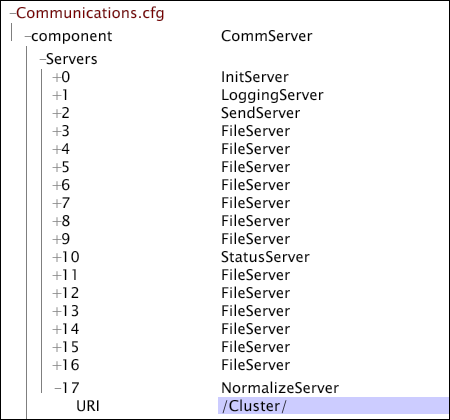

# Configurando uma Unidade de Servidor de Arquivos do Data Workbench Server{#configuring-a-data-workbench-server-file-server-unit}

Informações sobre as unidades do servidor de arquivos do Insight Server e o processo de configuração do servidor de arquivos.

<!--
c_abt_file_svr_units.xml
-->

Você pode configurar o servidor de análise de big data (InsightServer64.exe) para ser executado como uma Unidade de Servidor de Arquivos (FSU), completando os parâmetros no nó **[!UICONTROL Log Sources]** > **[!UICONTROL Log Server]** do [!DNL Log Processing.cfg] arquivo. Quando o servidor de análise de big data está configurado para ser executado como um FSU, ele armazena arquivos de origem (arquivos, arquivos de texto ou arquivos XML) que podem ser acessados rapidamente por vários servidores de processamento (DPUs). [!DNL .vsl] Quando as DPUs em um cluster de servidores de análise de big data acessam o FSU para ler os arquivos de log, elas dividem os arquivos de log entre elas e garantem que o mesmo arquivo não seja processado mais de uma vez.

>[!NOTE]
>
>Ao configurar um FSU que serve um cluster de servidores de análise de big data que consiste de cinco a dez DPUs, você deve tornar o servidor mestre do cluster o FSU.

Para obter informações sobre como instalar um cluster de servidores de análise de big data, consulte o Guia *de Instalação e Administração de Produtos para* Servidor.

<!--
c_file_svr_config_proc.xml
-->

Se o local for um local remoto, a máquina do servidor da análise de big data que está processando os dados se conecta à máquina remota designada para ler os registros.

Na máquina do servidor de análise de big data designada para execução como FSU, o [!DNL Access Control.cfg] arquivo permite que as DPUs se conectem ao FSU e o [!DNL Communications.cfg] arquivo mapeia a localização dos arquivos de dados remotos. As etapas do processo para configurar um FSU são as seguintes:

1. No [!DNL Log Processing.cfg] arquivo do servidor de análise de big data mestre, especifique o tipo de fonte de dados e o local da fonte. Consulte [Especificação da fonte](../../../home/c-dataset-const-proc/c-log-proc-config-file/c-ins-svr-file-svr-unit.md#section-d2b545db7ab142ffb4be32e040395383)de dados.

1. No [!DNL Access Control.cfg] arquivo no FSU, edite as permissões para permitir que as DPUs se conectem ao FSU para ler os dados de log. Consulte [Editando as permissões na unidade](../../../home/c-dataset-const-proc/c-log-proc-config-file/c-ins-svr-file-svr-unit.md#section-b4a54b591b4e4435a728a67f194057ef)do servidor de arquivos.

1. No [!DNL Communications.cfg] arquivo do FSU, edite as configurações para as entradas [!DNL LoggingServer] e [!DNL FileServer] para especificar o local dos arquivos de log. Consulte [Especificação do local dos arquivos](../../../home/c-dataset-const-proc/c-log-proc-config-file/c-ins-svr-file-svr-unit.md#section-f9a649bf1b2544feb10ad8820384edb0)de log.

1. Se você estiver configurando seu perfil de conjunto de dados para ser executado em um cluster de servidores de análise de big data, também deverá tornar o FSU do cluster no servidor em que todas as dimensões do perfil são construídas:
(Somente para clusters de servidores de análise de big data) Nos arquivos [!DNL Communications.cfg] e [!DNL cluster.cfg] no FSU, adicione entradas para um &quot;servidor normalizado&quot; para tornar o FSU o servidor dentro do cluster onde todas as dimensões são construídas. Consulte [Criação de um Servidor de Normalização Centralizado para um Cluster](../../../home/c-dataset-const-proc/c-log-proc-config-file/c-ins-svr-file-svr-unit.md#section-2c1f57b683f94cc193bc069e886bba28).

Para obter instruções sobre como configurar um perfil de conjunto de dados a ser processado por um cluster de servidores de análise de big data, consulte o Guia *de Instalação e Administração de Produtos para* Servidor.

>[!NOTE]
>
>As instruções a seguir pressupõem que todos os arquivos de registro residam no diretório padrão. Se desejar armazenar logs em outro diretório ou criar vários caminhos de log, entre em contato com os Serviços de consultoria da Adobe para discutir sua configuração específica.

## Especificação da fonte de dados {#section-d2b545db7ab142ffb4be32e040395383}

Ao especificar fontes de dados remotas para um conjunto de dados, você deve especificar o tipo de fonte de dados e o local dos arquivos de log no servidor de análise de big data mestre.

**Especificação da fonte de dados e de seu local**

1. Open the [!DNL Log Processing.cfg] file. Consulte [Editando o arquivo](../../../home/c-dataset-const-proc/c-log-proc-config-file/t-edit-log-proc-config-file.md#task-6a2fa1b735cb4eefad730f0a3a7858e5)de configuração de processamento de log.

1. Adicione uma fonte de dados XML, um arquivo de log [!DNL Sensor]ou um arquivo de log. See [Log Files](../../../home/c-dataset-const-proc/c-log-proc-config-file/c-log-sources.md#concept-3d4fb817c057447d90f166b1183b461e).

1. Preencha o parâmetro Caminhos de registro. Consulte Arquivos [de](../../../home/c-dataset-const-proc/c-log-proc-config-file/c-log-sources.md#concept-b25f11c477b54032a15b6117b3bf9009)sensor, Arquivos [de](../../../home/c-dataset-const-proc/c-log-proc-config-file/c-log-sources.md#concept-3d4fb817c057447d90f166b1183b461e)registro ou Fontes [de registro](../../../home/c-dataset-const-proc/c-log-proc-config-file/c-log-sources.md#concept-c7b154e93748447b986e97f6ef688887)XML. Certifique-se de especificar um URI válido.

1. Complete os parâmetros do Servidor de Log definidos na seguinte tabela:

<table id="table_5881B8DEFF984BC7A620CEEA3A637912"> 
 <thead> 
  <tr> 
   <th colname="col1" class="entry"> Parâmetro </th> 
   <th colname="col2" class="entry"> Descrição </th> 
  </tr> 
 </thead>
 <tbody> 
  <tr> 
   <td colname="col1"> Nome </td> 
   <td colname="col2"> Nome que identifica o servidor de arquivos remoto. </td> 
  </tr> 
  <tr> 
   <td colname="col1"> Nome comum do servidor SSL </td> 
   <td colname="col2"> 
  Nome comum do servidor listado no certificado SSL do servidor de arquivos. 
 
 Esse parâmetro é opcional se  Usar SSL estiver definido como falso. 
 </td> 
  </tr> 
  <tr> 
   <td colname="col1"> Endereço </td> 
   <td colname="col2"> 
Endereço da máquina do servidor de arquivos. Pode ser deixado em branco se o  Nome corresponder ao Nome  Comum do ServidorSSL. 
 
 Por exemplo:  visual.mycompany.com ou 192.168.1.90. 
 </td> 
  </tr> 
  <tr> 
   <td colname="col1"> Porta </td> 
   <td colname="col2"> Porta pela qual a máquina do servidor de análise de big data se comunica com o servidor de arquivos. </td> 
  </tr> 
  <tr> 
   <td colname="col1"> Certificado de cliente SSL </td> 
   <td colname="col2"> Nome do arquivo de certificado  SSL para o servidor de análise de big data ( server_cert.pem). </td> 
  </tr> 
  <tr> 
   <td colname="col1"> Usar SSL </td> 
   <td colname="col2"> Verdadeiro ou falso. True indica que o servidor de arquivos usa  SSL. </td> 
  </tr> 
 </tbody> 
</table>

Se um servidor proxy for necessário para que as DPUs se conectem ao FSU, você precisará concluir os seguintes parâmetros:

| Parâmetro | Descrição |
|---|---|
| Endereço proxy | O endereço de um servidor proxy que o servidor da análise de big data deve usar para acessar o servidor de arquivos. |
| Senha do proxy | Opcional. A senha para o servidor proxy. |
| Porta proxy | A porta do servidor proxy. O padrão é 8080. |
| Nome do usuário proxy | Opcional. O nome de usuário do servidor proxy. |

Veja a seguir um exemplo de um definido [!DNL Log Server] no [!DNL Log Processing.cfg] arquivo. A Fonte de Log nº 1 é uma fonte LogFile que aponta para um diretório chamado Logs (observe o URI especificado no parâmetro Caminhos de Log) na máquina chamada FSU01.

## Editando as permissões na unidade do servidor de arquivos {#section-b4a54b591b4e4435a728a67f194057ef}

No processo anterior, você configurava um perfil para um dado conjunto de dados para ler arquivos de log de um FSU. Agora você deve editar as permissões no FSU para permitir conexões das DPUs que estão executando o perfil. As etapas a seguir o orientam na edição do arquivo de permissões [!DNL Access Control.cfg].

**Para editar permissões no FSU**

1. Abra o [!DNL Server Files Manager] para a máquina do servidor da análise de big data que você está configurando como FSU e clique em **[!UICONTROL Access Control]** para mostrar seu conteúdo.

   Para obter informações sobre como abrir e trabalhar com o [!DNL Server Files Manager], consulte o Guia *do usuário da Análise de* big data.

1. Na [!DNL Server Files Manager] janela, clique **[!UICONTROL Access Control]** para mostrar seu conteúdo. O [!DNL Access Control.cfg] arquivo está localizado dentro deste diretório.

1. Clique com o botão direito do mouse na marca de seleção na coluna de nome do servidor para [!DNL Access Control.cfg]e clique em **[!UICONTROL Make Local]**. Uma marca de seleção é exibida na [!DNL Temp] coluna para [!DNL Access Control.cfg].

1. Clique com o botão direito do mouse na marca de seleção recém-criada na [!DNL Temp] coluna e clique em **[!UICONTROL Open]** > **[!UICONTROL in Workstation]**.

1. Na [!DNL Access Control] janela, clique **[!UICONTROL Access Control Groups]** para mostrar seu conteúdo.

1. Clique com o botão direito do mouse no rótulo numérico da versão final [!DNL AccessGroup] na lista e clique em **[!UICONTROL Add new]** > **[!UICONTROL Group]**.

1. Insira um [!DNL Name] para o novo [!DNL AccessGroup]. Exemplo: Conectando servidores.

1. Clique com o botão direito do mouse **[!UICONTROL Member]** sob a nova [!DNL AccessGroup], em seguida, clique em **[!UICONTROL Add new]** > **[!UICONTROL Member]**.

1. Insira o endereço IP da DPU do servidor da análise de big data que se conecta a esse servidor de arquivos.
1. Repita as etapas 4 e 5 para quaisquer DPUs de servidor de análise de big data que se conectem a esse FSU, incluindo as DPUs de servidor de análise de big data em um cluster que devem acessar os arquivos de log.
1. Clique com o botão direito do mouse **[!UICONTROL Read-Only Access]** sob a nova [!DNL AccessGroup], em seguida, clique em **[!UICONTROL Add new]** > **[!UICONTROL URI]**.

1. Insira o local dos arquivos de log armazenados na máquina do servidor de arquivos. Use barras (/) na especificação do caminho. O local padrão é /Logs/.
1. Clique com o botão direito do mouse **[!UICONTROL (modified)]** na parte superior da janela e clique em **[!UICONTROL Save]**.

1. Na [!DNL Server Files Manager] janela, clique com o botão direito do mouse na marca de seleção para [!DNL Access Control.cfg] na [!DNL Temp] coluna e, em seguida, clique em **[!UICONTROL Save to]** > **[!UICONTROL server name]** para salvar as alterações feitas localmente no FSU do servidor da análise de big data.

## Especificação do local dos arquivos de registro {#section-f9a649bf1b2544feb10ad8820384edb0}

É necessário editar o [!DNL Communications.cfg] arquivo no FSU para especificar o local dos arquivos de log.

**Especificação do local dos arquivos de log**

1. Na [!DNL Server Files Manager] janela, clique **[!UICONTROL Components]** para mostrar seu conteúdo. O [!DNL Communications.cfg] arquivo está localizado dentro deste diretório.

1. Clique com o botão direito do mouse na marca de seleção na coluna de nome do servidor para [!DNL Communications.cfg]e clique em **[!UICONTROL Make Local]**. Uma marca de seleção é exibida na [!DNL Temp] coluna para [!DNL Communications.cfg].

1. Clique com o botão direito do mouse na marca de seleção recém-criada na [!DNL Temp] coluna e clique em **[!UICONTROL Open]** > **[!UICONTROL in Workstation.]**.

1. Na [!DNL Communications.cfg] janela, clique **[!UICONTROL component]** para mostrar seu conteúdo.

1. Na [!DNL Communications.cfg] janela, clique **[!UICONTROL Servers]** para mostrar seu conteúdo. Vários servidores podem ser exibidos: Servidores de arquivos, servidores de registro, servidores de inicialização, servidores de status, servidores de envio ou servidores de replicação.

1. (Somente para fontes de [!DNL Sensor] log) Localize o [!DNL LoggingServer], que é o local onde [!DNL Sensor] grava seus arquivos de log a serem processados pelo servidor da análise de big data, em seguida, clique em seu número para exibir o menu. Edite o parâmetro Diretório de log para refletir o local desejado dos arquivos de log. O diretório de log padrão é a pasta Logs no diretório de instalação do servidor do banco de dados.

   Não modifique nenhum outro parâmetro para o [!DNL LoggingServer].

   

1. Localize o FileServer que especifica o local dos arquivos de log. Pode haver vários servidores de arquivos listados em Servidores, portanto, talvez seja necessário exibir o conteúdo de muitos deles (clicando no número do servidor) para encontrar o servidor desejado.
1. Edite os parâmetros [!DNL Local Path] e URI do FileServer para refletir a localização dos arquivos de log. O exemplo a seguir mostra que os arquivos de log residem na pasta Logs dentro do diretório de instalação do servidor da análise de big data:

   

   >[!NOTE]
   >
   >Se os parâmetros [!DNL Local Path] e URI forem preenchidos como mostrado, você poderá acessar os arquivos de log no FSU a partir de qualquer servidor de análise de big data clicando [!DNL Logs] no [!DNL Server Files Manager].

1. Clique com o botão direito do mouse **[!UICONTROL (modified)]** na parte superior da janela de configuração e clique em **[!UICONTROL Save]**.

1. Na [!DNL Server Files Manager] janela, clique com o botão direito do mouse na marca de seleção para [!DNL Communications.cfg] na [!DNL Temp] coluna, em seguida, clique em **[!UICONTROL Save to]** > *&lt;**[!UICONTROL server name]**>* para salvar as alterações feitas localmente no FSU do servidor da análise de big data.

## Criando um Servidor de Normalização Centralizado para um Cluster {#section-2c1f57b683f94cc193bc069e886bba28}

Se você estiver configurando seu perfil de conjunto de dados para ser executado em um cluster de servidores de análise de big data, você deverá tornar o FSU do cluster o servidor em que todas as dimensões do perfil são construídas.

A Adobe recomenda enfaticamente que o FSU do cluster funcione como o servidor mestre do cluster e seu servidor de normalização centralizado.

Para tornar o FSU o servidor de normalização centralizado, você deve abrir e editar os arquivos [!DNL Communications.cfg] e [!DNL Cluster.cfg] no FSU.

**Para tornar o FSU o servidor de normalização centralizado**

1. Adicione uma [!DNL NormalizeServer] entrada ao [!DNL Communications.cfg] arquivo no FSU.

   >[!NOTE]
   >
   >Se você instalou o pacote de versão completo para o servidor de análise de big data v5.0 ou posterior, o [!DNL Communications.cfg] arquivo no FSU já deve ter uma [!DNL NormalizeServer] entrada. Você pode seguir as etapas abaixo para confirmar que a entrada existe.

   1. Abra o [!DNL Communications.cfg] arquivo na análise de big data, conforme descrito em [Especificação do local dos arquivos](#section-f9a649bf1b2544feb10ad8820384edb0)de log.

   1. Clique em **[!UICONTROL component]** para mostrar seu conteúdo.
   1. Clique com o botão direito do mouse **[!UICONTROL Servers]** e clique em **[!UICONTROL Add New]** > **[!UICONTROL Centralized Normalization Server]**.

   1. No parâmetro URI para o [!DNL NormalizeServer], digite [!DNL /Cluster/].

      

   1. Clique com o botão direito do mouse **[!UICONTROL (modified)]** na parte superior da janela e clique em **[!UICONTROL Save]**.

   1. Na [!DNL Server Files Manager] janela, clique com o botão direito do mouse na marca de seleção para [!DNL Communications.cfg] na [!DNL Temp] coluna e clique em **[!UICONTROL Save to]** > *&lt;**[!UICONTROL server]**>* nome para salvar as alterações feitas localmente no FSU do servidor da análise de big data.

1. Defina o servidor de normalização centralizado no [!DNL Cluster.cfg] arquivo no servidor mestre em seu cluster de servidores de análise de big data.

   >[!NOTE]
   >
   >Se o FSU no qual você está configurando seu servidor de normalização centralizado não for o servidor de análise de big data mestre em seu cluster, você deverá adicionar os endereços IP das DPUs no cluster ao grupo de [!DNL Cluster Servers] acesso no [!DNL Access Control.cfg] arquivo do FSU. Para obter instruções para adicionar servidores ao [!DNL Cluster Servers] grupo, consulte Atualização do Arquivo de Controle de Acesso para uma seção Cluster no Guia de Instalação e Administração de Produtos para *Servidor.*

   1. Abra o [!DNL Profile Manager] seu perfil de conjunto de dados e clique **[!UICONTROL Dataset]** para mostrar seu conteúdo. O [!DNL Cluster.cfg] arquivo está localizado dentro deste diretório.

   1. Clique com o botão direito do mouse na marca de seleção ao lado de [!DNL Cluster.cfg]e clique em **[!UICONTROL Make Local]**. Uma marca de seleção para este arquivo é exibida na [!DNL User] coluna.

   1. Clique com o botão direito do mouse na marca de seleção recém-criada e clique em **[!UICONTROL Open]** > **[!UICONTROL in Notepad]**.

   1. Adicione o texto realçado no seguinte fragmento de arquivo:

      [!DNL Cluster = ClusterConfig:]

      [!DNL Normalize Server = serverInfo:]

      [!DNL Address = string:]

      [!DNL Port = int: 80]

      [!DNL SSL Server Common Name = string: server common name]

      [!DNL Use SSL = bool: false]

      >[!NOTE]
      >
      >Quando você insere o nome comum do FSU para o parâmetro SSL Server Common Name, o FSU usa seu [!DNL .address] arquivo para resolver o nome comum. Para obter informações sobre o [!DNL .address] arquivo, consulte o Guia *de Instalação e Administração de Produtos para* Servidor.

   1. Salve o arquivo.
   1. Na [!DNL Profile Manager], clique com o botão direito do mouse na marca de seleção para [!DNL Cluster.cfg] na [!DNL User] coluna e, em seguida, clique em **[!UICONTROL Save to]** > ***[!UICONTROL dataset profile name]*** para salvar as alterações feitas localmente no perfil do conjunto de dados.
