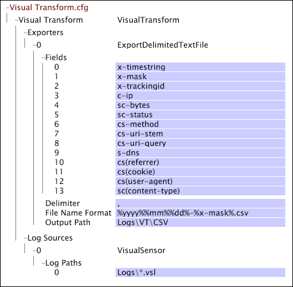

# Exemplo de arquivos Transform.cfg do Data Workbench{#sample-data-workbench-transform-cfg-files}

Informações sobre como especificar parâmetros no arquivo Transform.cfg com base nos vários cenários.

* [Um arquivo Transform.cfg de Insight simples](../../../../../home/c-dataset-const-proc/c-transf-func/c-config-files-transf/t-ins-transf-file/c-sample-transf-files.md#section-b7e83cafa3a947c597bd09d316930190)
* [Saída com valores separados por vírgula](../../../../../home/c-dataset-const-proc/c-transf-func/c-config-files-transf/t-ins-transf-file/c-sample-transf-files.md#section-03916934ad574efc8695abbae54a1816)
* [Arquivos de registro de exemplo](../../../../../home/c-dataset-const-proc/c-transf-func/c-config-files-transf/t-ins-transf-file/c-sample-transf-files.md#section-113b3b0c0c7547ea9536bb2f465c0875)
* [Divisão de arquivos de log por seção do site](../../../../../home/c-dataset-const-proc/c-transf-func/c-config-files-transf/t-ins-transf-file/c-sample-transf-files.md#section-2cac205cd3934d31abb6c6ed8780196d)

Em cada amostra, o arquivo é exibido como uma janela [!DNL Transform.cfg] no Data Workbench.

## Um arquivo Transform.cfg de Data Workbench simples {#section-b7e83cafa3a947c597bd09d316930190}

A janela [!DNL Transform.cfg] a seguir fornece instruções para ler arquivos [!DNL .vsl] do diretório [!DNL Logs] e exportar os campos x-timestring e x-trackingid para um arquivo de texto armazenado no diretório Logs\VT. Como nenhum período de rotação de arquivo ou formato de nome de arquivo de saída é especificado, cada arquivo contém dados para um dia de calendário e tem um nome no formato padrão [!DNL %yyyy%%mm%%dd%-%x-mask%.txt].

## Saída com valores separados por vírgula {#section-03916934ad574efc8695abbae54a1816}

A janela [!DNL Transform.cfg] a seguir fornece instruções para ler arquivos [!DNL .vsl] do diretório Logs e exportar campos de 0 a 13 para um arquivo delimitado por vírgulas ( [!DNL .csv]) armazenado na pasta Logs\VT\CSV directory. Como nenhum período de rotação de arquivo é especificado, cada arquivo contém dados de um dia de calendário. Os arquivos de saída são [!DNL .csv] arquivos nomeados no formato [!DNL %yyyy%%mm%%dd%-%x-mask%.csv].

## Arquivos de registro de exemplo {#section-113b3b0c0c7547ea9536bb2f465c0875}

Você pode configurar a funcionalidade de transformação para criar e manter uma versão atualizada e compacta dos arquivos de log completos. Isso permite que você teste suas configurações de conjunto de dados rapidamente, com tempos de reprocessamento de segundos ou minutos em vez de horas necessárias para reprocessar todo o conjunto de dados. O exemplo a seguir fornece um exemplo de como configurar a funcionalidade de transformação para fazer isso.

A janela [!DNL Transform.cfg] a seguir fornece instruções para ler arquivos [!DNL .vsl] do diretório Logs e exportar os campos x-timestring e x-trackingid para um arquivo de texto armazenado no diretório Logs\VT. O Limite de Hash especificado filtra determinadas IDs de rastreamento do conjunto de dados, criando, assim, um conjunto de dados que é amostrado por um fator de 100. Como nenhum período de rotação de arquivo é especificado, cada arquivo contém dados de um dia de calendário. Os nomes dos arquivos de saída estão no formato padrão [!DNL %yyyy%%mm%%dd%-%x-mask%.txt].

## Divisão de arquivos de log por seção do site {#section-2cac205cd3934d31abb6c6ed8780196d}

A janela [!DNL Transform.cfg] a seguir fornece instruções para ler [!DNL .vsl]arquivos do diretório Logs e exportar os campos x-timestring e x-trackingid para um arquivo de texto armazenado no diretório Logs\VT. A transformação da expressão regular ( [!DNL RETransform]) assume como entrada o campo cs-uri-stem e cria um novo campo (x-site) que define uma seção do site. O campo x-site é incluído no nome dos arquivos de texto de saída, cada um dos quais contém dados de um dia de calendário.

