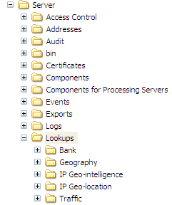

# Instalação dos arquivos de pesquisa geográfica{#installing-the-geography-lookup-files}

Etapas para instalar os arquivos de pesquisa Geografia no servidor da análise de big data.

O arquivo de pesquisa [!DNL (Lookups\Geography\DMA.txt]) fornecido com o [!DNL Geography] perfil é um arquivo de texto delimitado por tabulação de duas colunas que lista os códigos DMA (área de mercado designada) e os nomes correspondentes.

1. Abra a pasta Pesquisas a partir do arquivo [!DNL .zip] fornecido a você pela Adobe.
1. Copie a pasta Geografia para a pasta Pesquisas no diretório de instalação do servidor da análise de big data. Você quer acabar com um ...\Lookups\Geography folder on your data workbench server as shown in the following example. Os nomes das outras pastas dentro da pasta Pesquisas podem diferir dos mostrados.

   

