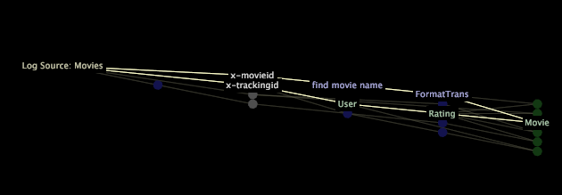

# Exibir componentes do perfil{#display-profile-components}

Você pode optar por exibir os componentes do conjunto de dados do seu perfil, os componentes do modelo de consulta ou espaços de trabalho, relatórios, opções de menu e camadas de globo no mapa de dependência.

**Para selecionar os componentes a serem exibidos**

1. Clique com o botão direito do mouse no mapa de dependências e clique em **[!UICONTROL Display]**.
1. Escolha uma ou mais das seguintes opções para exibir no mapa. Um X é exibido à esquerda de cada opção de exibição habilitada.

   * **** Os conjuntos de dados exibem os componentes do conjunto de dados. Consulte [Componentes do conjunto de dados](../../../../../home/c-get-started/c-admin-intrf/c-dataset-mgrs/c-dep-maps/c-dataset-comp.md#concept-4afe28ad29d14eca8a5000847254c293). Se você optar por exibir os componentes do conjunto de dados, terá a opção de [!DNL Include File Blocks] no mapa. Consulte [Trabalhar com blocos de arquivo](../../../../../home/c-get-started/c-admin-intrf/c-dataset-mgrs/c-dep-maps/c-wkg-file-blocks.md#concept-3652bbabfbd34449a5f842d8aa598efc).

   * **Consulta** de modelo para exibir componentes do modelo de consulta. Consulte [Componentes do Modelo de Consulta](../../../../../home/c-get-started/c-admin-intrf/c-dataset-mgrs/c-dep-maps/c-qry-mod-comp.md#concept-32c6dadd32f74179b026c7e96d47710f).

   * **Espaços de trabalho e** Visualizações para exibir espaços de trabalho, relatórios, opções de menu e camadas de globo. Consulte [Espaços de trabalho e Visualizações](../../../../../home/c-get-started/c-admin-intrf/c-dataset-mgrs/c-dep-maps/c-wksps-vis.md#concept-abbd4fb115ff47f49f879466ce274921). Essa opção funciona somente se a opção de exibição [!DNL Query Model] estiver ativada.

>[!NOTE]
>
>Se a opção de exibição [!DNL Query Model] não estiver ativada ao escolher a opção de exibição [!DNL Workspaces and Visualizations], uma mensagem de erro será exibida.

Se não conseguir ver todos os nós no mapa, você pode mover o mapa, aumentar ou diminuir o zoom para exibir o mapa inteiro ou para se concentrar em uma seção específica. Para obter mais informações sobre zoom, consulte [Zoom em Visualizações](../../../../../home/c-get-started/c-vis/c-zoom-vis.md#concept-7e33670bb5344f78a316f1a84cc20530).

Quando você clica em um nó, todos os nós que dependem desse nó e todos os nós dos quais esse nó depende são realçados e seus nomes são exibidos.

>[!NOTE]
>
>Um caminho destacado em um mapa de dependência não constitui uma seleção.

Ao clicar com o botão direito do mouse em um nó, é possível ver as informações de identificação sobre cada componente mostrado no mapa e escolher as opções de menu que permitem exibir mais detalhes sobre o componente ou editar o componente. Além disso, você pode realizar pesquisas de texto e exibir informações de desempenho para transformações e dimensões estendidas.
