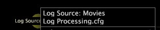

# Ver detalhes do nó{#view-node-details}

Informações sobre a exibição de informações de identificação sobre um componente de perfil.

* Clique com o botão direito do mouse no nó desejado e exiba as informações de identificação na parte superior da janela. As informações de identificação que você vê dependem do tipo de componente.

**Fonte de log**

O nome da fonte de log e o nome do arquivo no qual a fonte de log é definida.

**Campo**

O nome do campo.

**Transformação**

O tipo e o nome da transformação, o nome do arquivo no qual a transformação é definida e o número da transformação no arquivo.

>[!NOTE]
>
>As informações de desempenho para a transformação são exibidas somente se a opção [!DNL Show Performance Data] estiver habilitada para o mapa de dependência. Para obter mais informações, consulte [Exibição dos dados de desempenho](../../../../../home/c-get-started/c-admin-intrf/c-dataset-mgrs/c-dep-maps/c-disp-perf-data.md#concept-974e2bac3e184f0dab530e63aa4f5ecb).

**Dimensão estendida**

O nome e o tipo da dimensão estendida, o nome do arquivo no qual a dimensão é definida e o número da dimensão no arquivo.

>[!NOTE]
>
>As informações de desempenho da dimensão estendida são exibidas somente se a opção [!DNL Show Performance Data] estiver habilitada para o mapa de dependência. Para obter mais informações, consulte [Exibição dos dados de desempenho](../../../../../home/c-get-started/c-admin-intrf/c-dataset-mgrs/c-dep-maps/c-disp-perf-data.md#concept-974e2bac3e184f0dab530e63aa4f5ecb).

**Métrica**

O nome da métrica.

**Dimension derivado**

O nome da dimensão derivada.

**Filtro**

Se definido no conjunto de dados, o caminho do arquivo de configuração no qual o filtro é definido e o nome do filtro.

**Espaços de trabalho e relatórios**

O caminho do espaço de trabalho ou relatório no espaço de trabalho ou diretório de relatório do perfil.

**Opções de menu**

O caminho do item de menu no diretório de menu do perfil.

**Para exibir entradas ou saídas de um componente de perfil**

* Clique com o botão direito do mouse no nó desejado e clique em **[!UICONTROL Inputs]** ou **[!UICONTROL Outputs]**. Uma lista de entradas ou saídas é exibida.
