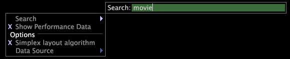

# Pesquisar em um mapa{#search-within-a-map}

Etapas para pesquisar componentes que contêm texto específico.

1. Clique com o botão direito do mouse no mapa de dependência e clique em **[!UICONTROL Search]**.
1. Na caixa de texto, digite o texto para o qual deseja pesquisar.

   

O mapa destaca os nós dos componentes cujos nomes ou configurações de parâmetros contêm o texto de pesquisa.
