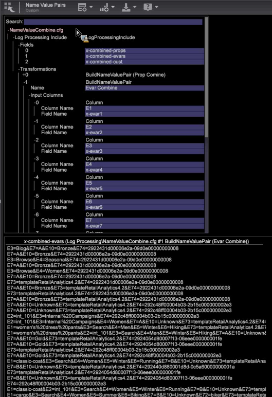

# Agrupamento de sequência de consulta{#query-string-grouping}

O Agrupamento de sequência de caracteres de consulta permite integrar um grande número de campos juntos.

O Agrupamento de sequência de caracteres de consulta é específico para cada perfil, mas funciona bem em transformações, como mostrado neste exemplo:

1. Crie os pares que deseja agrupar adicionando um arquivo de configuração personalizado ( [!DNL E:\...\Dataset\Log Processing\SC Fields.cfg]) e, em seguida, adicionando o Tipo de transformação *BuildNameValuePair* como parâmetro.

   ```
   2 = BuildNameValuePair:  
         Comments = Comment: 0 items 
         Condition = AndCondition: 0 items 
         Delimiter = string:  
         Input Columns = vector: 1 items 
           0 = Column:  
             Column Name = string: e100 
             Field Name = string: x-cust100 
             ...  
     (all the fields you wish to build)
             Name = string: Custom Events 
             Output = string: x-event-list       
   ```

1. Crie um novo arquivo para extrair os dados condensados para os campos que deseja usar adicionando um arquivo de configuração personalizado ( [!DNL E:\...\Dataset\Transformation\SC Fields Transformation.cfg]) e, em seguida, adicionando o Tipo de transformação *ExtractNameValuePairs* como um parâmetro.

   ```
   2 = ExtractNameValuePairs:  
         Comments = Comment: 0 items 
         Condition = AndCondition: 0 items 
         Delimiter = string:  
         Input Field = string: x-event-list 
         Name = string: Custom Events 
         Output Columns = vector: 1 items 
           0 = Column:  
             Column Name = string: e100 
             Field Name = string: x-cust100 
             ...  
     (all the fields you wish to extract) 
             Name = string: Custom Events 
             Output = string: x-event-list   
   ```

## Outras utilizações {#section-cc5d2b0c9e194fc88a5a18a06ef22f5e}

Se você tiver muitos campos com evars, props e variáveis personalizadas, durante o processamento de log você pode criar um par de valores de nome para combinar campos em um relatório. Por exemplo, é possível criar pares de valores nomeados em campos combinados para reduzir o tamanho do [!DNL tempDB] arquivo.


