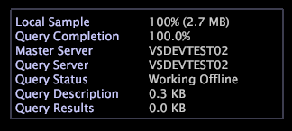

# Legenda do status da consulta{#query-status-legend}

A Legenda do status da consulta fornece informações detalhadas sobre as consultas que você está realizando.

A tabela a seguir lista as tarefas que podem ser concluídas usando o [!DNL Query Status Legend].

<table id="table_BD9330D4B3014A84B24EF0E71872F627"> 
 <thead> 
  <tr> 
   <th colname="col1" class="entry"> Para executar esta tarefa... </th> 
   <th colname="col2" class="entry"> Ação... </th> 
  </tr> 
 </thead>
 <tbody> 
  <tr> 
   <td colname="col1"> 
Para ver a proporção do tamanho da amostra local com o tamanho geral do conjunto de dados seguido do tamanho em MB da amostra local 
 </td> 
   <td colname="col2"> 
Visualize o campo Amostra  local. 
 </td> 
  </tr> 
  <tr> 
   <td colname="col1"> 
Para ver a porcentagem mínima concluída de todas as consultas atuais 
 </td> 
   <td colname="col2"> 
Exibir o campo Conclusão  da consulta. 
 </td> 
  </tr> 
  <tr> 
   <td colname="col1"> 
Para identificar o servidor mestre para um cliente em um cluster 
 </td> 
   <td colname="col2"> 
Visualize o campo Servidor  mestre. 
 </td> 
  </tr> 
  <tr> 
   <td colname="col1"> 
Para determinar o tamanho de uma consulta 
 </td> 
   <td colname="col2"> 
Exibir o campo  Resultados da consulta. Este campo mostra o tamanho da consulta atual e fornece uma maneira de ver quanto de impacto é feito no tamanho da consulta adicionando (ou removendo) uma métrica, fazendo uma seleção ou fazendo qualquer outra alteração no seu espaço de trabalho. 
 </td> 
  </tr> 
 </tbody> 
</table>

