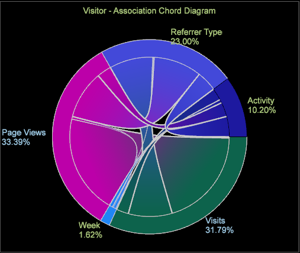

# Visualização de Corda de Associação{#association-chord-visualization}

A visualização de Corda de Associação permite mostrar a proporção e a associação entre métricas, dimensões e elementos, exibindo acordes maiores como uma indicação de uma associação mais forte.

A Tabela de associações compara os valores com o cálculo V de Cramer em vez de usar o coeficiente de correlação de Pearson, como empregado nas visualizações de Matriz [de](/help/home/c-get-started/c-analysis-vis/c-correlation-analysis/c-correlation-analysis.md) correlação e Correlação de [corda](/help/home/c-get-started/c-analysis-vis/associations-visualization.md) (esses valores podem apenas comparar métricas, enquanto a Tabela de associação e a Corda podem comparar métricas, dimensões e elementos). O Cord de associações também fornece outra exibição em uma Tabela [de](../../../home/c-get-started/c-analysis-vis/associations-visualization.md#concept-9d937dda38174875b32095c6eaf22f2f)associações previamente criada.

**Para criar um Acorde de Associação**

1. Em uma área de trabalho, clique com o botão direito do mouse em **Visualização > Análise preditiva > Corda** de associação.

   Um menu será aberto permitindo que você selecione uma dimensão estendida na lista.

   

   Depois de selecionada, a Tabela de Associação em branco será aberta com a Dimensão selecionada identificada no título. 

1. **Selecione uma métrica, dimensão ou elemento** de dimensão.

   Clique com o botão direito do mouse na visualização do acorde e selecione **Adicionar métrica** ou **Adicionar dimensão**. Selecione itens no menu para adicionar ao acorde.

   Também é possível arrastar métricas e dimensões do **[!UICONTROL Finder]** clicando **[!UICONTROL Ctrl-Alt]** e arrastando métricas e dimensões para o acorde. Ou arraste os elementos de dimensão diretamente de uma tabela aberta para a visualização de acorde.

1. **Escolha métricas, dimensões e elementos adicionais para associar**.

   Depois que dois ou mais valores forem selecionados, o gráfico será atualizado automaticamente e começará a exibir os dados de associação. Continue adicionando métricas conforme necessário para associar pontos de dados.

   

   A visualização de Corda exibe a proporção do todo representado pela área de cada segmento. Continue a adicionar métricas/dimensões/elementos conforme necessário para identificar e investigar relações significativas.

1. **Visualize a visualização** de Corda.

   Passe o cursor do mouse sobre cada valor na visualização para ver os relacionamentos.

1. **Alterar Configurações.** Clique com o botão direito do mouse na visualização do acorde para abrir um menu para alterar a métrica, a dimensão ou os elementos exibem as dimensões como números absolutos ou percentuais, remova a métrica selecionada ou todas as métricas, edite cores e detalhes e exporte valores para uma Tabela de associações.

**Para criar um Acorde de Associação a partir de uma Tabela de Associação:**

1. Abra uma visualização da Tabela **de** associação.
1. Clique com o botão direito do mouse e selecione **Exportar visualização** de corda. Um diagrama de Corda de Associação será aberto com valores selecionados na Tabela de Associação. 

>[!IMPORTANT]
>
>Exportar uma Tabela de Associação a partir de um Diagrama de Corda de Associação que contenha pelo menos uma métrica resultará em elementos duplicados nas linhas/colunas da Tabela de Associação. Para evitar elementos duplicados, crie uma nova Tabela de Associação e adicione os elementos desejados em vez de exportar os elementos de um Diagrama de Corda de Associação.

