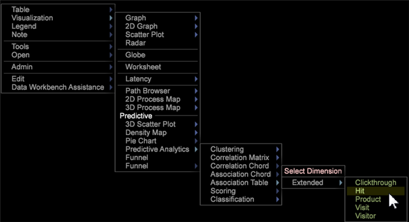

# Visualização da tabela de associação{#association-table-visualization}

A visualização da Tabela de associação permite associar métricas a métricas, dimensões e elementos de dimensão usando o algoritmo V de Cramer.

A Tabela de Associação compara os valores com o cálculo V de Cramer em vez de usar o coeficiente de correlação de Pearson, como usado nas visualizações de Matriz [de](https://docs.adobe.com/content/help/en/data-workbench/using/client/analysis-visualizations/correlation-analysis/c-correlation-analysis.html) Correlação e Corda [de](https://docs.adobe.com/content/help/en/data-workbench/using/client/analysis-visualizations/c-chord-visualization.html) Correlação (esses valores podem apenas comparar métricas, enquanto a Tabela de Associação e o Corda [de](../../../home/c-get-started/c-analysis-vis/associations-chord.md#concept-51d0bda998474dd5946cc2a9b8393445) Associação podem comparar métricas, dimensões e elementos).

## Criar uma tabela de associação {#section-87ed12ccc1af4196a1b6534e621c4cbb}

A Tabela de Associação compara métricas em uma dimensão contável ou não contável. A tabela pode ser modificada para realçar associações dentro da visualização por meio da seleção de cores ou para renderizá-la como um mapa de texto, mapa de calor ou ambos.

1. Abra uma Tabela de Associação.

   Clique com o botão direito do mouse em [!DNL Visualization] > [!DNL Predictive Analytics] > [!DNL Association Table].

   

1. Selecione uma dimensão estendida: uma dimensão de Click-through, Ocorrência, Produto, Visita ou Visitante. Uma Tabela de Associação será aberta com a dimensão estendida identificada no canto e sua métrica associada colocada na linha e na coluna.

   

   A Tabela de associações usa o V de Cramer como uma correlação simétrica, resultando em valores de métricas, dimensões e elementos selecionados refletidos nas colunas e linhas de uma Tabela de associação. Por exemplo, selecionar a dimensão estendida **Produto** usa a **[!UICONTROL Visits]** métrica como a métrica associada na linha e na coluna da tabela, resultando em uma comparação perfeita, mas inútil (1,00), pois os valores comparados são idênticos.

1. Adicione mais valores à Tabela de Associação.

   Clique com o botão direito do mouse em uma coluna ou linha e selecione **Adicionar métrica** ou **Adicionar dimensão**. Também é possível arrastar métricas e dimensões de um painel do **Finder** . Os elementos de dimensão também podem ser arrastados e soltos de uma tabela aberta para a visualização da tabela.

   

   >[!NOTE]
   >
   >Há um limite de dez linhas e colunas permitidas na Tabela de Associação.

