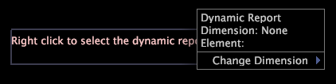

# Anotações de título dinâmicas{#dynamic-title-annotations}

Usando o Relatório, você pode gerar relatórios dinamicamente para os elementos de dimensão especificados em um arquivo de pesquisa ou para um número específico de elementos de dimensão, como para os usuários com as 10 contagens de ordem mais altas.

Usando uma anotação de título dinâmica, você pode exibir um título em um relatório dinâmico que identifica o nome do elemento de dimensão que está sendo processado no momento ou o nome do elemento de dimensão que você selecionou para exibir. [!DNL Report] As anotações dinâmicas de título permitem identificar quais dados de elemento você está visualizando no relatório sem alterar nenhuma das outras visualizações ou classificar acidentalmente uma seleção por um elemento específico.

>[!NOTE]
>
>Essa funcionalidade está disponível somente quando você possui uma licença [!DNL Report]. Para obter mais informações sobre [!DNL Report], consulte o Guia *de relatórios da Análise de* big data.

Para obter mais informações sobre a geração dinâmica de relatórios, consulte o Guia *de relatórios do* Insight.

**Para configurar uma anotação de título dinâmica**

* Clique com o botão direito do mouse na anotação dinâmica do título e clique em **[!UICONTROL Change Dimension]** > *&lt;**[!UICONTROL dimension name]**>*.

   

* Para exibir as informações de um elemento específico, clique **[!UICONTROL Change Element]** e clique no elemento desejado para visualizar o relatório desse elemento específico.

   

   **Exportar para o Microsoft Excel**

   Para obter informações sobre como exportar janelas, consulte [Exportar dados](../../../../home/c-get-started/c-wk-win-wksp/c-exp-win-data.md#concept-8df61d64ed434cc5a499023c44197349)da janela.

