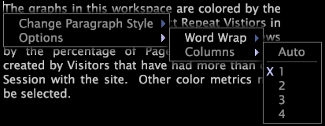

# Anotações de texto{#text-annotations}

As anotações de texto são janelas nas quais você pode inserir texto arbitrário para adicionar informações descritivas ou comentários a um espaço de trabalho.

Você move ou manipula anotações de texto em um espaço de trabalho da mesma maneira que outros tipos de visualizações. Também é possível formatar a aparência do texto, bem como nomear, editar ou salvar qualquer anotação de texto adicionada a um espaço de trabalho. As anotações de texto também podem ser exportadas para o Microsoft Excel e geradas e distribuídas por [!DNL Report].

Para obter mais informações sobre [!DNL Reports], consulte o *Guia do Relatório de Insight*.

## Adicionar ou editar texto {#section-8ecc44e0eeb24c5990050102013c0aed}

* Clique no corpo do texto para entrar no modo de edição e começar a digitar.

   >[!NOTE]
   >
   >As anotações de texto oferecem suporte a recursos básicos de edição, incluindo recortar (Ctrl+x), copiar (Ctrl+c), colar (Ctrl+v), desfazer (Ctrl+z), refazer (Ctrl+Shift+z), selecionar seção (clicar+arrastar) e selecionar tudo (Ctrl+a). Consulte [Trabalhar com texto no Windows](../../../../home/c-get-started/c-wk-win-wksp/c-work-text-win.md#concept-f1222434bf954767808e94b955945c8d).

## Aplicar formatação aos parágrafos {#section-27744c1589134aa3918aa8787429c0dc}

1. No corpo do texto, clique com o botão direito do mouse no parágrafo que deseja formatar.
1. Clique em **[!UICONTROL Change Paragraph Style]** > *&lt;**[!UICONTROL text style]**>*.

## Aplicar formatação a seleções {#section-4032ecbcc0064e5c96504c15b6f481bf}

1. No corpo do texto, clique e arraste para selecionar o texto que deseja formatar.
1. Clique com o botão direito do mouse na seleção e clique em **[!UICONTROL Change Selection Style]** > *&lt;**[!UICONTROL text style]***.

## Alterar configurações de quebra de linha {#section-56948687d47349fc8ba21e108fd13cc1}

Essa opção controla se e como o texto na anotação envolve as visualizações no espaço de trabalho.

* Clique com o botão direito do mouse no corpo do texto, clique em **[!UICONTROL Options]** > **[!UICONTROL Word Wrap]** e clique na opção desejada:

   * **Nenhum:** essa opção remove o vínculo de palavras dessa anotação.
   * **Ambos os lados:** essa opção permite que o texto dentro da anotação divida em ambos os lados das visualizações no espaço de trabalho.
   * **Melhor Lado:** essa opção permite que o texto dentro da anotação envolva apenas um lado das visualizações no espaço de trabalho.

## Alterar configurações de coluna {#section-5cd3f3d63cf64119a2fcec371e33b734}

Essa opção controla o número de colunas nas quais o texto deve ser exibido na anotação.

* Clique com o botão direito do mouse no corpo do texto, clique em **[!UICONTROL Options]** > **[!UICONTROL Columns]** e clique na opção desejada:

   * **Automático:** essa opção seleciona o layout de coluna mais apropriado para a largura e comprimento do texto.
   * **1-4:** Essas opções permitem exibir o texto em uma, duas, três ou quatro colunas.

## Exportar para o Microsoft Excel {#section-b239057b822348849fd17a83c3a03c22}

Para obter informações sobre como exportar janelas, consulte [Exportar Dados da Janela](../../../../home/c-get-started/c-wk-win-wksp/c-exp-win-data.md#concept-8df61d64ed434cc5a499023c44197349).
