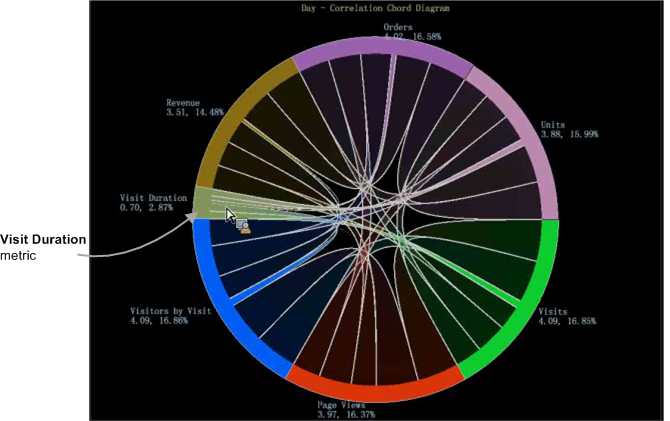

# Exibição de corda{#chord-visualization}

A visualização de Corda permite mostrar a proporção e a correlação entre as métricas, exibindo acordes maiores como uma indicação de uma correlação mais forte.

A visualização de Corda permite que você veja identificar correlações entre métricas, permitindo adicionar e avaliar facilmente possíveis correlações. Também fornece outra visualização em qualquer [Matriz de correlação](https://experienceleague.adobe.com/docs/data-workbench/using/client/analysis-visualizations/correlation-analysis/c-correlation-analysis.html) criada anteriormente. Usando a visualização de Corda, não é possível identificar uma correlação positiva ou negativa entre as métricas. Apenas existe uma correlação. Em certos casos, a determinação de uma relação direta ou inversa pode ser identificada pela aplicação de métricas de contador.

1. **Abra a **[!UICONTROL Chord]**visualização**.

   No espaço de trabalho, clique com o botão direito do mouse em [!DNL Visualization > Predictive Analytics > Chord].

1. **Selecione um Dimension no menu**.

   Uma visualização em branco será aberta e permitirá selecionar uma dimensão. O nome da dimensão aparecerá na parte superior da visualização de acorde em branco.

   >[!NOTE]
   >
   >Se você já tiver uma Matriz de correlação aberta no espaço de trabalho, também poderá renderizá-la como uma visualização de Corda.

1. **Escolha métricas para correlacionar**.

   Arraste métricas do **[!UICONTROL Finder]** clicando em **[!UICONTROL Ctrl-Alt]** para arrastar as métricas da tabela para o gráfico. Depois que duas ou mais métricas forem selecionadas, o gráfico será atualizado automaticamente e começará a exibir os dados de correlação. Continue adicionando métricas conforme necessário para correlacionar pontos de dados.

   

   A visualização de Corda exibe a proporção do todo representado pela área de cada segmento. Continue a adicionar métricas conforme necessário para identificar e investigar relacionamentos significativos.

   

1. **Exibir a visualização Corda**.

   Passe o mouse sobre cada métrica na visualização para ver os relacionamentos. No exemplo, você pode ver uma correlação entre Unidades e a maioria das outras métricas (exceto para a métrica **Duração da visita**).

   

   Ao passar o mouse sobre a métrica **Duração da visita** na visualização de Corda, é possível observar que há pouca ou no máximo baixa correlação entre todas as outras métricas.

   

1. **Alterar Configurações.** Clique com o botão direito do mouse na visualização de Corda para abrir um menu para alterar a dimensão, exibir as dimensões como números absolutos ou percentuais, remover a métrica selecionada ou todas as métricas, editar cores e detalhes e exportar valores para uma Matriz de correlação.

   
