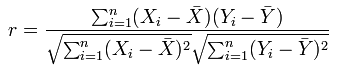

# Sobre o coeficiente de correlação Pearson{#about-the-pearson-correlation-coefficient}

O coeficiente de correlação Pearson é usado na Matriz de correlação como o algoritmo para exibir a força da dependência linear entre duas variáveis.

Essa correlação linear é uma medida estatística da dependência linear, ou correlação, entre duas variáveis para renderizar um valor entre +1 e -1 inclusive, representando uma dependência positiva ou negativa.

Aqui está o coeficiente de correlação Pearson

O valor de Pearson é visualizado na Matriz de correlação, que descreve a correlação entre duas métricas definidas. Essas métricas podem ser comparadas entre si em qualquer dimensão contável ou não contável no conjunto de dados.

Você pode destacar essas comparações usando o seletor de cores ou comparando valores em um mapa de texto e mapa de calor, ou ambos.
