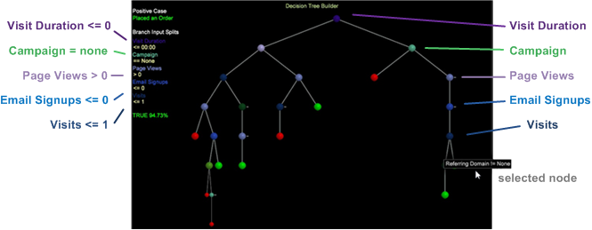
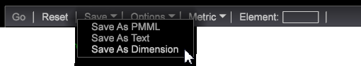

# Criação de uma árvore decisória{#building-a-decision-tree}

Configure uma árvore decisória identificando um caso positivo e adicionando métricas e entradas de dimensão para avaliar os dados e explorar a árvore decisória.

Siga estas etapas para criar uma árvore decisória.

1. Abra um novo espaço de trabalho.

   Depois de abrir um novo espaço de trabalho, talvez seja necessário clicar em **Adicionar** > Desbloquear **** temporariamente.

1. Para abrir o Construtor de árvore decisória, clique com o botão direito do mouse em **[!UICONTROL Visualization]** > Análise **** preditiva > **Classificação** > Construtor **de árvore** decisória.

1. Defina uma **caixa** positiva.

   É possível definir um caso positivo para uma árvore decisória selecionando dimensões em um Localizador ou elementos de dimensão em uma tabela ou projetando um filtro no Filtro de design. Na verdade, o caso positivo pode ser uma combinação de várias seleções na área de trabalho, incluindo filtros, dimensões, elementos e todos os tipos de valores de visualização da Análise de big data.

   * **Projete e aplique um filtro** como um caso positivo. Clique com o botão direito do mouse no espaço de trabalho e selecione **[!UICONTROL Tools]** > **[!UICONTROL Filter Editor]** para projetar e aplicar um filtro.

   * Adicionar **dimensões** como um caso positivo. No espaço de trabalho, clique com o botão direito do mouse e selecione **Ferramentas** > **Localizadores** (ou selecione **[!UICONTROL Add]** > **[!UICONTROL Finders]** no painel esquerdo). Digite um nome de dimensão no campo **Pesquisar** e selecione uma dimensão.

   * Adicione **Métricas** como um caso positivo. Clique com o botão direito do mouse e selecione **Ferramentas** > **Localizadores** ou selecione **[!UICONTROL Add]** > **[!UICONTROL Finders]** no painel esquerdo para abrir uma tabela Métricas. Selecione uma métrica como seu caso positivo.

   * Adicione elementos **de** dimensão como um caso positivo. Clique com o botão direito do mouse na área de trabalho e selecione **[!UICONTROL Table]** para abrir elementos de dimensão, em seguida, selecione um dos elementos de dimensão para definir sua capitalização positiva.

1. Clique em **[!UICONTROL Options]** > **[!UICONTROL Set Positive Case]**.

   Isso define o caso positivo e permite nomeá-lo. O nome aparecerá sob o **[!UICONTROL Positive Case]** cabeçalho no espaço de trabalho.

   >[!NOTE]
   >
   >Quando você define o caso positivo, a Árvore de decisão usa a seleção do espaço de trabalho atual, que pode ser definida como Visitantes (ou qualquer contável de nível superior definido, mas na maioria dos casos Visitantes) que correspondem à seleção atual no espaço de trabalho. Elas se combinam como um único filtro para um único caso positivo (e não vários casos positivos).

   Clicar **[!UICONTROL Set Positive Case]** quando não houver seleção apagará o caso positivo.

1. (opcional) Selecione **[!UICONTROL Set Population Filters]** para definir a população de visitantes a ser classificada.

   Se nenhum filtro de população for aplicado, o conjunto de treinamento será retirado de todos os visitantes (o padrão é &quot;Todos&quot;).

   >[!NOTE]
   >
   >Clique em **[!UICONTROL Show Complex Filter Description]** para exibir os scripts de filtragem para Caso positivo e Filtro de preenchimento.

1. Adicionar **métricas**, **dimensões** e elementos **de** dimensão como entradas.

   É possível selecionar entradas arrastando e soltando dos painéis do Finder ou das tabelas para elementos de dimensão individuais. Você também pode selecionar no **[!UICONTROL Metrics]** menu da barra de ferramentas.

   * Adicionar **métricas** como entradas.

      Selecione Métricas na barra de ferramentas. Pressione **Ctrl** + **Alt** para arrastar uma ou mais métricas para o Construtor de árvore de decisão.

      A métrica aparecerá na lista **** Entrada (Métricas) como uma entrada com codificação de cores exclusiva.

      

   * Adicionar **dimensões** como entradas.

      No espaço de trabalho, clique com o botão direito do mouse e selecione **Ferramentas** > **Localizador** e digite o nome da dimensão no campo **Pesquisar** . Pressione **Ctrl** + **Alt**, selecione uma dimensão e arraste a dimensão para o Construtor de árvore de decisão.

      A dimensão aparecerá na lista **Entrada (Dimensões)** com uma codificação de cores exclusiva.

   * Adicione elementos **de** dimensão como entradas.

      No espaço de trabalho, clique com o botão direito do mouse e selecione uma tabela Dimensão. Selecione Elementos de dimensão, pressione **Ctrl** + **Alt** e arraste os elementos selecionados para o Construtor de árvore de decisão.

      Os elementos de dimensão aparecerão na lista **Entrada (Elementos)** com uma codificação de cores exclusiva.
   >[!IMPORTANT]
   >
   >Você pode selecionar até um máximo de catorze entradas a serem avaliadas. Uma mensagem de erro será exibida se muitas entradas forem adicionadas.

1. Selecione **[!UICONTROL Go]** na barra de ferramentas.

   A árvore decisória será criada com base nas dimensões e métricas selecionadas. Métricas simples, como Adições ao carrinho, serão criadas rapidamente, enquanto dimensões complexas, como Duração da visita com vários pontos de dados, serão criadas mais lentamente com uma porcentagem da conclusão exibida à medida que são convertidas. Em seguida, o mapa de árvore será ameaçado e aberto para interação do usuário. As entradas de dimensão e métrica serão codificadas por cores, consistentes com os nomes dos nós.

   

   O nó folha é exibido como verde (true) ou vermelho (false) se a árvore tiver sido podada e se houver uma previsão de **Verdadeiro** ou **Falso** seguindo os ramos podados.

   >[!NOTE]
   >
   >A amostra de treinamento é extraída do conjunto de dados para que o criador de árvore use. A análise de big data usa 80% da amostra para criar a árvore e os 20% restantes para avaliar a precisão do modelo de árvore.

1. Verifique a precisão usando o **[!UICONTROL Confusion Matrix]**.

   Clique em **[!UICONTROL Options]** > **[!UICONTROL Confusion Matrix]** para exibir os valores de Precisão, Recall, Precision e F-Score. Quanto mais próximo de 100 por cento, melhor a pontuação.

   A Matriz de Confusão fornece quatro contagens de precisão do modelo usando uma combinação de valores:

   * Positivo Real (AP)
   * Positivo Previsto (PP)
   * Negativo Real (AN)
   * Previsto Negativo (PN)
   >[!TIP]
   >
   >Esses números são obtidos pela aplicação do modelo de pontuação resultante dos 20% de dados de teste retidos e já conhecidos como a resposta verdadeira. Se a pontuação for maior que 50 por cento, será previsto como um caso positivo (que corresponde ao filtro definido). Em seguida, precisão = (TP + TN)/(TP + FP + TN + FN), Recall = TP / (TP + FN) e Precision = TP / (TP + FP).

1. **Explore a árvore** decisória.

   Depois de gerar uma árvore decisória, você pode exibir o caminho da previsão e identificar todos os visitantes que atendem aos critérios definidos. A árvore identifica a divisão de entrada para cada ramificação com base em sua posição e codificação por cores. Por exemplo, se você selecionar o nó Domínio de referência, os nós que levam a essa divisão serão listados por código de cor à esquerda da árvore.

   Você pode fazer seleções dos nós de folha para selecionar ramificações (conjuntos de regras) da árvore decisória.

   Neste exemplo: Se a duração da visita for menor que 1, nenhuma campanha existe, pelo menos uma exibição de página existe, nenhuma inscrição por email e pelo menos uma visita. As projeções para esse critério de atendimento e para a realização de um pedido são de **94,73** %.

   

   **Interação** da árvore decisória: Você pode selecionar vários nós na árvore usando o **Ctrl-clique** padrão para adicionar ou **Shift-clique** para excluir.

   **Nós** codificados por cores: A cor dos nós corresponde à cor das dimensões e métricas de entrada, conforme atribuídas pelo Análise de big data.

   Os nós verde-claro e vermelho no nível de folha de um ramo ameaçado predizem o nó como Verdadeiro ou Falso.

   |  Verde brilhante | Identifica se o nó é igual a true e se todas as condições são atendidas. |
   |---|---|
   |  Vermelho brilhante | Identifica se o nó é igual a false e nem todas as condições são atendidas. |

1. **Salve a árvore** decisória.

   É possível salvar a Árvore decisória em diferentes formatos:

   

   * Linguagem de marcação preditiva (**PMML**), um formato de arquivo baseado em XML usado por aplicativos para descrever e trocar modelos de árvore decisória.
   * **Texto** que exibe colunas simples e linhas de true ou false, porcentagens, número de membros e valores de entrada.
   * Uma **Dimensão** com ramificações correspondentes a elementos de resultado previstos.

