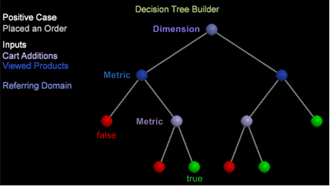

# Criar uma árvore de decisão{#building-a-decision-tree}

{{eol}}

Configure uma Árvore de decisão identificando um caso positivo e adicionando entradas de métrica e dimensão para avaliar os dados e explorar a árvore de decisão.

Siga estas etapas para criar uma árvore decisória.

1. Abra um novo espaço de trabalho.

   Depois de abrir um novo espaço de trabalho, talvez seja necessário clicar em **Adicionar** > **Desbloquear temporariamente**.

1. Para abrir o Construtor de árvore de decisão, clique com o botão direito do mouse **[!UICONTROL Visualization]** > **Análise preditiva** > **Classificação** > **Construtor de árvore de decisão**.

1. Defina um **Caso positivo**.

   Você pode definir um caso positivo para uma árvore de decisão selecionando dimensões em um Localizador ou elementos de dimensão em uma tabela ou projetando um filtro no Filtro de design. Na verdade, o caso positivo pode ser uma combinação de várias seleções no espaço de trabalho, incluindo filtros, dimensões, elementos e todos os tipos de valores de visualização de Data Workbench.

   * **Criar e aplicar um filtro** como um caso positivo. Clique com o botão direito do mouse no espaço de trabalho e selecione **[!UICONTROL Tools]** > **[!UICONTROL Filter Editor]** para criar e aplicar um filtro.

   * Adicionar **Dimension** como um caso positivo. No espaço de trabalho, clique com o botão direito do mouse e selecione **Ferramentas** > **Localizadores** ou selecione **[!UICONTROL Add]** > **[!UICONTROL Finders]** no painel esquerdo). Digite um nome de dimensão no **Pesquisar** e selecione uma dimensão.

   * Adicionar **Métricas** como um caso positivo. Clique com o botão direito do mouse e selecione **Ferramentas** > **Localizadores** ou selecione **[!UICONTROL Add]** > **[!UICONTROL Finders]** no painel esquerdo para abrir uma tabela Métricas . Selecione uma métrica como seu caso positivo.

   * Adicionar **Elementos de Dimension** como um caso positivo. Clique com o botão direito do mouse no espaço de trabalho e selecione **[!UICONTROL Table]** para abrir elementos de dimensão, selecione a partir dos elementos de dimensão para definir sua ocorrência positiva.

1. Clique em **[!UICONTROL Options]** > **[!UICONTROL Set Positive Case]**.

   Isso define o caso positivo e permite nomeá-lo. O nome aparecerá sob a variável **[!UICONTROL Positive Case]** no espaço de trabalho.

   >[!NOTE]
   >
   >Quando você define o caso positivo, a Árvore de decisão usa a seleção do espaço de trabalho atual, que pode ser definida como Visitantes (ou qualquer coisa contável de nível superior é definida, mas na maioria dos casos Visitantes) que correspondem à seleção atual no espaço de trabalho. Eles são combinados como um único filtro para um único caso positivo (não vários casos positivos).

   Clicar **[!UICONTROL Set Positive Case]** quando não houver seleção, o caso positivo será apagado.

1. (opcional) Selecione **[!UICONTROL Set Population Filters]** para definir a população de visitantes a ser classificada.

   Se nenhum filtro de população for aplicado, o conjunto de treinamento será retirado de todos os visitantes (o padrão é &quot;Todos&quot;).

   >[!NOTE]
   >
   >Clique no botão **[!UICONTROL Show Complex Filter Description]** para exibir os scripts de filtragem para Caso positivo e Filtro de população.

1. Adicionar **Métricas**, **Dimension** e **Elementos de Dimension** como entradas.

   Você pode selecionar entradas arrastando e soltando dos painéis do Localizador ou das tabelas para elementos de dimensão individuais. Também é possível selecionar a partir da variável **[!UICONTROL Metrics]** na barra de ferramentas.

   * Adicionar **Métricas** como entradas.

      Selecione Métricas na barra de ferramentas. Press **Ctrl** + **Alt** para arrastar uma ou mais métricas para o Construtor de árvore de decisão.

      A métrica aparecerá no **Lista de entradas (métricas)** como uma entrada com codificação por cores exclusiva.

      

   * Adicionar **Dimension** como entradas.

      No espaço de trabalho, clique com o botão direito do mouse e selecione **Ferramentas** > **Localizador** e digite o nome da dimensão no **Pesquisar** campo. Press **Ctrl** + **Alt**, selecione uma dimensão e arraste a dimensão para o Construtor de árvore de decisão.

      A dimensão aparecerá no **Entrada (Dimension)** lista com um código de cores exclusivo.

   * Adicionar **Elementos de Dimension** como entradas.

      No espaço de trabalho, clique com o botão direito do mouse e selecione uma tabela Dimension. Selecione Elementos de Dimension, pressione **Ctrl** + **Alt** e arraste os elementos selecionados para o Construtor de árvore de decisão.

      Os elementos da dimensão serão exibidos na variável **Entrada (Elementos)** lista com um código de cores exclusivo.
   >[!IMPORTANT]
   >
   >Você pode selecionar até um máximo de catorze entradas a serem avaliadas. Uma mensagem de erro será exibida se forem adicionadas muitas entradas.

1. Selecionar **[!UICONTROL Go]** na barra de ferramentas.

   A árvore de decisão será criada com base nas dimensões e métricas selecionadas. Métricas simples, como Adições ao carrinho, serão criadas rapidamente, enquanto dimensões complexas, como Duração da visita com vários pontos de dados, serão criadas mais lentamente com uma porcentagem da conclusão exibida à medida que são convertidas. O mapa de árvore será então removido e aberto para interação do usuário. As entradas de dimensão e métrica serão codificadas por cores de acordo com os nomes dos nós.

   

   O nó de folha é exibido como verde (true) ou vermelho (false) se a árvore tiver sido podada e se houver uma previsão de **Verdadeiro** ou **Falso** seguindo as ramificações podadas.

   >[!NOTE]
   >
   >A amostra de treinamento é retirada do conjunto de dados para que o criador de árvore use. A Data Workbench usa 80% da amostra para criar a árvore e os 20% restantes para avaliar a precisão do modelo de árvore.

1. Verifique a precisão usando o **[!UICONTROL Confusion Matrix]**.

   Clique em **[!UICONTROL Options]** > **[!UICONTROL Confusion Matrix]** para visualizar os valores de Precisão, Recall, Precisão e Pontuação F. Quanto mais próximo de 100 por cento, melhor a pontuação.

   A Matriz de Confusão fornece quatro contagens de precisão do modelo usando uma combinação de valores:

   * Positivo Real (AP)
   * Positivo previsto (PP)
   * Negativo Real (AN)
   * Previsto Negativo (PN)

   >[!TIP]
   >
   >Esses números são obtidos pela aplicação do modelo de pontuação resultante dos dados de 20% de testes retidos e já conhecidos como a verdadeira resposta. Se a pontuação for maior que 50%, é previsto como um caso positivo (que corresponde ao filtro definido). Em seguida, Precisão = (TP + TN)/(TP + FP + TN + FN), Recall = TP / (TP + FN) e Precision = TP / (TP + FP).

1. **Explore a árvore de decisão**.

   Após gerar uma árvore de decisão, você pode exibir o caminho da previsão e identificar todos os visitantes que atendem aos critérios definidos. A árvore identifica a divisão de entrada para cada ramificação com base em sua posição e codificação por cores. Por exemplo, se você selecionar o nó Domínio de referência, os nós que levam a essa divisão serão listados por código de cor à esquerda da árvore.

   Você pode fazer seleções dos nós de folha para selecionar ramificações (conjuntos de regras) da árvore de decisão.

   Neste exemplo: Se a duração da visita for menor que 1, nenhuma campanha existe, pelo menos uma exibição de página existe, nenhuma assinatura de email e houve pelo menos uma visita. As projeções sobre esses critérios de atendimento e a colocação de um pedido são **94,73** porcentagem.

   

   **Interação da árvore de decisão**: Você pode selecionar vários nós na árvore usando o **Ctrl-clique** para adicionar ou **Clique com a tecla Shift pressionada** para excluir.

   **Nós codificados por cores**: A cor dos nós corresponde à cor das dimensões e métricas de entrada, conforme atribuído pelo Data Workbench.

   Os nós verde-claro e vermelho no nível da folha de um ramo ameaçado prevê o nó como Verdadeiro ou Falso.

   |  Verde claro | Identifica que o nó é igual a true e que todas as condições são atendidas. |
   |---|---|
   |  Vermelho brilhante | Identifica se o nó é igual a false e nem todas as condições são atendidas. |

1. **Salvar a árvore de decisão**.

   É possível salvar a Árvore de decisão em diferentes formatos:

   

   * Linguagem de marcação preditiva (**PMML**), um formato de arquivo baseado em XML usado por aplicativos para descrever e trocar modelos de árvore de decisão.
   * **Texto** exibição de colunas e linhas simples de true ou false, porcentagens, número de membros e valores de entrada.
   * A **Dimension** com ramificações correspondentes a elementos de resultado previstos.
