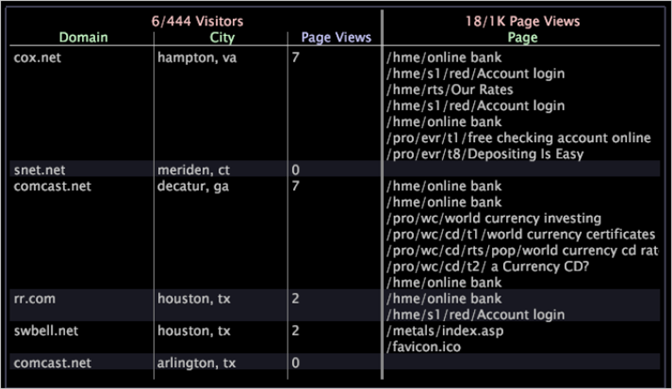

# Tabela de detalhes{#detail-table}

{{eol}}

As tabelas de detalhes permitem exibir informações adicionais sobre um subconjunto de dados, que é definido pelas seleções feitas em outras visualizações.

As informações adicionais que você vê são amostras de todos os dados disponíveis.

A tabela a seguir descreve os elementos de uma tabela de detalhes.

<table id="table_C88C7F7F5AEA4820B908923E45CC0A62"> 
 <thead> 
  <tr> 
   <th colname="col1" class="entry"> Elemento </th> 
   <th colname="col02" class="entry"> Cor do canal </th> 
   <th colname="col2" class="entry"> Descrição </th> 
  </tr> 
 </thead>
 <tbody> 
  <tr> 
   <td colname="col1"> 
Nível 
 </td> 
   <td colname="col02"> 
Rosa 
 </td> 
   <td colname="col2"> 
Qualquer dimensão contável para a qual você deseja exibir informações detalhadas de atributos e métricas. O nível é precedido pelo número de elementos exibidos do número de elementos disponíveis, por exemplo, 6/444 indica que 6 elementos estão sendo exibidos de um possível 444. No exemplo acima, o nível de Visitantes indica que todos os detalhes fornecidos são baseados no visitante. O nível Exibições de página indica que todos os detalhes fornecidos se baseiam na exibição de página. Visualizar vários níveis ao mesmo tempo é útil quando você deseja analisar dados que têm pais contáveis diferentes. 
 </td> 
  </tr> 
  <tr> 
   <td colname="col1"> 
Atributo 
 </td> 
   <td colname="col02"> 
Verde 
 </td> 
   <td colname="col2"> 
Qualquer dimensão que seja um para muitos ou um para um com o nível, como Cidade para Visitantes. Cada linha exibe o elemento relacionado a cada elemento do nível selecionado. No exemplo acima, os atributos Domínio e Cidade listam o domínio e a cidade de cada um dos visitantes de amostra. 
 </td> 
  </tr> 
  <tr> 
   <td colname="col1"> 
Métrica 
 </td> 
   <td colname="col02"> 
Azul 
 </td> 
   <td colname="col2"> 
Detalhes da métrica sobre o nível selecionado. No exemplo acima, com o nível definido como Visitantes, a métrica Exibições de página exibe o número de exibições de página para um visitante individual, enquanto o nível de Exibições de página fornece os detalhes sobre cada uma dessas exibições de página. 
 </td> 
  </tr> 
 </tbody> 
</table>

Digamos que você esteja trabalhando com dados do site e queira descobrir quais páginas os visitantes em cidades específicas e de domínios específicos visitados durante um período específico.

Primeiro, é necessário criar uma visualização que exiba o período em que você está interessado e, em seguida, selecionar esse período. Agora é possível adicionar uma tabela de detalhes para exibir os detalhes desejados para um número de exemplo de visitantes no conjunto de dados.

Para visualizar os detalhes descritos acima, você deve concluir as seguintes etapas:

1. Clique com o botão direito do mouse na tabela de detalhes e clique em **[!UICONTROL Add Level]** > **[!UICONTROL Visitor]**.
1. Clique com o botão direito do mouse na tabela de detalhes e clique em **[!UICONTROL Add Level]** > **[!UICONTROL Page View]**.
1. Clique com o botão direito do mouse no **[!UICONTROL Visitors]** título e clique em nível **[!UICONTROL Add Attribute]** > **[!UICONTROL Geography]** > **[!UICONTROL Domain]**.
1. Clique com o botão direito do mouse no cabeçalho Nível de visitantes e clique em **[!UICONTROL Add Attribute]** > **[!UICONTROL Geography]** > **[!UICONTROL City]**.
1. Clique com o botão direito do mouse no cabeçalho Nível de visitantes e clique em **[!UICONTROL Add Metric]** > **[!UICONTROL Page Views]**.
1. Clique com o botão direito do mouse no cabeçalho do nível Visualizações de página e clique em **[!UICONTROL Add Attribute]** > **[!UICONTROL Page]** > **[!UICONTROL Page]**.

A amostra de espaço de trabalho a seguir mostra os detalhes relacionados para uma amostragem aleatória de seis visitantes do site durante o período especificado.

## Adicionar um nível {#section-f948d3361fd84906ac4d9ebce520bfd0}

* Clique com o botão direito do mouse na tabela de detalhes e clique em **[!UICONTROL Add Level]** > *&lt;**[!UICONTROL dimension name]**>*.

## Remover um nível {#section-a8c820e0b656451e98e5ea75373edefc}

* Clique com o botão direito do mouse no cabeçalho de nível existente e clique em **[!UICONTROL Remove Level]** > *&lt;**[!UICONTROL dimension name]**>*.

## Adicionar atributos e métricas {#section-cdda2df3c9a448d5b9770686c8b8efb3}

* Clique com o botão direito do mouse em um cabeçalho de atributo ou métrica e clique em **[!UICONTROL Add Attribute]** > *&lt;**[!UICONTROL attribute name]**>* ou **[!UICONTROL Add Metric]** > *&lt;**[!UICONTROL metric name]**>*.

## Remover atributos e métricas {#section-4002ac957a2846678f9940270987d651}

* Clique com o botão direito do mouse na coluna que deseja remover e clique em **[!UICONTROL Remove Attribute]** > *&lt;**[!UICONTROL attribute name]**>* ou **[!UICONTROL Remove Metric]** > *&lt;**[!UICONTROL metric name]**>*.

## Exportar para o Microsoft Excel {#section-a9eaba63c88a4598836a34669ba8cac1}

Para obter informações sobre como exportar janelas, consulte [Exportar dados da janela](../../../home/c-get-started/c-wk-win-wksp/c-exp-win-data.md#concept-8df61d64ed434cc5a499023c44197349).
