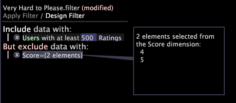
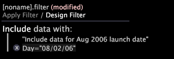

# Trabalhar com condições de filtro{#working-with-filter-conditions}

Informações sobre como trabalhar com condições de filtro, incluindo a criação de um novo filtro e a adição de uma condição a um novo filtro.

## Create a filter {#section-70ba51ae625e493fa3ca70b93ffba406}

* Abra um editor de filtro em sua área de trabalho clicando com o botão direito do mouse em **[!UICONTROL Add Visualization]** > **[!UICONTROL Filter Editor]**.

   -ou-

* Se você já tiver um editor de filtro aberto e um filtro carregado, clique com o botão direito do mouse no nome do filtro atual e clique em **[!UICONTROL New Blank Filter]**.

## Adicionar uma condição a um novo filtro {#section-50986db80f1148c489630a8a63fe9f28}

1. Crie um novo filtro. Certifique-se de que o Filtro de design esteja realçado (em vez de Aplicar filtro), indicando que você está trabalhando no modo Filtro de design.
1. Clique com o botão direito do mouse na área marcada **[!UICONTROL Right-click to build filter]** e selecione uma das seguintes opções:

   * Para criar um filtro de inclusão, clique em **[!UICONTROL Include group with]**.
   * Para criar um filtro de exclusão, clique em **[!UICONTROL Exclude group with]**.

1. Selecione o tipo de condição a ser adicionada ao filtro.

   A tabela a seguir fornece descrições dos tipos de condição de filtro disponíveis:

<table id="table_3B35B57FF32349F09E91E8256FF1672A"> 
 <thead> 
  <tr> 
   <th colname="col1" class="entry"> Tipo de condição </th> 
   <th colname="col2" class="entry"> Descrição </th> 
  </tr>
 </thead>
 <tbody> 
  <tr> 
   <td colname="col1"> 
seleção do espaço de trabalho 
 </td> 
   <td colname="col2"> 
Define uma condição de filtro com base nas seleções no espaço de trabalho. Essa opção está disponível somente se uma ou mais seleções existirem na área de trabalho. 
 
Para exibir mais informações sobre a seleção, clique com o botão direito do mouse na condição e clique em  Exibir detalhes. Uma chamada é exibida para a condição. 
 
Se você fizer outra seleção no espaço de trabalho, poderá adicionar a seleção como uma subcondição da primeira seleção. As seleções são agrupadas como ANDs lógicos. Portanto, os dados incluídos ou excluídos pela condição devem satisfazer todas as seleções de espaço de trabalho. 
 </td> 
  </tr> 
  <tr> 
   <td colname="col1"> 
pelo menos um 
 </td> 
   <td colname="col2">Define uma condição de filtro com base na existência de pelo menos um (qualquer) elemento de uma dimensão escolhida. Para editar a condição, clique com o botão direito do mouse na condição e clique em  Alterar condição para. Clique em uma das dimensões disponíveis. </td> 
  </tr> 
  <tr> 
   <td colname="col1"> 
fórmula 
 </td> 
   <td colname="col2"> 
Define uma condição de filtro com base na fórmula inserida. Você deve usar a sintaxe apropriada para que o filtro funcione. 
 
 
Observação: Para obter informações sobre a sintaxe para definir filtros, consulte <a href="../../../../home/c-get-started/c-qry-lang-syntx/c-syntx-fltr-exp.md#concept-72f2563f809747a2a3cff7ec72462a15"> Sintaxe para expressões</a>de filtro. 
 
 </td> 
  </tr> 
  <tr> 
   <td colname="col1"> 
valor métrico 
 </td> 
   <td colname="col2"> 
Define uma condição de filtro com base em um valor de métrica especificado. 
 
Para definir a condição, siga estas etapas: 
     <ul id="ul_B69D31258A36460E94535709239CD165"> 
      <li id="li_51317A681E654DD7A9D997DF9F2F22BA">Clique com o botão direito do mouse em  [escolher nível] &gt;  Alterar nível para selecionar o nível e a métrica de uma lista de dimensões no conjunto de dados. </li> 
      <li id="li_975E56C335824FDCB988344952DE2E9F">Clique com o botão direito do mouse em  [escolha a métrica] &gt;  Alterar métrica para selecionar a métrica de uma lista de métricas em seu conjunto de dados. </li> 
      <li id="li_D00B3AF3D8DE472C9D0E9EABBBCAAF61">Clique com o botão direito do mouse em menor que e clique em  Alterar comparação para selecionar uma das condições de comparação disponíveis (menor que, maior que, exatamente, pelo menos ou no máximo). </li> 
      <li id="li_3334CE0A0950448590E5442AB243F46B">Digite o valor desejado para a métrica. </li> 
     </ul> 
 </td> 
  </tr> 
  <tr> 
   <td colname="col1"> 
primeiro/último 
 </td> 
   <td colname="col2"> 
Define um filtro que permite incluir ou excluir um nível com uma dimensão especificada. Por exemplo, você pode especificar um primeiro/último filtro para incluir (ou excluir): 
 
Sessões cuja última Exibição de página tem uma Página de  /hme/rts/Nossas taxas. 
 
Para definir uma condição Primeiro/Último: 
     <ul id="ul_5AD916DA093844B8AC70127B1EB9BFC8"> 
      <li id="li_AB9FF22ADC8843A79856FED60B9478FA">Escolha  Incluir grupo com ou  Excluir grupo com &gt;  primeiro/último como uma nova condição no Editor de filtro. </li> 
      <li id="li_92F536FCC2A74DDE97F66C6C45ACC3DC">Clique com o botão direito do mouse em  [escolha o contêiner] &gt;  Alterar contêiner para selecionar o contêiner. </li> 
      <li id="li_1E5DBE04ABC74D84B7C0EF6886CDB5DC">Clique com o botão direito do mouse em  primeiro ou em  último lugar para especificar o nível. </li> 
      <li id="li_8B73EBF5D06E4513B5F0376EB2805D1C">Clique com o botão direito do mouse para especificar uma dimensão e digite um valor no campo disponível. </li> 
      <li id="li_A9E02EF6C6004DDF9B00EB853B6E54EE">Clique em Aplicar. </li> 
     </ul> 
 </td> 
  </tr> 
 </tbody> 
</table>

O filtro neste exemplo define um primeiro/último filtro para usuários cuja última exibição de página foi [!DNL /hme/rts/Our Rates]:

1. (Opcional) Para adicionar mais condições ao filtro, clique com o botão direito do mouse na área da janela em que você está criando o filtro e selecione o tipo de filtro (consulte a Etapa 2) e a regra de condição (consulte a Etapa 3).

   >[!NOTE]
   >
   >As condições de inclusão múltipla são agrupadas como ORs lógicos. Por conseguinte, os dados incluídos no filtro devem satisfazer pelo menos uma das condições de inclusão definidas. Várias condições de exclusão também são agrupadas como ORs lógicos. Para serem excluídos, os dados devem satisfazer pelo menos uma das condições de exclusão.

O filtro neste exemplo define um subconjunto de dados que consiste em visualizadores de filmes (usuários) que classificaram muitos filmes, mas que não atribuíram a nenhum filme uma pontuação alta (4 ou 5). Este filtro (apropriadamente denominado Muito difícil de agradar) consiste em duas condições:

* **Uma condição de valor de métrica:** A condição inclui usuários que classificaram pelo menos 500 filmes.
* **Uma condição de seleção de espaço de trabalho:** A condição exclui os usuários que deram a qualquer filme uma pontuação de 4 ou 5. O texto explicativo informa que 4 e 5 foram os elementos selecionados da dimensão Pontuação.

## Excluir uma condição de filtro {#section-3092e0d7ac624885b8fe24616279de13}

>[!NOTE]
>
>Você pode excluir condições somente quando estiver trabalhando no modo Filtro de design. Se você tiver aplicado um filtro à sua área de trabalho, clique em Filtro de design para retornar ao modo Filtro de design antes de excluir uma ou mais condições do filtro.

* Clique no **x** à esquerda da condição para excluí-la.

## Editar uma descrição de condição {#section-5015fd2c88ed4b6a95be7f0d53be2db0}

Você pode adicionar descrições a cada uma das condições que você adicionar a um filtro. Você pode editar ou remover as descrições, conforme desejado.

>[!NOTE]
>
>As descrições das condições são exibidas somente quando você está trabalhando no modo Filtro de design.

* Clique com o botão direito do mouse na condição e clique em **[!UICONTROL Edit description]**.

   * Para adicionar ou editar uma descrição, digite-a no [!DNL Edit condition description] campo. A descrição é exibida entre aspas acima da condição na janela do editor de filtro.

      

* Para remover uma descrição, clique em **[!UICONTROL Remove description]**. A condição permanece na janela do editor de filtro.

