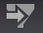

# Editores de filtro{#filter-editors}

Um editor de filtro é uma visualização especial para criar e editar filtros.

Enquanto outras visualizações no Análise de big data exibem dados de seu conjunto de dados, um editor de filtros permite que você especifique qual parte ou subconjunto de dados será exibido nas visualizações.

 Botão **Salvar filtro.** Quando você seleciona um item dentro de um espaço de trabalho - uma tabela detalhada, uma visualização, um filtro ou outro item - um botão **Salvar filtro** é aberto na barra de ferramentas, permitindo que você crie um filtro para o item selecionado. A opção para inserir um nome é fornecida quando o ícone Salvar filtro é clicado. O filtro pode então ser salvo no perfil.

Você cria um filtro abrindo uma janela do editor de filtros no seu espaço de trabalho e adicionando uma ou mais condições. Para ajudar você a definir as condições do filtro, os campos editáveis na janela do editor de filtro aparecem como caixas de texto ou são realçados quando você passa o mouse sobre elas. Basta clicar na caixa de texto para adicionar texto ou clicar com o botão direito do mouse no campo realçado para ver quais opções estão disponíveis. O filtro criado é exibido como uma sentença, facilitando a compreensão de qual subconjunto de dados está incluído ou excluído. Se desejar, você pode criar uma descrição para cada condição de filtro para que seu rótulo no editor de filtro seja mais significativo para você ou sua equipe.

Além disso, você pode usar o editor de filtro para abrir e editar qualquer [!DNL .filter] arquivo.

>[!NOTE]
>
>Quando você abre o filtro pela primeira vez, o editor de filtro atualiza a definição do filtro para corresponder ao formato do editor de filtro.

