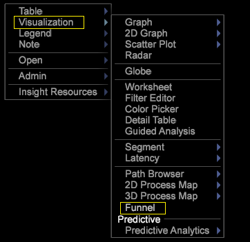

# Criar um funil{#building-a-funnel}

Siga estas etapas para criar uma nova visualização de funil

<!--  -->

1. Em um novo espaço de trabalho, abra uma tabela de dimensão.

   

   Por exemplo, clique com o botão direito do mouse no espaço de trabalho e selecione **[!UICONTROL Table > Site Content > Page Name]**

1. Abra uma visualização de funil.

   Por exemplo, clique com o botão direito do mouse no espaço de trabalho e selecione **[!UICONTROL Visualization > Funnel]**.

   

1. Adicione uma dimensão selecionando o elemento e arraste enquanto mantém **[!UICONTROL `<Ctrl>`]** + **[!UICONTROL `<Alt>`]** pressionada.

1. Arraste o elemento para a posição na zona de destino, **[!UICONTROL Drag Dimension Element Here]**.

   

1. Adicione outras dimensões.

   Você pode adicionar até oito etapas ao seu funil.
1. Solte a seleção da tabela que você fez para exibir seu funil com base em um público-alvo total.

   As visualizações de funil seguem o padrão de todas as outras visualizações, permitindo que o elemento selecionado controle o segmento de dados que você está visualizando.
1. Modifique a dimensão do clipe de funil, a dimensão de nível e a métrica.

   Clique com o botão direito do mouse no título para ajustar essas opções com base nas métricas e dimensões definidas no perfil personalizado.

   

A partir do Funil, você pode identificar sua queda e queda por taxas e a porcentagem de clientes convertendo vendas e seguindo campanhas ou caminhos de conteúdo. Para obter mais informações, você pode abrir um [Navegador de caminhos](../../../../home/c-get-started/c-analysis-vis/c-funnel-visualization/c-path-browser-funnel.md#concept-b0cedf7a28ae422696ded1258c9a4119) para ver uma lista detalhada das páginas tomadas antes de chegar à página selecionada e os caminhos percorridos após a saída.

Consulte [Recursos adicionais do funil](../../../../home/c-get-started/c-analysis-vis/c-funnel-visualization/c-funnel-visualization-features.md#concept-e65c81fe17794acd8d00d796b1780dc3).
