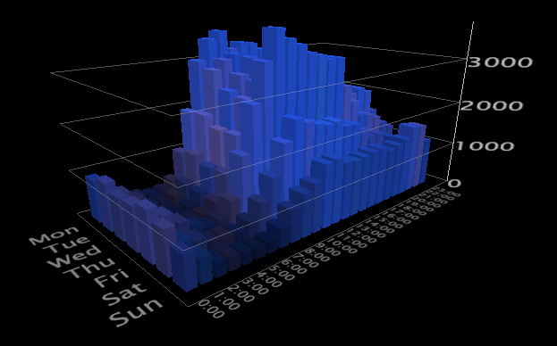

# Gráficos 2D{#d-graphs}

Gráficos bidimensionais (2D) exibem uma métrica em duas dimensões.

Considere o exemplo a seguir:

**Para girar um gráfico**

* Clique com o botão direito do mouse no gráfico e arraste o mouse na direção de rotação desejada.

**Para aumentar ou diminuir o zoom no gráfico**

* Com o ponteiro do mouse em qualquer lugar na janela do gráfico, pressione ambos os botões do mouse ao mesmo tempo e empurre o mouse para longe de sua janela para aumentar o zoom e para diminuir o zoom. Você também pode usar a roda do mouse, se disponível.

**Dimensionamento do eixo vertical**

1. Mova o mouse sobre o eixo vertical para realçar um plano do gráfico.
1. Enquanto o plano está realçado, clique e arraste o mouse para cima ou para baixo para dimensionar o eixo vertical do gráfico.

Consulte [Aplicar zoom em visualizações](../../../../home/c-get-started/c-vis/c-zoom-vis.md#concept-7e33670bb5344f78a316f1a84cc20530).
