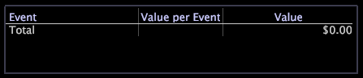

# Legendas de valor{#value-legends}

Uma legenda de valor exibe eventos de valor definidos.

A legenda de valor é configurada somente nos aplicativos HBX e [!DNL Site] , mas pode ser configurada para outros aplicativos. Para obter mais informações, entre em contato com os Serviços de consultoria da Adobe.

Em HBX e [!DNL Site], um evento de valor é definido como uma sessão que gerou valor comercial. Por exemplo, os registros de dados de evento associados a exibições de página específicas (por exemplo, uma página de agradecimento de pedido ou uma página de conclusão de aplicativo) podem representar eventos de valor para uma organização de negócios.

Com eventos de valor, você pode medir e rastrear a quantidade de valor gerada pelo site. Você pode avaliar o valor comercial em dólares para cada evento e responder perguntas como:

* Qual é o caminho mais lucrativo através do site?
* Que referenciador ou campanha gerou mais valor?

Para cada evento, a legenda exibe o valor unitário do evento (valor por evento) e o valor total gerado pelo evento. Use a legenda para definir e alterar eventos de valor e atribuir valores de unidade a eles.

A tabela a seguir lista as métricas relacionadas aos eventos de valor.

| Métrica | Descrição |
|---|---|
| Conversão | A porcentagem de sessões que geraram valor comercial |
| Valor | O valor total de negócios gerado, em dólares |
| Média Valor | O valor médio de negócios gerado, em dólares, por sessão |

Você pode definir facilmente qualquer coisa que os visitantes fazem no site como um evento de valor: postar uma solicitação de serviço ao cliente, concluir um aplicativo, exibir um conteúdo ou concluir uma compra. Cada evento de valor corresponde a um usuário acessando uma página específica ou um conjunto de páginas no site e está associado a um valor comercial em dólares. Por exemplo, você pode supor que cada usuário que chega à página &quot;Obrigado por comprar&quot; gera uma margem de contribuição de $20 em média. Você definiria um evento de valor para essa página que tem um valor de $20.

## Definir novos eventos de valor {#section-2ea4d168336e4d2e98b22b636ed43853}

**Para definir um novo evento de valor em HBX ou[!DNL Site]**

Ao criar um evento de valor, você arrasta páginas do site que representam o valor de uma visualização para uma legenda de valor.

1. Abra uma legenda de valor.

   

1. Adicione eventos de valor à legenda a partir de mapas de processo, tabelas de página URI ou exibições de hierarquia de página:

   * Em um mapa de processos, arraste os nós do mapa de processos para a legenda.
   * Em uma tabela de página de URI, pressione Ctrl+Alt e arraste uma página da tabela para a legenda.
   * Em uma exibição de hierarquia de página, clique à esquerda de um nó (pasta, página ou grupo) e arraste-o para a legenda.
   

   O ponteiro do mouse exibe a palavra &quot;Não&quot; até que o mouse atinja a legenda.

1. Na legenda de valor, atribua um valor comercial a cada sessão para a qual o evento ocorre:

   1. Na [!DNL Value per Event] coluna, clique na célula que corresponde à página que você adicionou como um evento de valor.
   1. Digite a quantia em dólar a ser atribuída para o valor desse evento e pressione Enter.
   

   Por padrão, o URL da página definida como um evento de valor aparece na legenda de valor. Se desejar, clique duas vezes nesse URL na legenda para entrar no modo de edição e renomear o evento. Você também pode editar o valor de um evento específico a qualquer momento. O servidor da Análise de big data recalcula automaticamente as métricas baseadas em eventos de valor, como valor médio e conversão.

Depois de definir pelo menos um evento de valor, a dimensão Segmento de valor fica disponível para uso. Essa dimensão representa o valor total que um visitante gerou em todas as sessões.

## Remover eventos de valor {#section-25cd90a859384ca183c0fc0998f888cf}

* Clique com o botão direito do mouse no evento desejado e clique em **[!UICONTROL Delete Event]**.

   

>[!NOTE]
>
>O servidor da Análise de big data calcula as métricas em todo o conjunto de dados acessíveis ao perfil que você está usando. Por padrão, o [!DNL Data Workbench Server] calcula métricas como Valor, Eventos de valor, Valor médio e Conversão em todos os dados no conjunto de dados de análise, mesmo se os dados não forem da mesma fonte lógica.

## Exportar para o Microsoft Excel {#section-feaa7a8eb8124fafbc74169bebaed6d8}

Para obter informações sobre como exportar janelas, consulte [Exportar dados](../../../../home/c-get-started/c-wk-win-wksp/c-exp-win-data.md#concept-8df61d64ed434cc5a499023c44197349)da janela.
