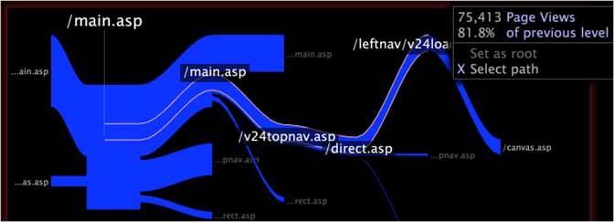

# Selecionar um caminho{#select-a-path}

{{eol}}

Você pode selecionar um caminho em um navegador de caminho para criar filtros que incluem dados associados aos elementos no caminho.

Ao selecionar um caminho de elementos de dimensão base em um navegador de caminho, você está selecionando dados para os elementos correspondentes da dimensão de nível.

Por exemplo, suponha que você tenha criado um navegador de caminho mostrando páginas de um site. Cada página é um elemento da dimensão Página e a dimensão de nível para Página é Exibição de página. Ao selecionar um caminho de páginas em um navegador de caminho, você está selecionando dados para as exibições de página associadas a essas páginas.

>[!NOTE]
>
>Você pode alterar a dimensão de nível padrão de um navegador de caminho. Para obter instruções sobre como configurar um navegador de caminho, consulte [Configuração de navegadores de caminho](../../../../home/c-get-started/c-intf-anlys-ftrs/t-config-path-brwsr.md#task-bbb3ddaa140a414f984b697c2b8202a3).

1. Clique em um elemento no navegador de caminho para estender o caminho exibido para a esquerda ou direita da raiz.
1. Clique com o botão direito do mouse no elemento desejado e clique em **[!UICONTROL Select path]**. O caminho selecionado é contornado em branco.

   >[!NOTE]
   >
   >Não é possível selecionar um nó inicial ou final.

1. Repita a Etapa 1 para cada elemento que deseja adicionar ao caminho.

   Por exemplo, se você estiver trabalhando com dados do site, é possível selecionar um caminho de páginas no site.

   

   Esse caminho constitui uma seleção e todas as outras visualizações abertas no espaço de trabalho (incluindo legendas) são atualizadas para exibir dados associados ao caminho criado pelos elementos selecionados. Consulte [Fazer seleções em visualizações](../../../../home/c-get-started/c-vis/c-sel-vis/c-sel-vis.md#concept-012870ec22c7476e9afbf3b8b2515746).
