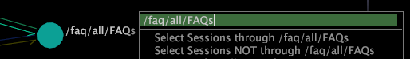

# Rotular um nó{#label-a-node}

Informações sobre como exibir, ocultar e alterar o rótulo de um nó.

**Para exibir o rótulo de um nó**

* Clique com o botão direito do mouse no nó e clique em **[!UICONTROL Label]***&lt; **[!UICONTROL node name]**>*. O rótulo do nó é exibido. Essa opção de menu estará disponível somente se o nó não estiver rotulado.

**Para ocultar o rótulo de um nó**

* Clique com o botão direito do mouse no nó e clique em **[!UICONTROL Unlabel]***&lt; **[!UICONTROL node name]**>*. O rótulo do nó é removido. Essa opção de menu estará disponível somente se o nó já estiver rotulado.

**Alteração do rótulo de um nó**

>[!NOTE]
>
>A alteração do rótulo de um nó afeta apenas o rótulo que é mostrado no mapa do processo. Isso não afeta o nome do elemento que o nó representa.

1. Clique com o botão direito do mouse no nó. O rótulo do nó é mostrado na parte superior do menu do nó.
1. Clique no rótulo do nó para entrar no modo de edição e alterar o rótulo do nó, conforme desejado.

