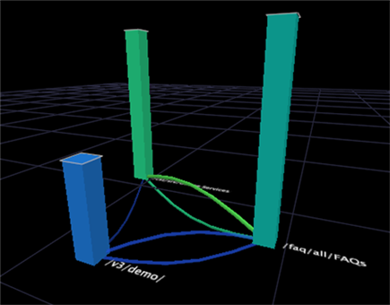

# Mapa de processos{#process-map}

{{eol}}

Mapas de processos permitem analisar o fluxo de atividade entre elementos de uma dimensão.

Você cria mapas de processos arrastando e soltando os elementos de uma dimensão em um mapa em branco bidimensional (2D) ou tridimensional (3D). Os elementos se tornam nós no mapa. Nós são círculos em mapas de processos 2D e barras em mapas de processos 3D.

>[!NOTE]
>
>Um mapa de processos obtém seu nome do uso ao analisar o fluxo de atividade entre as etapas em um processo. Nesse tipo de análise, cada elemento no mapa representa uma etapa no processo.

Diferentemente dos navegadores de caminho, os mapas de processo podem mostrar quantos elementos ou quantos forem necessários para sua análise. Você escolhe os elementos de interesse e os arrasta e solta no mapa. Além disso, ao contrário dos navegadores de caminho, os mapas de processo representam o fluxo de atividade em ambas as direções entre um elemento e um ou mais elementos.

>[!NOTE]
>
>Para que esses mapas funcionem com mais eficiência, você deve abrir uma legenda de cores no espaço de trabalho. Para obter informações sobre o uso de legendas de cores com mapas de processos, consulte [Ativação de links de cores](../../../../home/c-get-started/c-analysis-vis/c-proc-maps/c-act-color-lnks.md#concept-2c9b9f67f2bd4cd7a5431fa21c094edc). Para obter mais informações sobre legendas de cores, consulte [Legendas de cores](../../../../home/c-get-started/c-analysis-vis/c-legends/c-color-leg.md#concept-f84d51dc0d6547f981d0642fc2d01358).

Cada mapa de processos tem uma dimensão base, dimensão de grupo, dimensão de nível e métrica associada, que fornece as chaves para interpretar os dados mostrados no mapa de processos.

As configurações padrão para as dimensões e métricas de um mapa de processos dependem do aplicativo do Data Workbench que você está usando. Para obter informações sobre as dimensões e métricas disponíveis para seus mapas de processos, consulte o guia de aplicativos para seu aplicativo do Data Workbench.

* **Dimensão básica:** Ao arrastar e soltar um elemento em um mapa de processos, você está arrastando e soltando um elemento da dimensão base.
* **Dimensão de nível:** Cada dimensão no conjunto de dados tem uma dimensão de nível associada (também chamada de principal). A dimensão de nível do mapa de processos deve ser a mesma que a dimensão de nível (ou principal) da dimensão base do mapa de processos. Por exemplo, se você arrastar uma página (um elemento da dimensão Página) para o mapa, a dimensão de nível correspondente seria Exibição de página.
* **Dimensão do grupo:** A dimensão de grupo determina como os elementos da dimensão de nível são agrupados para formar as conexões entre nós. Para mapas de processos, a dimensão de grupo é importante por três motivos principais:

   * Uma conexão entre dois nós não pode estender mais de um elemento de uma dimensão de grupo. Para entender isso, considere um exemplo de uso de dados da Web. Suponha que as dimensões base, nível e grupo do mapa de processos sejam Página, Exibição de página e Sessão, respectivamente. Uma conexão da página A para a página B informa que, durante qualquer sessão única, uma exibição de página da página A ocorreu antes de uma exibição de página da página B sem exibições de página de separação de outras páginas (nós) no mapa. Observe que as exibições de página de outras páginas do site podem ter ocorrido entre as exibições de página para as páginas A e B durante a mesma sessão, mas essas páginas não são mostradas neste mapa.
   * Uma conexão entre dois nós pode representar vários elementos da dimensão de grupo. Por exemplo, pode haver várias sessões em que uma exibição de página da página A ocorreu antes de uma exibição de página da página B. Portanto, a conexão entre a página A e a página B representa todas as sessões individuais em que uma exibição de página da página A ocorreu antes de uma exibição de página da página B sem exibições de página de separação de outras páginas (nós) no mapa.
   * Ao fazer uma seleção com base em um nó em um mapa de processos, você está selecionando todos os elementos da dimensão de grupo que envolveu esse nó. Consulte [Fazer seleções em visualizações](../../../../home/c-get-started/c-vis/c-sel-vis/c-sel-vis.md#concept-012870ec22c7476e9afbf3b8b2515746). Para obter informações sobre seleções, consulte [Fazer seleções em visualizações](../../../../home/c-get-started/c-vis/c-sel-vis/c-sel-vis.md#concept-012870ec22c7476e9afbf3b8b2515746).

* **Métrica:** O tamanho do nó para um determinado elemento é proporcional ao valor da métrica para esse elemento. Nós maiores indicam valores de métrica maiores que nós menores.

Por exemplo, se você estiver usando a variável [!DNL Site] Para HBX aplicativo, você pode arrastar, por padrão, elementos da dimensão Página no mapa de processos. O tamanho de cada nó está relacionado à quantidade de sessões (definida pela métrica Sessões) em que a página foi visualizada.

>[!NOTE]
>
>É possível alterar as dimensões ou métricas padrão de um mapa de processos. Para obter etapas para configurar um mapa de processos, consulte [Configurando Mapas de Processos](../../../../home/c-get-started/c-intf-anlys-ftrs/t-config-proc-maps.md#task-4a95730b18a14bc790a77c013832b2d6).
