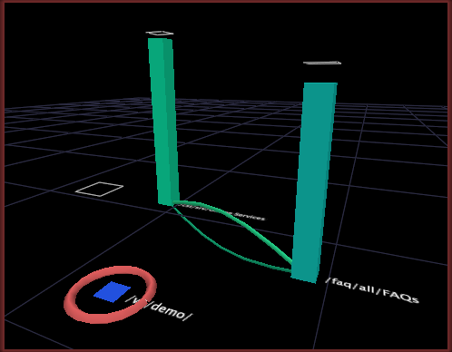

# Fazer uma seleção em um mapa de processos{#make-a-selection-from-a-process-map}

Você pode fazer seleções em mapas de processos para criar filtros que incluem ou excluem dados associados a um determinado nó.

Fazer uma seleção em um mapa de processos envolve a dimensão de grupo do mapa, que determina como os elementos da dimensão base (ou seja, os nós em seu mapa) são agrupados para formar as conexões entre nós.

>[!NOTE]
>
>Você pode alterar a dimensão de grupo padrão de um mapa de processos. Consulte [Configurando Mapas de Processo](../../../../home/c-get-started/c-intf-anlys-ftrs/t-config-proc-maps.md#task-4a95730b18a14bc790a77c013832b2d6).

Ao fazer uma seleção com base em um nó em um mapa de processos, você está selecionando todos os elementos da dimensão de grupo que envolveu esse nó. Para entender melhor a função da dimensão de grupo, considere os seguintes exemplos:

* Os filmes podem ser agrupados pelos visualizadores que os classificaram. Cada visualizador é um elemento da dimensão Usuário, então a dimensão Usuário seria a dimensão de grupo para o mapa de processos. Ao fazer uma seleção a partir de um nó para um filme específico, você cria um filtro que mostra os dados para os usuários que classificaram ou não esse filme.
* As páginas do site podem ser agrupadas pelas sessões em que foram visualizadas. Cada sessão é um elemento da dimensão Sessão , portanto, a dimensão Sessão seria a dimensão de grupo para o mapa de processos. Ao fazer uma seleção de um nó para uma página específica, você cria um filtro que mostra dados para as sessões durante as quais essa página foi ou não visualizada.

**Para fazer uma seleção**

1. Clique com o botão direito do mouse em qualquer nó em um mapa de processos.
1. Clique em uma das seguintes opções para fazer uma seleção com base no nó :

   * **[!UICONTROL Select]***  **[!UICONTROL group dimension name +s]***  **[!UICONTROL through node name]**: Filtra os dados para incluir todos os elementos da dimensão de grupo que passaram pelo nó filtrando todas as sessões que não passaram pelo nó.

   * **[!UICONTROL Select]***  **[!UICONTROL group dimension name +s]***  **[!UICONTROL NOT through node name]**: Filtra os dados para incluir todos os elementos da dimensão de grupo que não passaram pelo nó filtrando todas as sessões que passaram pelo nó.

Quando você faz uma seleção em um mapa de processos 3D, o nó para o qual a seleção é feita é formatado em círculo. Os referenciais são exibidos ao redor de cada barra, o que ajuda a comparar os valores de métrica com e sem a seleção. Consulte [Entendendo os benchmarks](../../../../home/c-get-started/c-vis/c-ustd-benchmks.md#concept-c7b0f4102e92458096f8c4765cbe2914).

