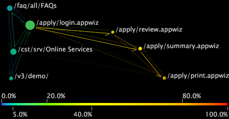

# Tipos de mapas de processos{#types-of-process-maps}

Informações sobre os diferentes tipos de mapas de processos.

## Mapas de processo 2D {#section-ea7fbdb80b1b44aebcd9e4090b6540bf}

Os mapas de processos bidimensionais fornecem uma visualização bidimensional da atividade entre elementos de dimensão. O tamanho de um nó em um mapa de processo 2D é proporcional ao valor da métrica associada a esse nó. Além disso, a espessura e a intensidade de uma seta entre dois nós são proporcionais à média dos valores da métrica para esses nós.

Em um mapa de processos 2D, você pode executar qualquer uma das seguintes tarefas:

* Selecionar, mover, remover e rotular nós
* Fazer seleções
* Salvar dimensões
* Criar outras visualizações
* Ativar links de cores
* Exibir quantidades de métrica
* Adicionar chamadas

O mapa de processos 2D no exemplo a seguir mostra nós correspondentes aos nomes de filmes. Cada nome de filme é um elemento da dimensão Filme, que é definida em um conjunto de dados que consiste em dados de filme. A dimensão Filme é a dimensão base desse mapa de processos.

No exemplo, o tamanho de cada nó e a espessura e intensidade de cada seta são proporcionais à métrica Classificações, que é uma contagem de classificações recebidas por um filme. Portanto, um filme com um nó grande, como *Dia da Independência*, tem mais classificações do que um filme com um nó pequeno, como *Horizonte de Eventos*. Você também pode ver que mais visualizadores de filmes classificados como *Dia da Independência* antes de *Montanha Fria* do que os mesmos filmes na ordem oposta. Observe que as setas não indicam que os visualizadores classificaram *Dia da Independência* e depois classificaram *Montanha Fria* imediatamente depois, ou vice-versa. Os visualizadores podem ter avaliado outros filmes no meio, mas esses filmes não são mostrados neste mapa.

## Mapas de métrica 2D {#section-a9b846fc71224058918fbc378315effe}

Mapas de métricas bidimensionais são um tipo de mapa de processos 2D que posiciona nós com base no valor de uma métrica específica. Em muitos casos, a métrica usada com o mapa de métrica 2D é Conversão ou Retenção. Os mapas de conversão e retenção ajudam você a entender quais etapas nos processos dos canais voltados para o cliente influenciam na conversão e retenção do cliente.

>[!NOTE]
>
>A métrica usada com um mapa de métrica 2D deve ser expressa como uma porcentagem.

Em um mapa de métrica de conversão, os nós com conversão de 0% são representados à esquerda do gráfico, e as páginas com conversão de 100% são representadas à direita. A atividade entre nós é exibida, facilitando a visualização de quais etapas em um processo levam a uma conversão maior ou menor e quais etapas impulsionam o abandono. Uma análise de conversão de processos é uma maneira eficaz de comparar processos ou diferentes implementações do mesmo processo.

Da mesma forma, os mapas de retenção mostram elementos com 0% de retenção à esquerda do gráfico e elementos com 100% de retenção à direita. Você pode ver a taxa de retenção para cada nó no mapa, o que ajuda a determinar quais elementos influenciam os clientes a retornar.

>[!NOTE]
>
>Não é possível mover nós em mapas de métrica 2D horizontalmente. Mapas de métricas são projetados para posicionar nós da esquerda para a direita com base em seus valores de métrica.

## Mapas de processos 3D {#section-80acb63ea0994af1af7faef3c6264e51}

Os mapas de processos tridimensionais fornecem uma visualização tridimensional da atividade entre elementos de dimensão. A altura de uma barra em um mapa de processo 3D é proporcional ao valor da métrica associada a esse nó. Assim como em mapas de processo 2D, tanto a espessura quanto a intensidade dos conectores entre dois nós são proporcionais à média dos valores da métrica para esses nós. Em um mapa de processos 3D, você pode executar qualquer uma das seguintes tarefas:

* Selecionar, mover, remover e rotular nós
* Fazer seleções
* Salvar dimensões
* Criar outras visualizações
* Ativar links de cores

O mapa de processos 3D no exemplo a seguir mostra nós correspondentes às páginas de um site. Cada página é um elemento da dimensão Página , que é definida em um conjunto de dados que consiste em dados de tráfego da Web. A dimensão Página é a dimensão base desse mapa de processos.

No exemplo, a altura de cada barra e a espessura e intensidade de cada conector são proporcionais à métrica Sessões, uma contagem de sessões nas quais as páginas foram visualizadas. Portanto, uma página com barra alta, como /faq/all/FAQs, foi visualizada durante mais sessões do que uma página com uma barra curta, como /vs/demo. Observe que as conexões entre duas páginas não indicam que uma página foi visualizada imediatamente antes ou depois de outra durante uma sessão específica. Outras páginas podem ter sido visualizadas durante a mesma sessão, mas essas páginas não são mostradas neste mapa.
