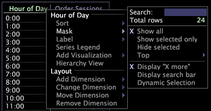

# Mascarar dados{#mask-data}

Mascaramento refere-se à seleção de um subconjunto de seus dados ou de um subconjunto dos elementos em uma dimensão.

Você mascara ou oculta esses elementos que não deseja incluir na análise.

O Data Workbench fornece dois métodos para mascarar elementos da dimensão. O primeiro método emprega as opções disponíveis no menu [!DNL Mask]. Usando as opções de menu [!DNL Mask], você pode usar o mouse para selecionar esses elementos para mostrar ou mascarar, ou pode mostrar elementos classificados mais alto ao classificar os dados por métrica. O segundo método para mascarar elementos da dimensão emprega uma pesquisa.

**Para mascarar dados**

1. Clique com o botão direito do mouse em um elemento ou no rótulo da dimensão desejada e clique em **[!UICONTROL Mask]**.

   

1. Clique em uma das seguintes opções:

   * **[!UICONTROL Show all]**
   * **[!UICONTROL Show selected only]**
   * **[!UICONTROL Hide selected]**
   * **[!UICONTROL Show top > 5, 10, 25, 50, 100]** ou  **[!UICONTROL 500]** dos elementos exibidos classificados por métrica
   * **[!UICONTROL Show top > All Positive]** para mostrar apenas valores maiores que zero (0)
   * **[!UICONTROL Display “X more”]** para mostrar o número de elementos mascarados no momento
   * **[!UICONTROL At least one >]***&lt;>>*(disponível somente ao trabalhar com uma dimensão denormal)**[!UICONTROL countable dimension name]**

      Ao trabalhar com uma dimensão denormal, essa opção permite mascarar uma dimensão por uma dimensão contável. Quando selecionada, a tabela mostra apenas os elementos que têm pelo menos um elemento da dimensão contável selecionada. A tabela exibe até 1.023 elementos.

>[!NOTE]
>
>Como o Adobe [!DNL Platform] processa dados em ordem aleatória, quando pelo menos uma máscara resulta em mais de 1.023 elementos, os elementos mais comuns e maiores têm maior chance de serem incluídos na tabela.

Ao mascarar por Mostrar acima ou Pelo menos um, por padrão, a ordem na tabela corresponde aos valores, conforme afetados pela seleção no momento. Se posteriormente você alterar a seleção, a ordem não será alterada a partir da ordem original, a menos que a tabela seja reordenada ou você ative a Seleção Dinâmica. Ao clicar em **[!UICONTROL Mask]** > **[!UICONTROL Dynamic Selection]**, a tabela é republicada sempre que você alterar a seleção.

**Para mascarar dados usando uma pesquisa**

* É possível mascarar dados usando uma das seguintes opções de pesquisa:

   * Clique com o botão direito do mouse em um elemento ou no rótulo da dimensão desejada, clique em **[!UICONTROL Mask]** e, na caixa [!DNL Search], digite a frase para a qual deseja pesquisar.

      

   * Clique com o botão direito do mouse em um elemento ou no rótulo da dimensão desejada, clique em **[!UICONTROL Mask]** > **[!UICONTROL Display search bar]** e, na caixa de pesquisa que é exibida na célula do rótulo da dimensão, digite a frase para a qual deseja pesquisar.

      

      À medida que você digita uma frase de pesquisa, o Data Workbench atualiza a dimensão para refletir as correspondências.

Para restringir ainda mais o mascaramento durante uma pesquisa, você pode usar qualquer um dos seguintes métodos:

* Você pode digitar &quot;re:&quot; na caixa ou na barra [!DNL search] para que a frase de pesquisa seja interpretada como uma expressão regular. Você pode usar qualquer sintaxe associada a expressões regulares em sua frase de pesquisa. Para obter mais informações sobre expressões regulares, consulte o apêndice Expressão regular no *Guia de configuração do conjunto de dados*.
* Você pode digitar o símbolo $ como o primeiro caractere em sua string de pesquisa para localizar frases que começam com a string inserida ou como o último caractere para localizar frases que terminam com a string inserida.
* Você pode digitar um espaço como o primeiro caractere em sua string de pesquisa para encontrar qualquer palavra em uma frase que comece com a string inserida ou como o último caractere a encontrar qualquer palavra em uma frase que termine com a string inserida.

A seguir estão exemplos de diferentes maneiras de mascarar uma tabela usando a string &quot;on&quot; em uma pesquisa:

* Digitar &quot;on&quot; exibe todas as frases que contêm a string &quot;on&quot; em qualquer lugar da frase: &quot;**on** line banking&quot;, &quot;c **on** tact compradores,&quot; &quot;bulli **on** moedas,&quot; &quot;bank **on** line,&quot; &quot;gold opti **on** s&quot; e &quot;silver bulli **on a11/>.&quot;**
* A digitação de &quot;$on&quot; exibe todas as frases que começam com a string &quot;on&quot;:

   &quot;**on** line banking&quot; e &quot;**on**-line payment.&quot;

* A digitação de &quot;em$&quot; exibe todas as frases que terminam com a string &quot;on&quot;:

   &quot;prata bulli **on**&quot; e &quot;gold opti **on**.&quot;

* A digitação de &quot;on&quot; exibe todas as frases que contenham uma palavra que comece com a string &quot;on&quot;:

   &quot;**on** line banking&quot; e &quot;bank **on** line.&quot;

* A digitação de &quot;on&quot; exibe todas as frases que contenham uma palavra que termine com a string &quot;on&quot;:

   &quot;bulli **nas** moedas&quot; e &quot;touli prata **em**.&quot;

* Usar &quot;on&quot; exibe cada frase que contém a string &quot;on&quot; como uma palavra:

   &quot;**na linha** bancária&quot; e &quot;banco **na linha**.&quot;
