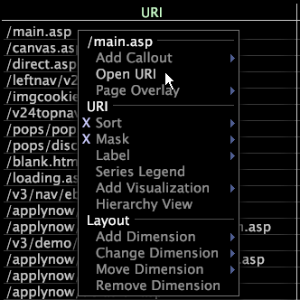

# Abrir um URI de uma tabela{#open-a-uri-from-a-table}

A funcionalidade aberta está atualmente configurada apenas no aplicativo Site e somente para abrir URIs.

Consulte [Configuração da funcionalidade](../../../../home/c-get-started/c-intf-anlys-ftrs/c-config-open-funct.md#concept-854e6dc8bef34e6aa4ccfb7a8929af4d)aberta.

Em [!DNL Site]uma tabela de URI, você pode clicar com o botão direito do mouse em um URI para exibir uma página da Web em um navegador da Web. Para exibir um URI em seu formato nativo (como HTML), a Análise de big data deve ter acesso ao local referenciado e ao aplicativo necessário para abrir esse item. Por exemplo, para exibir uma página da Web, o Análise de big data deve ter acesso à Internet e também ter um navegador da Web instalado.

* Clique com o botão direito do mouse em um elemento da dimensão e clique em **[!UICONTROL Open URI]**.

   

   O URI é aberto em seu aplicativo nativo.

