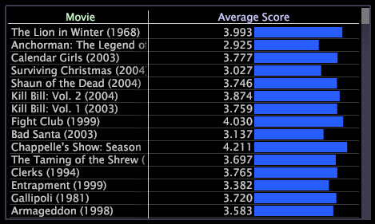

# Tabelas{#tables}

{{eol}}

Uma tabela pode exibir uma ou mais métricas em uma ou mais dimensões de dados.

O exemplo a seguir mostra uma tabela na qual a Pontuação média de cada filme é exibida como um valor, mas também é representada pelo comprimento da barra.

