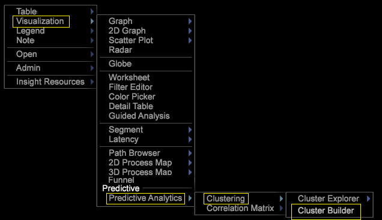
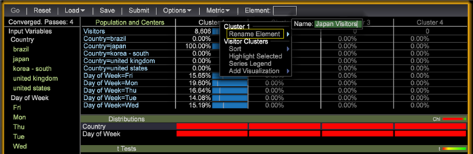

# Construção de clusters{#building-clusters}

Selecione variáveis de entrada, o número de clusters e uma população de destino (se desejado) para definir clusters no conjunto de dados.

**Construção de clusters**

1. Abra o **[!UICONTROL Cluster Builder]**.

   Clique em **Visualização** > Análise **** preditiva > **Clustering** > Construtor **** de cluster.

   

1. Selecione as variáveis de entrada.

   * Adicione métricas à lista **[!UICONTROL Input Variables]** selecionando no **[!UICONTROL Metric]** menu da barra de ferramentas.

      

   * Adicione elementos de dimensão à lista **[!UICONTROL Input Variables]** arrastando-os da tabela de uma Dimensão.

      Pressione **[!UICONTROL Ctrl + Alt]** e arraste os elementos de dimensão selecionados para a **[!UICONTROL Input Variables]** lista ou para a **[!UICONTROL Element]** caixa na barra de ferramentas.

      
   Por padrão, o agrupamento é executado em todo o conjunto de dados. É possível ver todas as variáveis de entrada no **[!UICONTROL Preprocessing]** painel esquerdo.
1. Use o **[!UICONTROL Options]** menu para selecionar o número desejado de clusters.

   

1. Se você quiser agrupar um subconjunto de Visitantes em seu conjunto de dados, é possível definir um Filtro de preenchimento.

   

   Comece definindo o subconjunto desejado usando as seleções na Workspace ou usando o **[!UICONTROL Filter Editor]**. Depois de selecionar o subconjunto desejado, defina a População de destino no **[!UICONTROL Options]** menu. É recomendável que você atribua um nome de identificação ao grupo direcionado.

   O **[!UICONTROL Options]** menu também tem configurações para controlar o número máximo de passagens e o limite aceitável para convergência central.

1. Depois que as entradas e as opções tiverem sido configuradas, clique no botão **Ir** para executar o agrupamento localmente ou pressione **[!UICONTROL Submit]** para enviar a tarefa para o servidor do Predictive Analytics. As submissões ao servidor salvarão a dimensão resultante no conjunto de dados quando a convergência estiver concluída.

   Durante a execução local, você verá o Construtor de cluster mover-se por quatro estágios de clustering da cobertura, ao definir centros inteligentes com base nas entradas.

   Quando os centros dos clusters pararem de alterar mais do que o limite de convergência especificado, a Dimensão de Cluster será convertida e o Construtor de Cluster exibirá informações adicionais sobre a relevância de uma entrada para cada cluster.

1. Personalize os clusters.

   Clicar com o botão direito do mouse na barra de cores das estatísticas abre um menu de contexto que permite personalizar os limites de relevância e, no caso das distribuições de elementos de dimensão, escolher qual teste será exibido.

   

   As entradas de métricas fornecem um teste t para cada cluster, enquanto as entradas de elementos de dimensão fornecem três testes de distribuição (Chi ao quadrado, uma estatística U de entropia e a estatística V de Cramer) para cada cluster.

   >[!NOTE]
   >
   >Se você adicionar ou remover entradas durante a convergência, o processo pausará até que você pressione **Ir** novamente.

   Depois de criar clusters, você pode abrir o seletor de cores para atribuir cores para diferentes resultados de distribuição.

   

1. Com a Dimensão de cluster convergida, é possível adicionar métricas à tabela e fazer seleções normalmente. Você também pode clicar com o botão direito do mouse nos nomes dos elementos (Cluster 1, Cluster 2 etc.) para abrir o menu de contexto para renomeá-los para algo mais significativo.

   

1. Se você quiser usar essa dimensão de cluster em outras visualizações, poderá **[!UICONTROL Save]** usá-la localmente ou **[!UICONTROL Submit]** no servidor.

Se você quiser executar a convergência novamente ou ver a relevância das entradas, o Construtor de clusters também poderá carregar as dimensões existentes do cluster.

>[!TIP]
>
>Quando selecionada, todas as variáveis de entrada **[!UICONTROL Reset]** serão liberadas e você receberá uma visualização em branco do construtor de cluster para definir novos clusters.

