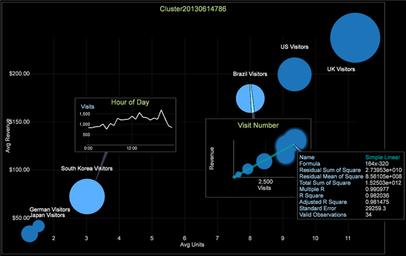

# Explorar clusters{#exploring-clusters}

Depois que um Dimension de Cluster é criado, você pode salvá-lo e examiná-lo usando o Cluster Explorer.

1. Selecione Visualização > Análise preditiva > Cluster > Cluster Explorer > Clusters. Escolha a dimensão de cluster salva que deseja explorar.

   

1. Clique com o botão direito do mouse no título da visualização e clique em Alternar rótulos para ativá-los. Você pode usar esse menu para alterar a dimensão do cluster que está explorando, alterar a métrica do raio, adicionar linhas de tendência e exibir correlação.

   

1. Para modificar o Dimension de Cluster que você está explorando, altere a métrica de raio, adicione linhas de tendência e exiba a correlação usando este menu.

   

   O Cluster Explorer exibe os centros dos clusters em qualquer dois eixos de entrada de cada vez. Isso permite examinar sua separação em espaço multidimensional.

1. Clique com o botão direito do mouse no cluster para exibir o menu e escolha entre os tipos de chamada: Anotação de imagem ou texto, legenda de métrica, tabela, gráfico de linha ou gráfico de dispersão.

   
