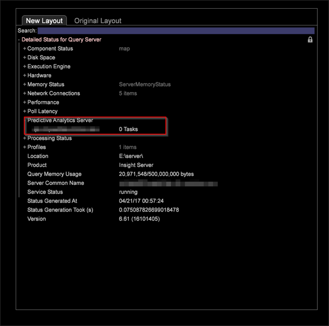

# Cluster do visitante{#visitor-clustering}

O agrupamento de visitantes permite que você aproveite as características do cliente para categorizar dinamicamente os visitantes e gerar conjuntos de clusters com base em entradas de dados selecionadas, identificando grupos que têm interesses e comportamentos semelhantes para análise e direcionamento do cliente.

**Processo de agrupamento**

O processo de agrupamento exige que você identifique métricas e elementos de dimensão para usar como entradas e permite que você escolha uma população-alvo específica para aplicar esses elementos para criar clusters especificados. Quando você executa o processo de agrupamento, o sistema usa a métrica e as entradas de dimensão para determinar os centros iniciais apropriados para o número especificado de clusters. Esses centros são então usados como ponto de partida para aplicar o algoritmo K-Means.

* Os centros iniciais são escolhidos de forma inteligente por meio de um passe Canopy Clustering.
* Os clusters de dados são criados associando cada ponto de dados ao centro mais próximo.
* A média de cada um dos clusters K torna-se o novo centro.
* O algoritmo é repetido nas etapas 2 e 3 até que a convergência seja alcançada. Isso pode levar múltiplos passos.

O **[!UICONTROL Maximum Iterations]** **[!UICONTROL Options]** menu permite que o analista especifique o número máximo de iterações a serem executadas pelo algoritmo de agrupamento. Definir essa opção pode resultar em uma conclusão mais rápida do processo de agrupamento com base no limite máximo de iterações, em detrimento da convergência exata dos centros de cluster.

>[!NOTE]
>
>Depois que os clusters forem definidos, a Dimensão de Cluster poderá ser salva para uso como qualquer outra dimensão. Ele também pode ser carregado no Cluster Explorer para examinar a separação dos centros de cluster.

No Construtor de cluster, você pode selecionar **[!UICONTROL Options]** > **[!UICONTROL Algorithm]** para selecionar algoritmos ao definir clusters. Atualmente, há três algoritmos suportados:

* KMeans
* Kays`++`
* Maximização da expectativa

Há duas maneiras de executar o processo de agrupamento:

* Método 1 - Clique **[!UICONTROL Go]** na janela de visualização do cluster.
* Método 2 - Clique **[!UICONTROL Submit]** na janela de visualização de cluster, que envia diretamente o trabalho de cluster para o Servidor. É possível rastrear o progresso por meio da opção &quot;Status detalhado para consulta&quot;.

O algoritmo tem as seguintes restrições:

1. Se você estiver usando o Método 1, poderá selecionar qualquer um dos algoritmos de cluster suportados.
1. Se estiver usando o Método 2, você pode selecionar kmeia ou kmedium++. A opção Maximização de expectativas não estará disponível.

>[!NOTE]
>
>No [!DNL DPU.cfg] arquivo, o valor para &quot;Consulta, Limite de Memória&quot; é definido como 500 MB por padrão. Esse valor deve ser aumentado ao executar vários trabalhos de cluster. Por exemplo, se você estiver executando 5 trabalhos de cluster em paralelo, aumente esse valor para 1 GB. Não há como cancelar o trabalho de agrupamento sem reiniciar o Servidor.

**Recomendações**

O número de iterações (número de vezes que os dados são digitalizados) e o limite de convergência que você configura afetam grosseiramente o desempenho do agrupamento. A tabela a seguir fornece uma orientação mais ampla que você pode seguir:

| Número de clusters | Algoritmo | Iterações | Limite de convergência | Normalização |
|---|---|---|---|---|
| 6 | Kays | 25,50 | 1e-3 | Mín. máx. |
| 6 | Kays | 25,50 | 1e-6 | Mín. máx. |
| 6 | KSignifica++ | 50 | 1e-6 | Mín. máx. |
