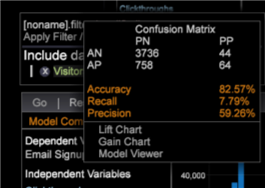

# Gráficos de ganho e elevação de propensão{#propensity-gain-and-lift-charts}

{{eol}}

Os gráficos Aumento e Ganho oferecem visualizações para avaliar o desempenho potencial de um modelo com pontuação para avaliar o desempenho em relação a partes definidas do público-alvo.

Os gráficos de ganho e elevação são visualizações criadas para avaliar o desempenho potencial do modelo pontuado. Esses gráficos avaliam o desempenho em cada porção da população.

**Para abrir um gráfico de aumento ou de ganho**

1. Selecionar [!DNL Add Visualization > Predictive Analytics > Scoring] .
1. Passar o mouse **[!UICONTROL Model Complete]** de uma pontuação salva.

**Sobre Gráficos de elevação e ganho**

Os Gráficos de Aumento e Ganho são ferramentas visuais úteis para medir o valor de um modelo preditivo. Ambos os gráficos consistem em uma curva de aumento (verde) e uma linha de base (rosa). Para o **Gráfico de ganho**, a distância entre a curva de aumento e a linha de base representa o quanto você pode melhorar o desempenho nas respostas (ou o &quot; ganho&quot;) ao usar o modo preditivo. O ganho é realizado priorizando e direcionando os prospetos (clientes/visitantes) com maior probabilidade de conversão, em vez de fazer marketing aleatório para clientes/visitantes. Dessa forma, você pode quantificar o valor esperado de usar o modelo preditivo para escolher quais prospetos entrar em contato.

Semelhante ao Gráfico de Ganho, a variável **Gráfico de aumento** mostra quanta probabilidade de receber respostas positivas é maior do que se contatasse prospetos aleatoriamente. Você deseja que a distância entre a curva de aumento e a linha de base seja a maior possível, representando maiores ganhos esperados do uso do modelo preditivo para contatar os clientes. Matematicamente, os gráficos de ganho e elevação são definidos da seguinte maneira:

* **Ganho** = (Resposta esperada usando Modelo preditivo para contatar perspectivas) / (Resposta esperada de perspectivas de contato aleatório)
* **Lift** = (Resposta esperada entre um tamanho de grupo específico de perspectivas identificado usando o modelo preditivo) / (Resposta esperada entre o mesmo tamanho de grupo específico de perspectivas identificado aleatoriamente)

**Exemplo de Gráficos de Aumento e Ganho**

Por exemplo, considere o exemplo de um varejista que deseja lançar uma campanha de re-marketing por email para vender calças de yoga. Historicamente, o analista espera uma taxa média de resposta de 20% com base em campanhas anteriores de re-marketing por email, semelhantes a essa. Embora o analista tenha quase 5 milhões de clientes em seu banco de dados de email, a empresa só quer vender para os clientes com maior probabilidade de responder ao email e comprar. Dessa forma, a empresa maximizará o ROI da campanha, garantindo que não envie emails desnecessariamente para clientes não interessados. Dada uma taxa de resposta esperada de 20%, o profissional de marketing e o analista esperam que aproximadamente 1 milhão de clientes respondam e comprem. Em vez de adivinhar aleatoriamente quais desses clientes estarão entre as 20% de respostas, o analista quer ser inteligente em prever qual dos 1 milhão de clientes potenciais (entre os bancos de dados de 5 milhões de clientes) tem maior probabilidade de responder.

Usando o recurso Pontuação de público-alvo do Adobe, o analista define o sucesso como um clique em um email compra calças yoga dependentes. Após selecionar as variáveis independentes (com base na experiência e no conhecimento obtido com a análise de correlações de dados e do clustering do público-alvo entre outras análises), cada prospecto é avaliado com base na probabilidade de responder positivamente à campanha de re-marketing por email (clicando no email e comprando yoga calcinhas). O analista abre os gráficos Ganho e Aumento resultantes com base no modelo preditivo.

O eixo y mostra a porcentagem das respostas positivas esperadas cumulativas. No nosso exemplo, esperamos um total de 1 milhão de respostas positivas. Um valor de 20% no eixo y corresponde a 20% dos 1 milhão de respostas positivas esperadas, ou 200.000 respostas positivas. O eixo x mostra a porcentagem de clientes em potencial contatados. Em nosso exemplo, o eixo x representa uma fração dos 5 milhões de clientes no banco de dados de email. A linha de base (rosa) é a taxa de resposta geral - se você entrar em contato com X% dos prospetos, você receberá X% do total de respostas positivas. Usando o modelo preditivo, a curva de aumento (verde) mostra a porcentagem de respostas positivas obtidas (eixo y) ao entrar em contato com uma porcentagem específica de prospetos (eixo x).

O gráfico Lift representa o aumento esperado como resultado do uso do modelo preditivo para determinar o milhão de prospetos com maior probabilidade de comprar yoga calças depois de receber e clicar no email. Para entrar em contato com 20 por cento das perspectivas selecionadas aleatoriamente usando um modelo preditivo, você deve esperar obter 20 por cento dos respondedores. No entanto, usando o modelo preditivo para identificar os 20% mais prováveis de responder, você espera receber 50% dos respondedores. O valor y da curva de aumento em 20% é 50/20 = 2.5. O gráfico de aumento mostra quanta probabilidade você tem de receber entrevistados é maior do que se você entrar em contato com uma amostra aleatória de prospetos. Por exemplo, ao entrar em contato com apenas 20% dos prospetos com base no modelo preditivo, você alcançará 2,5 vezes mais entrevistados do que não ter usado nenhum modelo preditivo.
